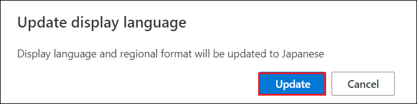
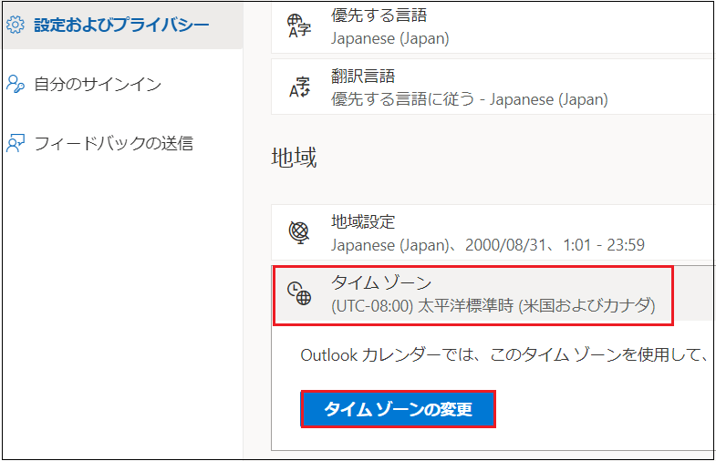
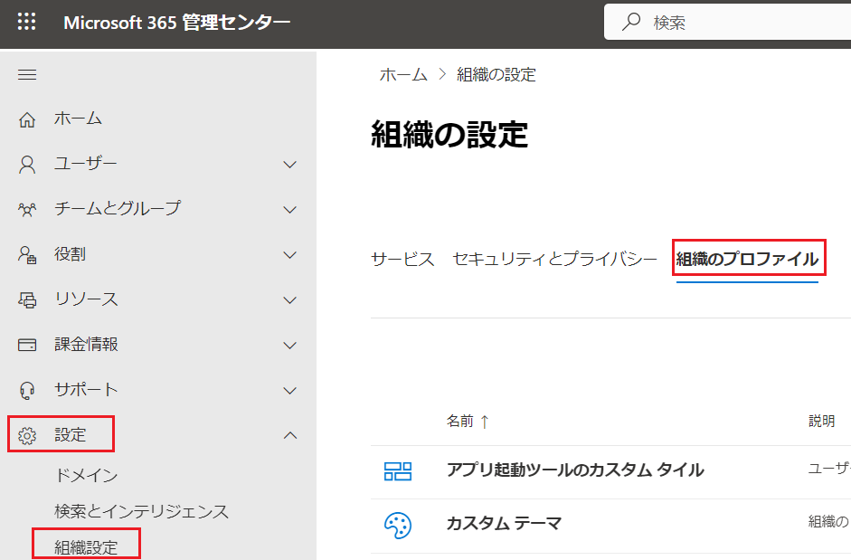
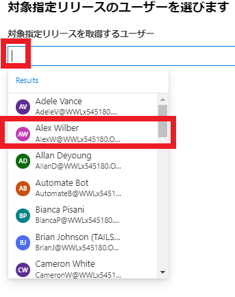
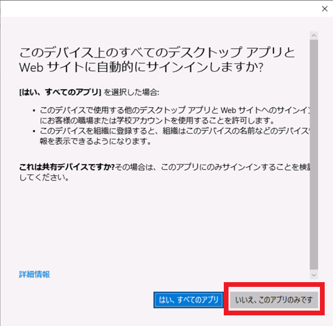

## [WWL テナント - 利用規約](https://github.com/MicrosoftLearning/MS-102T00-Microsoft-365-Administrator-Essentials/blob/master/Instructions/Labs/LAB_AK_01_Lab1_Ex1_Initialize_M365_Tenant.md#wwl-tenants---terms-of-use)

インストラクター主導のトレーニング実施の一部としてテナントが提供されている場合、テナントはインストラクター主導のトレーニングのハンズオン ラボをサポートする目的で利用可能であることに注意してください。

テナントを共有したり、ハンズオン ラボ以外の目的で使用したりしないでください。本コースで利用するテナントはトライアルテナントのため、授業終了後は利用・アクセスできず、延長の対象外となります。

テナントを有料サブスクリプションに変更してはなりません。このコースの一環として取得したテナントは引き続き Microsoft Corporation の所有物であり、当社はいつでもアクセス権を取得し、再所有する権利を留保します。

# [ラーニング パス 1 - ラボ 1 - 演習 1 - Microsoft 365 テナントを初期化する](https://github.com/MicrosoftLearning/MS-102T00-Microsoft-365-Administrator-Essentials/blob/master/Instructions/Labs/LAB_AK_01_Lab1_Ex1_Initialize_M365_Tenant.md#learning-path-1---lab-1---exercise-1---initialize-your-microsoft-365-tenant)

Adatum Corporation は Contoso Electronics の子会社です。Adatum は、レガシー アプリケーション (Microsoft Exchange Server 2019 など) をオンプレミス展開で実行します。ただし、最近 Microsoft 365 に加入したため、オンプレミス展開とクラウド展開を同期する必要があるハイブリッド展開が作成されました。

Adatum の Microsoft 365 管理者として、あなたは仮想化されたラボ環境を使用して Adatum のハイブリッド展開に Microsoft 365 を展開する任務を負っています。この演習では、Adatum の Microsoft 365 試用版テナントをセットアップし、インストラクターがラボホスト環境で Microsoft 365 資格情報を取得する方法を説明します。このコースの残りのラボでは、これらの資格情報を使用します。

ラボ環境では、ラボ ホスティング プロバイダーが Microsoft 365 試用版テナントをすでに取得しています。ラボ プロバイダーは、VM ラボ環境で使用する 2 つの管理者アカウントも作成しました。

- Adatum のオンプレミス環境のローカル管理者アカウント (Adatum\Administrator)。
- Microsoft 365 のデフォルトのテナント管理者アカウント (このユーザー アカウントの表示名は MOD 管理者です)。

初めて Microsoft 365 にアクセスするときは、最初に Microsoft 365 テナント管理者アカウント (MOD 管理者) を使用してログインします。次に、Adatum の Microsoft 365 組織プロファイルを更新し、Microsoft Azure Active Directory 用と、Information Rights Management、監査アラート、Microsoft Graph PowerShell、機密ラベルを使用する後のラボ用にテナントを準備します。

### タスク 1: Microsoft 365 ポータルの日本語化

1. お手元のPCで、InPrivate ウィンドウ(Microsoft Edge) もしくは、シークレットウィンドウ (Google Chrome) で、Microsoft 管理センター (https://admin.microsoft.com/) にアクセスし、管理者の資格情報でサインインします。

2. **[サインインの状態を保持しますか]** ページでは、 **[いいえ]** をクリックします 。

3. 「You need to set up multifactor authentication 」というメッセージが出た場合は **[Skip for Now]** を選択してください。 

   

4. 画面右上の **歯車マーク** をクリックし、表示される **[Settings]** メニューをクリックします。

5. **[Setting]** の一覧から、 **[Language and time zone]** の **[Change your language]** をクリックします。s

   

6. **[My Account]** の **[Settings ＆ Privacy]** ページが表示されます。

7. **[Language]** セクションの **[Display Language]** をクリックして、 **[Change display language]** をクリックします。

   

8. **[Language]** ページで **[Japanese]** を選択し、 **[Select]** をクリックします。

9. **[Display language and regional format will be updated to Japanese]** とメッセージが表示されたら、 **[Update]** をクリックします。

   

10. **[表示言語と地域設定が Japanese に更新されました。新しい言語を完全に適用するには、サインアウトする必要があります。]** とメッセージが表示されたら、 **[キャンセル]** をクリックします。

    

11. **[設定およびプライバシー]** ページで、 **[地域]** の **[タイムゾーン] - [タイムゾーンの変更]** をクリックします。

    

12. **[ (UTC ＋ 09:00)大阪、札幌、東京]** を選択して、 **[選択]** をクリックします。

13. Microsoft 365 ポータル の右上にあるイニシャルのアイコンをクリックしてから、 **[sign out]** をクリックしてサインアウトします。

    

14. サインアウトが完了したら、一度ブラウザーを×で閉じます。

15. https://admin.microsoft.com に再度サインインします。「**多要素認証を設定する必要があります**」というメッセージが出た場合は **[今は行わない ]** を選択してください。 

    

    日本語化されたことが確認できたら(少し時間がかかったり、再サインインを要することもあります)、手順を進めてください。

    

### タスク 2 - Adatum の組織プロファイルをセットアップする

このコースのラボ全体を通じて、Adatum の Microsoft 365 管理者である Holly Dickson の役割を引き受けてロールプレイを行います。このタスクでは、Adatum のテナントに必要なオプションを構成します。ホリーはまだ自分用の個人用 Microsoft 365 ユーザー アカウントを作成していないため (これは次のラボ演習で作成します)、ホリーは最初に、ラボのホスティングによって作成された既定の Microsoft 365 テナント管理者アカウントとパスワードを使用して Microsoft 365 にサインインした状態で作業を実施します。

1. **[Microsoft 365 へようこそ]** ページの左側のウィンドウに表示されるアプリケーション アイコンの一覧で、 [**管理(Admin)]** を選択します。これにより、新しいブラウザー タブで **Microsoft 365 管理センターが開きます。** 

2. Microsoft 365 管理センターの左ペインから、 **[・・・すべて表示]** をクリックします。

   

3. 左側のナビゲーション ウィンドウで  **[設定]** を選択します。 **[設定]** グループで、 **[組織設定]** 選択します。

4.  **「組織設定」** ページには、デフォルトで **「サービス」** タブが表示されます。 **「組織のプロファイル」** タブを選択します。

   

5. **[組織のプロファイル(Organization profile)]** タブ を下にスクロールし、 **[組織の情報(Organization Infomation)]**  をクリックします。

6. **[組織の情報(Organization Infomation)]**  ページで以下の項目を設定します。**※特に指示がないものは既定値のままで構いません。** 入力したら、 **[保存(Save)]** をクリックします

   - 名前:  **Adatum Corporation** 

   - 郵便番号:  **98052**

   - 都道府県: **ワシントン**

   - 市区町村: **Redmond**

     番地:  **555 Main Street**

   - 電話番号: 変更しないでください

   - 技術連絡先: 変更しないでください

   - 優先する言語: **English**

7. **[組織情報]** ウィンドウの上部に、変更が保存されたことを示すメッセージが表示されます。右上隅の **[X]** を選択してペインを閉じます。

8. **[組織プロファイル]** タブに戻り、組織プロファイル データのリストで **[リリースに関する設定(Release preferences)]** を選択します。

   **注:** Microsoft 365 の利点の 1 つは、最新の機能と更新プログラムを環境に自動的に適用できることです。このプロセスにより、組織のメンテナンス コストとオーバーヘッドが削減され、早期導入ユーザーが新機能をテストできるようになります。**リリース設定** を設定することにより、Microsoft 365 テナントがこれらの更新プログラムをいつどのように受信するかを制御できます。

9. **[特定のユーザーに対象指定リリース(Targeted release for select users)]** オプションを選択し、 **[保存(Save)]** を選択します。

10. **[リリースに関する設定]** ペインで、[特定のユーザーに対象指定リリース(Targeted release for select users)] の下にある **[ユーザーを選択(Select users)]** オプションを選択します。

11. 表示される **[ターゲット リリースのユーザーの選択]** ペインで、 **[ターゲット リリースを受け取るのは誰ですか?(Who should receive targeted releases?)] 内を選択します。** 

    

    以下の各ユーザーを一度に 1 人ずつ選択してください。 フィールドを再度クリックするとリストが再表示され、次のユーザーを選択できるようになります。以下の4人のユーザーに対してそれぞれ実施してください。

    - **Alex Wilber**
    - **Joni Sherman**
    - **Lynne Robbins**
    - **MOD Administrator**

    **注:** Alex、Joni、Lynne は、Holly の Microsoft 365 パイロット チームのメンバーです。彼らのアカウントは、このコースのラボ全体で使用されます。

12. 4人がリストされたことを確認し、 **[保存(Save)]** を選択します。

13. **[リリース設定]** ペインの上部に、4 人のユーザーが対象のリリースに追加されたことを示すメッセージが表示されます。右上隅の **[X]** を選択してペインを閉じます。

14. 次のタスクのために、Microsoft 365 管理センターを開いたままにします。

### タスク 3 - Adatum のパイロット プロジェクト チーム用のカスタム テーマを作成する

誰かが Microsoft 365 にサインインすると、システムはその人の写真 (提供されている場合) または写真が提供されていない場合はイニシャルを表示します。Adatum の Microsoft 365 管理者である Holly Dickson は、サインインしているユーザーの写真やイニシャルを見るだけでは満足できません。彼女は、パイロット プロジェクト チームのメンバー用に、サインインしているユーザーの名前も表示されるカスタム テーマを作成したいと考えています。パイロット プロジェクトの終了時に、パイロット プロジェクト チームのメンバーがこのデザインを好む場合は、すべてのユーザーに適用されるようにデフォルト テーマで同じオプションを構成します。

カスタム テーマは、1 つ以上の Microsoft 365 グループに関連付ける必要があります。したがって、この変更を実装するには、ホリーはまずパイロット プロジェクト チームのメンバー用の Microsoft 365 グループを作成する必要があります。次に、このグループに関連付けられたカスタム テーマを作成し、サインインしているユーザーの名前を表示する設定を有効にすることができます。このタスクでは、Adatum の Microsoft 365 パイロット プロジェクト チームのメンバー用の Microsoft 365 グループを作成します。次に、サインインしているユーザーの名前を表示するカスタム テーマを作成し、パイロット プロジェクト チームをこのテーマに割り当てます。カスタム テーマで構成できる他のオプションも確認し、必要に応じて色を変更できます。

1. **Microsoft 365 管理センター**で、左側のナビゲーション ウィンドウで **[チームとグループ]を選択し、その下で** **[アクティブなチームとグループ]** を選択します。

2. Microsoft 365 グループのリストの上にあるメニュー バーに表示される **[Microsoft365グループを追加する]** オプションを選択します。これにより、**グループの追加** ウィザードが開始されます。

   

3. [基本のセットアップ] ページで、 [名前] フィールドに **「M365 パイロット プロジェクト」** と入力し、[説明] フィールドに **「Microsoft 365 パイロット プロジェクト チームのメンバー」** と入力します。  **「次へ」** を選択します。

4. 次に、MOD 管理者をM365 パイロット プロジェクト グループの所有者として割り当てます。   **[+所有者の割り当て]** を選択します。

5. 表示される[所有者の割り当て] ペインで、 **[MOD Administrator] の横にあるチェック ボックスをオン** にし、ペインの下部にある **[追加 (1)]** ボタンを選択します。

6. [所有者の割り当て] ページに、MOD 管理者がグループの所有者として表示されるはずです。**「次へ」** を選択します。

7. ここで、M365 パイロット プロジェクト グループにメンバーを割り当てます。**[メンバーの追加]** ページで、**[+メンバーの追加]** を選択します。

8. 表示される[メンバーの追加] ウィンドウで、次のユーザーの横にあるチェック ボックスをオンにします: **Alex Wilber**、**Allan Deyoung** 、**Diego Siciliani** 、**Isaiah Langer** 、**Joni Sherman** 、**Lynne Robbins** 、**Megan Bowen** 、**MOD Administrator** 、**Nestor Wilke** 、および**Patti Fernandez** 。次に、ペインの下部にある **[追加 (10)]ボタンを選択します。**

9. [メンバーの追加]ページで、これら 10 人のユーザーがグループのメンバーとしてリストされていることを確認します。ユーザーを見逃した場合は、**[+メンバーの追加]** を選択して、見逃したユーザーを追加します。10 人のユーザー全員がこのページに表示されたら、**[次へ]** を選択します。

10. [設定の編集]ページで、次の情報を入力します。

    - [グループのメール アドレス]フィールドに **「m365pilotproject」** と入力します。
    - [プライバシー]フィールドで **[プライベート]** を選択します。
    - [Microsoft Teams をグループに追加]セクションで、 **[このグループのチームを作成する]** チェック ボックスがオンになっていることを確認し、  **[次へ]** を選択します。

11. [確認とグループの追加の完了]  ページで、入力した内容を確認します。修正する必要がある場合は、調整が必要な特定の領域で [編集] を選択し、必要な修正を行ってから、  [次へ] を選択してこのページに戻ります。すべてが正しければ、**「グループを作成」** を選択します。

    [M365 パイロット プロジェクト グループが作成されました]ウィンドウが表示されたら、ページの上部にある、新しいグループがアクティブ グループのリストに表示されるまでに 5 分かかる場合があるというコメントに注目してください。 

12. **[閉じる]** を選択します。これにより、 [アクティブなチームとグループ]ページに戻り、 [Microsoft 365グループ] タブが表示されます。M365 パイロット プロジェクト グループは Microsoft 365 グループであるため、最終的にはこのタブに表示されるはずです。必要に応じて、Microsoft 365 グループのリストに M365 パイロット プロジェクト グループが表示されるまで、メニュー バーの[更新]オプションを選択します。

16. Microsoft 365 管理センターのナビゲーション ウィンドウの **[設定]** グループで、  **[組織設定]** を選択します。

17. [組織設定]ページで、 **[組織のプロファイル(Organizational profile)]** タブを選択します。

18. 組織プロファイル データのリストで、**[カスタム テーマ(Custom themes)]** を選択します。

19. 表示される[組織に合わせて Microsoft 365 をカスタマイズ] ウィンドウでは、ユーザーが Microsoft 365 にサインインしたときに表示される既定のテーマをカスタマイズしたり、追加のカスタム テーマを追加したりできます。 **+テーマを追加する(Add theme)** オプションを選択します。

20. 表示される[新しいグループ テーマ]ウィンドウには、デフォルトで[全般(General)] タブが表示されます。「名前(Name)」フィールドに **「M365 パイロット プロジェクトのテーマ」** と入力します。

21. 「グループ(Groups)」 フィールド内を選択します。表示されるグループのリストで、**M365 パイロット プロジェクト** がグループのリストに表示されている場合は選択します。

    **注:** M365 パイロット プロジェクトがグループのリストに表示されない場合は、 [グループ]フィールドに「M365」と入力します。検索結果ボックスが表示され、M365 パイロット プロジェクトグループが表示されます。M365 パイロット プロジェクトを選択します。

22. **[ユーザーの表示名を表示(Show the user's display name)]** チェック ボックスをオンにします。これは、ホリーが M365 パイロット プロジェクト チームのメンバー向けにカスタマイズしたいと考えている設定です。

    

23. **[ロゴ(Logos)]** タブを選択し、時間をかけてそのオプションを確認します。 **「色(Colors)」** タブでも同じことを行います。更新できるさまざまなテーマとブランド オプションに注目してください。

    **Microsoft 365 パイロット プロジェクト チームのメンバーが使用するこのテーマのさまざまなオプションを検討してください。必要に応じて変更を加えます。(特に思いつかない場合は、ナビゲーション バーの色(Navigation bar color)　の右の黒い■をクリックすると、違う色を選択することができます。)**

    **ヒント:** カラー パターンによっては、美的にユーザーの注意をそらすものもあります。いずれかの色を変更する場合は、ネオン カラーや明るいピンクや白などの高解像度の色など、コントラストの高い色を一緒に使用しないことをお勧めします。

24. **[保存(Save)]** を選択します。変更を保存したら、M365 パイロット プロジェクトのテーマペインを閉じます。

25. ブラウザー上部のアドレス バーの左側にある **[更新]** アイコンを選択します。画面が更新されたら、**MA の**イニシャルが付いた円の左側にMOD 管理者の名前がどのように表示されるかに注目してください。作成したカスタム テーマにより、サインインしているユーザーの名前がプロフィール写真またはイニシャルの左側に表示されます。

26. 組織プロファイル データのリストで、**[カスタム テーマ]** を選択します。

27. 表示される[組織に合わせて Microsoft 365 をカスタマイズ]ウィンドウで、**既定のテーマ**と**M365 パイロット プロジェクトのテーマが**どのように表示されるかに注目してください。**既定のテーマ**を選択します。

28. [デフォルトのテーマ]ペインで、[ユーザーの表示名を表示] オプションが選択されていないことに注目してください。ウィンドウの上部にある戻る矢印を選択して、 [組織に合わせて Microsoft 365 をカスタマイズ] ウィンドウに戻ります。[組織に合わせて Microsoft 365 をカスタマイズ]ウィンドウを閉じます。

29. 次のタスクのためにMicrosoft 365 管理センターを開いたままにします。


### タスク 4 - SharePoint Online の Information Rights Management を有効にする

このタスクでは、SharePoint Online の Information Rights Management (IRM) を有効にします。

**重要:** 実習 7 では Exchange および SharePoint の IRM を検証しますが、IRM が SharePoint Online に表示されるまでに最大 60 分以上かかる場合があるため、ここで SharePoint Online の IRM を有効にする必要があります。演習 7 の検証演習に進むまでに、IRM の内部構成は完了しているはずなので、SharePoint Online に IRM が存在するまで待つ必要はありません。実際の展開で IRM を有効にする予定がある場合は、この時間の問題に留意してください。

1. Microsoft 365 管理センターで、左側のナビゲーション ウィンドウで [すべて表示(必要な場合)] を選択して、すべてのナビゲーション オプションを表示します。[管理センター]グループで、 **[SharePoint]** を選択します。これにより、新しいタブでSharePoint 管理センターが開きます。

2. [新しいホームページへようこそ]ウィンドウで、 **[ツアーを開始する(Take the tour)]** を選択します。

3. SharePoint 管理センターの左側のナビゲーション ウィンドウで、**[設定（Settings））]** を選択します。

4. [設定]ページの下部に、「探している設定が見つからない場合は、クラシック設定ページ に移動します。」 という文があります。**「クラシック設定ページ(classic setiing page)」** というハイパーリンク付きテキストを選択します。

5. 従来の [設定]ページで、 [Information Rights Management (IRM)]セクションまで下にスクロールします。このセクションの右側のオプションで、**「構成で指定した IRM サービスを使う(Use the IRM service specified in your configuration)」オプション** を選択し、**「IRM 設定を更新(Refreash IRM Settings)」** ボタンを選択します。

   

6. ページの一番下までスクロールし、**「OK」** ボタンを選択します。

7. 変更が保存されると、 [設定] ページの上部に戻ります。ブラウザーで、現在表示しているタブ ( **https://xxxxxZZZZZZ-admin.sharepoint.com** タブ) を閉じます。これにより、 SharePoint 管理センター の[設定] ページに戻ります。

8. ブラウザーでSharePoint 管理センタータブを閉じます。 次のタスクのためにブラウザで他のタブを開いたままにしておきます。

### タスク 5 – Microsoft Graph PowerShell をインストールする

Microsoft 365 をインストールするときに、いくつかの構成タスクを実行するには、Microsoft Graph PowerShell が必要です。今後のラボ演習では、Windows PowerShell を使用してこれらのタスクのいくつかを実行するため、Microsoft Graph PowerShell モジュールをインストールすることから始める必要があります。このモジュールを使用すると、PowerShell を通じて Microsoft 365 のユーザーおよび組織の管理タスクの多くを実行できます。パスワードのリセット、パスワード ポリシー、ライセンスの管理とレポートなどの大量のタスクに最適です。

1. ラボ環境の仮想マシン **LON-CL1** にログインします。タスクバーの左下隅に表示される検索ボックスに **「power」** と入力します。検索結果の一覧で、**[Windows PowerShell]** を右クリックし、表示されるドロップダウン メニューで **[Run as administrator] を選択します。** 

2. **Windows PowerShell** 、コマンド プロンプトに次のコマンドを入力して、PowerShell ギャラリーから Microsoft Graph PowerShell モジュールをインストールし、Enter キーを押します。

   ```
    Install-Module Microsoft.Graph -Scope CurrentUser
   ```

   NuGet providerを今インストールするかどうか確認するメッセージが表示された場合は、 **Y** を入力して( [Y] Yes を選択)、Enter キーを押します。

3. 信頼できないリポジトリ (PSGallery) からモジュールをインストールするかどうかを確認するメッセージが表示されます。**A** を入力して( [A] Yes to All を選択)、Enter キーを押します。

   **注:** 応答すると、すべての Microsoft Graph サブモジュールのインストールが開始されます。すべてのインストール メッセージ (各サブモジュールの) の表示が完了しても、Microsoft Graph PowerShell のインストールが完了するまでに約 5 ～ 10 分かかります。この間、カーソルは信頼できないリポジトリ メッセージの下で点滅し続けます。ちょっとした休憩を取るには良い機会かもしれません。

4. Microsoft Graph PowerShell がインストールされると、コマンド プロンプトが表示されます。次のコマンドを実行して、Microsoft.Graph プライマリ モジュールの下にインストールされたサブモジュールの完全なリストを表示します。

   ```
    Get-InstalledModule Microsoft.Graph.* 
   ```

   **注記：** このコースで Microsoft Graph PowerShell を使用するラボでは、Microsoft.Graph.Identity.DirectoryManagement、Microsoft.Graph.Users、および Microsoft.Graph.Groups のサブモジュールを使用します。サブモジュールのコマンドレットにアクセスするには、まずサブモジュールをインポートする必要があります。"Import-Module Microsoft.Graph" コマンドを使用して 30 個以上のサブモジュールをすべて一度にインポートすることも、実行中の機能を実行するために必要な各モジュールをインポートすることもできます (たとえば、"Import-Module Microsoft.Graph")。 .Graph.Users」を使用して、特定の時点でユーザー メンテナンスを実行します。このトレーニングの目的では、後のラボ演習では 3 つのサブモジュールのみを使用するため、ここで 40 以上のサブモジュールすべてをインポートするわけではありません。代わりに、これら 3 つのサブモジュールは、後のラボで必要になったときにインポートするまで待ちます。

5. PowerShell ウィンドウを閉じ**ない** でください。Windows PowerShell ウィンドウを開いたままにしておきます。LON-CL1 にログインしたままにしてください。

### タスク 6 – 監査ログをオンにしてアラート ポリシーを有効にする

ラボ 6 では、Microsoft 365 Defender ポータルを使用してアラート ポリシーを作成します。ただし、アラートを実装する前に、管理者はまず組織の監査ログを有効にする必要があります。監査ログを有効にしてから完全に有効になるまでに数時間かかる場合があるため、このラボでは監査ログを有効にして、ラボ 6 に到達するまでに完全に有効になるようにします。

1. LON-CL1 に**は引き続き adatum\administrator** アカウントとしてログインし、前のタスクから Windows PowerShell を開いたままにしておく必要があります。

2. PowerShell ウィンドウで、次のコマンドを実行して、監査ログを有効にするコマンドレットを含む Exchange Online 管理モジュールをインストールします。

   ```
    Install-Module ExchangeOnlineManagement
   ```

3. 信頼できないリポジトリ (PSGallery) からモジュールをインストールするかどうかを確認するように求められます。**「A**」と入力して **「[A] Yes to All」** を選択し、Enterキーを押します。

4. Exchange Online 管理モジュールがインストールされると、コマンド プロンプトが表示されます。次のコマンドを実行して、モジュールに接続します。

   ```
    Connect-ExchangeOnline
   ```

5. 資格情報を要求する**サインイン** ウィンドウが表示されます。ラボ ホスティング プロバイダーから提供された MOD 管理者アカウント (**[admin@xxxxxZZZZZZ.onmicrosoft.com](mailto:admin@xxxxxZZZZZZ.onmicrosoft.com)**、xxxxxZZZZZZ はラボ ホスティング プロバイダーから提供されたテナント プレフィックスです) を入力し、[**次へ**] を選択します。[**パスワードの入力**] ウィンドウで、ラボ ホスティング プロバイダーから提供された**管理パスワード**を入力し、 [**サインイン**] を選択します。

6. [Stay signed in to all your apps(すべてのアプリにサインインしたままにする)]ページが 表示されたことを確認し、 **[No, this app only]** をクリックします。 ([OK]ボタンをクリックしないでください。)

   

7. コマンド プロンプトで次のコマンドを実行して、監査ログを有効にします。

   ```
    Set-AdminAuditLogConfig -UnifiedAuditLogIngestionEnabled $true
   ```

   **手記：** 要求した管理監査ログ構成の変更がシステム全体に反映されるまでに最大 60 分かかる可能性があることを示す警告メッセージが表示されます。そのため、この機能を有効にするのは、このコースの後半にあるアラート ポリシー ラボを待つのではなく、今すぐ有効にします。

8. コマンド プロンプトで次のコマンドを実行して、監査ログが有効になっていることを確認します。

   ```
    AdminAuditLogConfig 
   ```

9. 表示されるプロパティの一覧で、**UnifiedAuditLogIngestionEnabled** プロパティが **True** に設定されていることを確認します。

10. PowerShell ウィンドウを閉じ**ないでください**。Windows PowerShell ウィンドウは開いたままにしておきます。LON-CL1にログインしたままにします。

### 
