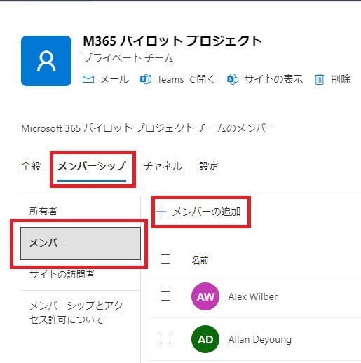
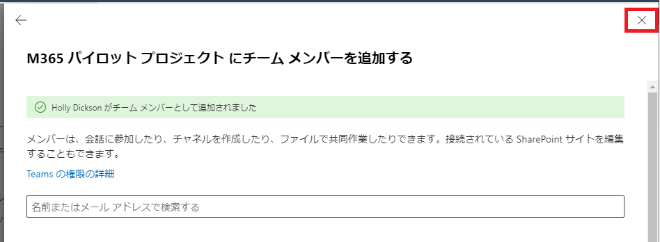

# [ラーニング パス 1 - ラボ 1 - 演習 2 - ユーザーとグループの管理](https://github.com/ctct-edu/ms-102-lab/blob/main/Instructions/Labs/LAB_AK_01_Lab1_Ex2_Manage_Users_and_Groups.md#learning-path-1---lab-1---exercise-2---manage-users-and-groups)

次のラボ演習では、Adatum の新しい Microsoft 365 管理者である Holly Dickson としての役割を続けます。この演習では、Microsoft 365 内でいくつかのユーザーおよびグループの管理機能を実行します。まず、Microsoft 365 グローバル管理者の役割が割り当てられる Holly の Microsoft 365 ユーザー アカウントを作成します。複数の Microsoft 365 グループを作成し、既存の Microsoft 365 ユーザーをそれらのグループのメンバーとして割り当てます。次に、グループの 1 つを削除し、Windows PowerShell を使用して削除されたグループを回復します。

### タスク 1 - Adatum の Microsoft 365 管理者のユーザー アカウントを作成する

Holly Dickson は、Adatum の新しい Microsoft 365 管理者です。彼女には Microsoft 365 ユーザー アカウントが設定されていないため、最初は前のラボで MOD 管理者アカウント (既定のグローバル管理者) として Microsoft 365 にサインインしました。このタスクでは、引き続き MOD 管理者としてログインし、その間に Holly の Microsoft 365 ユーザー アカウントを作成します。また、Holly のアカウントに Microsoft 365 グローバル管理者のロールを割り当てます。このロールは、Microsoft 365 内のすべての管理機能を実行するために必要なアクセス許可を Holly に提供します。 このタスクに続いて、Holly の新しいアカウントを使用してログインし、Holly のペルソナを使用して残りのすべてのラボを実行します。

**ライセンスに関する注意:** Holly のアカウントを作成する前に、まず利用可能なライセンスの数を確認します。そうすることで、ラボ テナントが 20 個の Microsoft 365 E5 ライセンスと 20 個の Enterprise Mobility + Security E5 ライセンスを提供しているにもかかわらず、これらのライセンスはすべて、ラボ ホスティング プロバイダーによって作成された既存のユーザー アカウントにすでに割り当てられていることがわかります。そのため、Holly に割り当てることができるように、まず既存のユーザーから各ライセンスの 1 つを割り当て解除する必要があります。

**重要:** 実際の展開で作成する個人のグローバル管理者については、それぞれを 1 人のユーザー (Holly Dickson など) にマップし、それぞれに Azure Active Directory 多要素認証 (MFA) を適用する必要があります。ただし、このトレーニング コースでは時間が限られており、Holly がログインするたびに 2 番目の認証方法を使用してログインすることを強制してラボの時間を浪費したくないため、Holly のアカウントに対して MFA を有効にすることはありません。

1. 新しいユーザーを追加するので、ユーザー アカウントを追加する前に、ライセンスの可用性を確認することから始める必要があります。Microsoft 365 管理センターのナビゲーション ウィンドウで、**[課金情報]** を選択し、**[ライセンス]** を選択します。

2. 「ライセンス」 ページには、デフォルトで「サブスクリプション」 タブが表示されます。サブスクリプションのリストで、  サブスクリプションに使用可能なライセンスがないことに注意してください。ラボ テナントはサブスクリプションごとに 20 ライセンスを提供しますが、40 ライセンスすべてが割り当てられています。Holly には **Microsoft 365 E5 (Teams なし)** および **Microsoft Teams Enterprise** ライセンスの両方を割り当てる必要があるため、まず既存のユーザー アカウントからライセンスの割り当てを解除して、Holly で使用できるようにする必要があります。

3. Microsoft 365 管理センターのナビゲーション ウィンドウで、**[ユーザー]** を選択し、 **[アクティブなユーザー]** を選択します。Christie Cline は社内の新しい役割に異動し、Microsoft 365 パイロット プロジェクトの一員ではなくなるため、 **Microsoft 365 E5 (Teams なし)** および **Microsoft Teams Enterprise** ライセンスを彼女のアカウントから割り当て解除して、ホリーの新しいアカウントにそれらを再割り当てできるようにします。。

4. [アクティブ ユーザー]ページのユーザーのリストで、**Christie Cline** を選択します(名前の横にあるチェック ボックスではなく、Christie の名前を選択します)。

5. 表示される**Christie Cline**ペインには、デフォルトで[アカウント]タブが表示されます。 **[ライセンスとアプリ]** タブを選択します。[ライセンス (2)] で、  **Microsoft 365 E5 (Teams なし)** および **Microsoft Teams Enterprise** の横にあるチェック ボックスを  **オフ** にし、**[変更の保存]** を選択します。変更を保存したら、**[x]** をクリックしてChristie Cline ペインを閉じます。

6. これで、Adatum の新しい Microsoft 365 管理者である Holly Dickson のユーザー アカウントを作成する準備ができました。これにより、Holly は Microsoft オンライン サービス全体のほとんどの管理機能とデータにグローバルにアクセスできるようになります。また、Christie Cline から割り当てを解除した 2 つのライセンスを Holly に割り当てます。

   **[アクティブ ユーザー]** ウィンドウで、アクティブ ユーザーのリストの上にあるメニュー バーに表示される [**ユーザーの追加]** オプションを選択します。これにより、**ユーザーの追加**ウィザードが開始されます。

7. ユーザーの追加ウィザードの **「基本設定」** ページで、次の情報を入力します。

   - 名前：**Holly**

   - 姓 : **Dickson**

   - 表示名: このフィールドにタブで移動すると、**Holly Dickson**が表示されます。

   - ユーザー名:**Holly**

   - **[パスワードを自動作成する]** チェック ボックスをオフにします (チェックを外します) 。これにより、管理者が定義したパスワードを入力するための新しいフィールドが表示されます。

   - 表示される新しい**パスワード**フィールドに、ラボ ホスティング プロバイダーからテナント管理者アカウント (つまり、MOD 管理者アカウント) 用に提供されたものと同じ**Microsoft 365 管理者 パスワードを入力します。**

   - **[このユーザーに最初のサインイン時にパスワードの変更を要求する**] チェック ボックスをオフにします (チェックを外します)。

8. **「次へ」** を選択します。

9. [製品ライセンスの割り当て] ページで、次の情報を入力します。

   - 場所を選択:**米国**
   - ライセンス: [ユーザーに製品ライセンスを割り当てる]オプションで、 **[Microsoft 365 E5 (Teams なし)]** および **[Microsoft Teams Enterprise]** チェック ボックスをオンにします。

10. **「次へ」** を選択します。

11. [オプション設定] ページで、 **[役割]の右側にあるドロップダウン矢印** を選択します。

12. [役割] セクションで、**[管理センターに対するアクセス許可]** オプションを選択します。このオプションを選択すると、最も一般的に使用される Microsoft 365 管理者ロールがその下で有効になります。

    **注:** 最後の共通ロールの後に表示される [カテゴリ別にすべて表示]を選択すると、すべての管理者ロールが表示されます。Holly の場合、一般的に使用される役割のリストに表示される全体管理者役割が割り当てられるため、すべての管理者役割をカテゴリ別に表示する必要はありません。

13. **「グローバル管理者」** チェックボックスを選択します。

    **注:** Adatum にすでに 7 人のグローバル管理者がいることを示す警告メッセージが表示されます。通常の環境では、これは過剰となるため、推奨されません。ラボ環境でのこのラボの目的のために、このメッセージは無視してください。

14. **「次へ」** を選択します。

15. [確認と終了] ウィンドウで、選択内容を確認します。何かを変更する必要がある場合は、適切な編集リンクを選択し、必要な変更を加えます。それ以外の場合は、すべてが正しい場合は、**[追加の完了]** を選択します。

16. ‎[Holly Dickson‎ がアクティブなユーザーに追加されました] ページの [ユーザーの詳細] セクションで、**[表示]** オプションを選択して、 Holly のパスワードが、ラボ ホスティング プロバイダーによってテナント管理者アカウント (つまり、MOD 管理者アカウント) に提供された **Microsoft 365 管理者 パスワード**と同じであることを確認します。

    **注:** 誤って別のパスワードを入力した場合は、[**アクティブ ユーザー]ページに戻ってから、** **[パスワードをリセット]** アイコン (Holly のアカウントの上にマウスを移動すると表示される鍵のアイコン) を選択して、彼女のパスワードを正しいパスワードに変更する必要があります。

17. 「閉じる」を選択します。

19. 次のタスクのために、ブラウザーで Microsoft 365 管理センターを開いたままにしてください。

### タスク 2 – Microsoft 365 ユーザー アカウントをセットアップする

前のタスクを完了した後も、**MOD 管理者**アカウントとして**Microsoft 365 管理センター**にサインインしている必要があります。このタスクでは、Adatum の新しい Microsoft 365 管理者である Holly Dickson として、Adatum の Microsoft 365 パイロット プロジェクトの実装を開始します。したがって、MOD 管理者として Microsoft 365 からログアウトし、Holly として再度ログインしてこのタスクを開始します。

Adatum の Microsoft 365 管理者である Holly Dickson として、展開の初期段階を支援する Microsoft 365 パイロット プロジェクト チームのメンバーとして、Alex Wilber、Joni Sherman、Lynne Robbins、および Patti Fernandez を選択しました。各ユーザーはパイロット プロジェクト チームの主要メンバーです。ユーザー アカウントは既に Microsoft 365 に存在しますが、今後のラボ演習で必要になったときに、より簡単に Microsoft 365 にサインインできるように、パスワードを構成する必要があります。Holly のアカウントを作成したときと同じように、テナント管理者アカウント (つまり MOD 管理者アカウント) と同じ**Microsoft 365 管理者 パスワード**をユーザー パスワードとして割り当てます。また、後のラボ演習で使用する Microsoft 365 グループを追加する必要があります。

1. ブラウザーでMicrosoft 365 管理センターが開いたままになっているはずです。

   ブラウザの右上隅にある **MOD 管理者のユーザー アイコン（MA の円) を選択** します。表示されるMOD 管理者ウィンドウで、 **[サインアウト] を選択します。**

   **重要:** あるユーザー アカウントからサインアウトし、別のユーザー アカウントでサインインする場合は、[サインアウト]タブを除くすべてのブラウザー タブを閉じる必要があります。これは、前のユーザーに関連付けられているウィンドウを閉じることで混乱を避けるのに役立つベスト プラクティスです。

2. ブラウザーの[サインアウト]タブで、アドレス バーに次の URL を入力して Microsoft 365 にサインインし直します: **[https://portal.office.com](https://portal.office.com/)**。

3. [サインイン] ウィンドウに **Holly@xxxxxZZZZZZ.onmicrosoft.com** と入力します(xxxxxZZZZZZ は、ラボ ホスティング プロバイダーによって提供されるテナント プレフィックスです)。**「次へ」** を選択します。

4. [パスワードの入力] ウィンドウで、パスワードを入力し、 **[サインイン]** を選択します。

5. [Microsoft 365 へようこそ] ダイアログ ボックスが画面の中央に表示された場合、それを閉じるオプションはありません。代わりに、ウィンドウの右側にある前向き矢印アイコン ( **>** ) を 2 回選択し、次にチェック マーク アイコンを選択して、このメッセージ ウィンドウ内のスライドを進めます。

6. [Microsoft 365 へようこそ] 画面の左端に表示されるアプリケーション アイコンの列で、**[管理]** を選択します。これにより、新しいブラウザー タブで**Microsoft 365 管理センターが開きます。**

7. Microsoft 365 管理センターのナビゲーション ウィンドウで **[・・・すべて表示]** をクリックし、**[チームとグループ]** を選択します。その下で [**アクティブなチームとグループ]** を選択します。

8. [TeamsとMicrosoft 365のグループ] タブには、既存の Microsoft 365 グループが表示されます。Microsoft 365 グループのリストで、**「M365 パイロット プロジェクト」** を選択します。

9. 表示されるM365 パイロット プロジェクトペインで、**「メンバーシップ」** タブを選択します。

10. 「メンバーシップ」タブでは、ナビゲーション・ペインにデフォルトで「所有者」 サブタブが表示されます。その下に表示される **「メンバー」** サブタブを選択します。

11. [メンバー] サブタブで、 **[+メンバーの追加]** を選択します。

    

12. 表示される[M365 パイロット プロジェクトにチーム メンバーを追加] ウィンドウで、 **[名前または電子メール アドレスで検索する]** フィールド内をクリックします。表示されるユーザーのリストで、下にスクロールして **Holly Dickson** を選択します。 **[追加 (1)]** を選択した後、右上の **[x]をクリックして**  [M365 パイロット プロジェクト‎ にチーム メンバーを追加する]ウィンドウを閉じます。

    

13. Microsoft 365 管理センターの左側のナビゲーション ウィンドウで **[ユーザー]** を選択し、その下で **[アクティブなユーザー]** を選択します。

14. [アクティブ ユーザー] ウィンドウで、ユーザーの表示名 の上にマウスを置くと、ユーザー名の右側に鍵のアイコンが表示されます。 鍵のアイコンを選択すると、ユーザーのパスワードをリセットできます。Alex Wilber、Joni Sherman、Lynne Robbins、および Patti Fernandez のパスワードを、ラボ ホスティング プロバイダーによってテナント管理者アカウント (つまり、MOD 管理者アカウント) 用に提供されたのと同じMicrosoft 365管理者 パスワードにリセットする必要があります。

     **Alex Wilberの上にマウスを置き、表示される鍵のアイコンを選択します。** 

15. Alex の [パスワードのリセット] ペインで、 **[パスワードを自動的に作成する]チェック ボックスをオフにします (チェックを外します)。** 

16. 表示される[パスワード] フィールドに、ラボ ホスティング プロバイダーからテナント管理者アカウント (つまり、MOD 管理者アカウント) 用に提供されたものと同じ **Microsoft 365 管理者 パスワードを入力します。** 「パスワード」フィールドの最後にある目 (「パスワードを表示」) アイコンを選択すると、入力した値が表示されます。テナントのパスワードを正しく入力したことを確認してください。

17. **[このユーザーに最初のサインイン時にパスワードの変更を要求する]** チェック ボックスをオフにします (チェックを外します) 。

18. **[パスワードのリセット]** を選択します。画面の上部に **[パスワードを保存]** ダイアログ ボックスが表示された場合は、 **[しない]** を選択します。次に、**[パスワードがリセットされました]** ペインで **[閉じる]** を選択します。

19. **Joni Sherman**、**Lynne Robbins**、および**Patti Fernandez**に対して手順 14 ～ 18 を繰り返します。

### タスク 3 – Microsoft 365 グループをセットアップする

このタスクでは、後のラボで使用する 3 つの新しいグループを作成します。次に、ユーザーをグループに割り当ててグループを管理します。2 つのグループは Microsoft 365 グループになります。3 番目はセキュリティ グループです。2 つのタイプのグループを作成すると、グループ タイプ間の違いをいくつか確認できるようになります。グループを作成した後、そのうちの 1 つを削除します。これにより、Windows PowerShell を使用して削除されたグループを回復する方法を検討する次のタスクが設定されます。

1. Microsoft 365 管理センターのナビゲーション ウィンドウで **[チームとグループ]** を選択し、その下で [**アクティブなチームとグループ]** を選択します。

2. [アクティブなチームとグループ] ページには、既存の Microsoft 365 グループが表示されます。

   グループのリストの上にあるメニュー バーに表示される **[+Microsoft 365 グループを追加する]** オプションを選択します。これにより、**グループの追加**ウィザードが開始されます。

3. **[基本の設定]** ページで、 [名前]フィールドに **「Inside Sales」** と入力し、[説明]  フィールドに **「Inside Sales チームのコラボレーション グループ」**  と入力します。**「次へ」** を選択します。

4. 次に、Allan Deyoung と Patti Fernandez を Inside Sales グループのオーナーとして割り当てます。[所有者の割り当て] ウィンドウで、**[+所有者の割り当て]** を選択します。

5. 表示される[所有者の割り当て]ウィンドウで、  **[Allan Deyoung] と[Patti Fernandez] の横にあるチェック ボックスをオン** にし、ウィンドウの下部にある **[Add(2)]** ボタンを選択します。

6. [所有者の割り当て] ページに、Allan と Patti がグループの所有者として表示されます。**「次へ」** を選択します。

7. ここで、Diego Siciliani と Lynne Robbins を Inside Sales グループのメンバーとして割り当てます。[メンバーの追加]ページで、**[+メンバーの追加]** を選択します。

8. 表示される[メンバーの追加]ウィンドウで、 **[Diego Siciliani と Lynne Robbins]  の横にあるチェック ボックスをオン** にし、ウィンドウの下部にある **[追加(2)]**  ボタンを選択します。

9. [メンバーの追加] ページに、Diego と Lynne がグループのメンバーとして表示されます。**「次へ」** を選択します。

10. [設定の編集]　ページで、次の情報を入力します。

    - [グループ電子メール アドレス]　フィールドに**InsideSales** を入力します。
    - [プライバシー]フィールドでは、デフォルトで[パブリック] が選択されている必要があります。この値は変更しないでください。
    - [Microsoft Teams をグループに追加] セクションで、[このグループのチームを作成する] チェック ボックスがオンになっていることを確認し (空白の場合は選択します)、 **[次へ]** を選択します。

11. [確認とグループの追加の完了] ページで、入力した内容を確認します。修正する必要がある場合は、調整が必要な特定の領域で[編集]を選択し、必要な修正を行ってからこのページに戻ります。すべてが正しければ、**「グループの作成」** を選択します。

12. **[Inside Sales‎ グループが作成されました]** ウィンドウが表示されるまでに 1 分ほどかかる場合があります。ページの上部にある、新しいグループがアクティブ グループのリストに表示されるまでに 5 分かかる場合があるというコメントに注意してください。

     **[閉じる]** を選択します。これにより、 [アクティブなチームとグループ]ページに戻り、 [Microsoft 365グループ] タブが表示されます。Inside Sales グループは Microsoft 365 グループであるため、最終的にはこのタブに表示されるはずです。

13. 手順 1 ～ 12 を繰り返して、次の情報を含む新しいMicrosoft 365 グループを追加します。

    - 名前:**Accounting**
    - 説明:**すべての会計スタッフの完全なリスト**
    - 所有者:**Joni Sherman**
    - メンバー: 現時点ではメンバーを追加しません。 (グループの作成時だけでなく、グループの作成後もグループにメンバーを追加できます。)現時点では、 **「次へ」** を選択してこのステップをスキップし、現時点ではメンバーを追加しません。
    - グループメールアドレス:**Accounting**
    - プライバシー:**パブリック**

14. Accountingグループを作成すると、 「アクティブなチームとグループ」ウィンドウに戻ります。グループが表示されるまでに数分かかる場合があるため、メニュー バーの「更新」オプションを 1 回か 2 回選択する必要がある場合があります。**Accounting**グループが表示されたら選択します。

15. 表示される「Accounting」ペインで **「メンバーシップ」** タブを選択します。

16. 「メンバーシップ」 タブでは、左側の列に 4 つのサブタブ (所有者、メンバー、サイトの訪問者、およびメンバーシップと権限について) が表示されます。

17. **「メンバー」** サブタブを選択します。「メンバー」 サブタブで、 **「メンバーの追加」** ボタンを選択します。

18. [チーム メンバーをAccountingに追加] ペインで、**[名前またはメール アドレスで検索する]** フィールドを選択します。アクティブなユーザーのリストが表示されます。

    ユーザーのリストで、**Alex Wilber**を選択します。ユーザーのリストを表示するには、フィールドを再度選択する必要があることに注意してください。**[Joni Sherman]** を選択し、フィールドに戻って選択してから、**[Lynne Robbins]** を選択します。3 人のユーザーをすべて選択したら、ペインの下部にある **[Add(3)]**  ボタンを選択します。3 人の新しいメンバーがグループに追加されたら、**[Accounting]** ウィンドウの右上隅にある **[X]** を選択してウィンドウを閉じます。

    

19.  [アクティブなチームとグループ]ウィンドウに戻ります。 **[セキュリティ グループ]** タブを選択して、セキュリティ グループのリストを表示します。 **[+セキュリティ グループを追加]** オプションを選択します。手順 3 ～ 19の要領を繰り返して、次の情報を含む新しいグループを追加します。

    名前:IT Admins

    説明:IT Admins

    [設定の編集] ページでは、グループに Azure AD ロールを割り当てるつもりはないため、単純に [次へ] を選択します。

20. グループの追加が完了すると、[アクティブなチームとグループ]ページが表示されます。IT Admins グループが[セキュリティ グループ] タブに表示されるかどうかを確認します。

    > **ヒント:** グループがセキュリティ グループのリストにすぐに表示されない場合は、1 分ほど待ってから、メニュー バー ( [グループの追加]の右側)で [更新] オプションを選択します。グループが表示されるまでさらに 1 ～ 2 分待つ必要がある場合があります。

21. [セキュリティ] タブで、**IT Admins** グループを選択します (名前の左側に表示されるチェック ボックスではなく、名前を選択します)。

22. 表示される **[IT Admins]** ペインで、 **「メンバー」** タブを選択します。

23. 「メンバー」タブには、所有者とメンバーのセクションが表示されます。「メンバー」セクションでは、メンバーがいないことがわかります。このセクションで、**「すべてのメンバーの表示と管理」** を選択して、グループにメンバーを追加します。

24. 表示される[メンバー]  ペインで、**[+メンバーの追加]** を選択します。これにより、アクティブな Microsoft 365 ユーザーのリストが表示されます。

25. ユーザーのリストで、 **Isaiah Langer 、Megan Bowen 、およびNestor Wilke のチェック ボックスをオン** にし、ペインの下部にある **[追加(3)]** ボタンを選択します。

26. 「メンバー」 ペインに、選択した 3 人のユーザーが表示されていることを確認します。右上隅の **[X]を選択して、** [メンバー] ペインを閉じます。

27. 次に、グループを削除した場合の影響をテストします。アクティブなチームとグループのリストで、**[Microsoft 365グループ]** タブを選択します。Microsoft 365 グループのリストで、Inside Salesグループを見つけて、 **Inside Sales グループの右側に表示される垂直省略記号アイコン (その他のアクション) を選択** します。表示されるドロップダウン メニューで、**[チームの削除]** を選択します。

28. インサイドセールスを削除しますか？と表示されるペインで、**[チームを削除]** ボタンを選択します。

29. グループを削除したら、**「閉じる」** ボタンを選択します。

30. これにより、アクティブなチームとグループ のリストに戻ります。Inside Salesグループは **[Microsoft 365グループ]** タブに表示されなくなります。Inside Sales グループがまだ表示されている場合は、数分待ってから、メニュー バーの[更新]オプションを選択します。 更新されたアクティブなチームとグループの リストには、Inside Sales グループが含まれなくなります。

31. このグループの削除がその所有者またはメンバーに影響を与えたかどうかを確認するには、ナビゲーション ペインで **[アクティブなユーザー]を選択します。**

32. [アクティブ ユーザー]リストで、Inside Sales グループの 2 人のオーナー ( **Allan Deyoung** と**Patti Fernandez** ) と 2 人のメンバー ( **Diego Siciliani** と**Lynne Robbins**  ) がまだユーザーのリストに表示されていることを確認します。これにより、グループを削除しても、そのグループの所有者またはメンバーであったユーザー アカウントは削除されないことが検証されます。

### タスク 4 – PowerShell を使用してグループを回復する

このタスクでは、Microsoft 365 グループである Inside Sales グループを回復します。完全に削除されるセキュリティ グループを除くすべてのグループ タイプについて、削除されたグループを回復できます。このタスクでは、Windows PowerShell を使用して、以前に削除した Inside Sales グループを回復します。Windows PowerShell を使用してこのタスクを実行するには、Microsoft Graph PowerShell を使用します。これは、このコースの最初のラボでインストールしておく必要があります。

**重要 - Microsoft Graph PowerShell の回避策:** 通常の状況では、Restore-MgDirectoryDeletedItem コマンドレットを使用して、最近削除されたアプリケーション、グループ、servicePrincipal、管理単位、またはユーザー オブジェクトを削除済みアイテムの「コンテナー」から復元します (削除済みアイテムは残ります)最大 30 日間復元できます。30 日を経過すると、アイテムは完全に削除されます)。この Microsoft Graph PowerShell コマンドレットでは、復元する項目のオブジェクト ID を指定する必要があります。通常、削除されたオブジェクトのリスト (オブジェクト ID とともに) を表示するには Get-MgDirectoryDeletedItem コマンドレットを使用しますが、このコマンドレットは現在データを返しません。回避策として、このタスクは Invoke-MgGraphRequest コマンドレットを使用して直接 REST API 呼び出しを呼び出します。

**注 - Microsoft Graph PowerShell:** このコースの最初のラボ演習で Microsoft Graph PowerShell をインストールしました。ただし、30 を超えるサブモジュールはどれもインポートしていません。このトレーニング コースのラボでは 3 つのモジュールのみが使用されるため、必要に応じて各サブモジュールを個別にインストールすることになるとその時点で説明されました。このラボ演習では、 Microsoft.Graph.Identity.DirectoryManagement サブモジュールと Microsoft.Graph.Groups サブモジュールをインポートします。次に、削除されたグループを表示および回復するために必要な適切な読み取り/書き込み権限を使用して、これらのサブモジュールに接続します。

1. LON-CL1 で、前のラボ演習で Windows PowerShell がまだ開いている場合は、タスク バーの**Windows PowerShellアイコンを選択します。** それ以外の場合は、以前と同じように Windows PowerShell の昇格されたインスタンスを開く必要があります。PowerShell ウィンドウを最大化します。

2. 前のラボ演習では、Microsoft Graph PowerShell をインストールしました。ここで、**Microsoft.Graph.Groups** サブモジュール (Microsoft グループを表示および保守するためのコマンドレットが含まれる) と**Microsoft.Graph.Identity.DirectoryManagement** サブモジュール (削除されたグループを回復するために必要なコマンドレットが含まれる) の両方をインポートする必要があります 。これを行うには、次のコマンドを入力して Enter キーを押します。

   ```
    Import-Module Microsoft.Graph.Groups
   
    Import-Module Microsoft.Graph.Identity.DirectoryManagement
   ```

   

3. コマンド プロンプトで、Microsoft Graph に接続し、インポートしたばかりのコマンドレットを使用する許可の要求を実行する必要があります。Microsoft Graph PowerShell のアクセス許可は事前承認されていません。したがって、必要に応じて、モジュールごとに 1 回限りのアクセス許可リクエストを実行する必要があります。

   - 「Group.ReadWrite.All」スコープは、アクティブなグループの現在のリストを表示し、削除されたグループを復元するために必要です。
   - 「Directory.ReadWrite.All」スコープは、ユーザーやグループなど、Adatum のディレクトリ内のデータの読み取りと書き込み、および削除されたグループの復元の権限を提供します。

   次のコマンドを入力して Enter キーを押します。

   ```
    Connect-MgGraph -Scopes 'Group.ReadWrite.All', 'Directory.ReadWrite.All'
   ```

   

4. 資格情報を要求するサインインウィンドウが表示されます。 **Holly@xxxxxZZZZZZ.onmicrosoft.com**  の Holly の Microsoft 365 アカウントを使用してサインインします(xxxxxZZZZZZ は、ラボ ホスティング プロバイダーによって提供されるテナント プレフィックスです)。パスワードについては、ラボ ホスティング プロバイダーからテナント管理者アカウント (つまり、MOD 管理者アカウント) 用に提供されたものと同じ**Microsoft 365 管理者 パスワードを使用してサインインします。**

5. 表示される[Permissions requested]  ダイアログ ボックスで、 **[Consent on behalf of your organiation]** チェック ボックスを **オン** にし、**[Accept]**  を選択し ます。

6. 次に、Microsoft Graph PowerShell を使用して、アクティブなグループのリストを表示します。Inside Sales グループはこのリストには表示されません。次のコマンドを入力して Enter キーを押します (注: グループのリストが表示されるまでに 1 分ほどかかる場合があります)。

   ```
    Get-MgGroup
   ```

   

7. このタスクの開始時の注意に示されているように、この時点では通常、Get-MgDirectoryDeletedItem コマンドレットを実行して、削除されたオブジェクトのリストを表示します。これには、前のタスクで削除した**Inside Salesグループのオブジェクト ID が含まれます。** ただし、このコマンドレットに関する現在の問題を考慮すると、代わりに次の一連のコマンドを実行して、このオブジェクト ID を取得する必要があります。各コマンドを入力して Enter キーを押します。

   ```
    $url = "https://graph.microsoft.com/v1.0/directory/deleteditems/microsoft.graph.group"
   
    Invoke-MgGraphRequest -Method GET -Uri $url -ContentType "application/json" -outVariable deletedGroups
   
    $DeletedGroup = $deletedGroups.value | where displayName -eq 'Inside Sales'
   ```

   

    **注:** これらのコマンドを実行すると、削除された Inside Sales グループの属性が $DeletedGroup 変数に保存されます。

8. Inside Sales グループの属性を取得したので、**Restore-MgDirectoryDeletedItem** コマンドレットを実行してグループを復元できます。その際、グループのオブジェクト ID を「-DirectoryObjectId」の隣のパラメータとして宣言する必要があります。通常はオブジェクト ID (例: -DirectoryObjectId 'e76bbcdb-24c5-41a6-805d-b352976fd2a8') をコピーして貼り付けますが、 Get-MgDirectoryDeletedItemコマンドレットに関する現在の問題により、実際のID 値を識別できません。 。そのため、前のコマンドを実行して、$DeletedGroup 変数内のグループの属性を取得する必要がありました。次に、 Restore-MgDirectoryDeletedItemコマンドレットを実行し、 IDを使用するように指示します。$DeletedGroup 変数に格納されている属性の中からフィールドを選択します。次のコマンドを入力して Enter キーを押します。

   ```
    Restore-MgDirectoryDeletedItem -DirectoryObjectId $DeletedGroup.id
   ```

   

9. ここで、**Inside Sales** グループが回復されたことを確認する必要があります。これはMicrosoft 365 管理センターで行うこともできますが、このタスクは PowerShell で動作するため、Microsoft Graph PowerShell を使用して回復を確認してみましょう。これを行うには、次のコマンドを入力してアクティブなグループのリストを取得します。これには Inside Sales グループが含まれているはずです。

   ```
    Get-MgGroup
   ```

   

10. 次の演習のために Windows PowerShell ウィンドウを開いたままにしておきます。ここでは、PowerShell ウィンドウを最小化するだけです。

11. ブラウザーの**Microsoft 365 管理センターで、** **[アクティブなチームとグループ]** ウィンドウに移動し、必要に応じて[Microsoft 365]タブを選択し、Microsoft 365 グループのリストで **Inside Sales**  グループを確認します 。

    **注:** Inside Sales グループが表示されない場合は、1 ～ 2 分待ってから、グループのリストの上にあるメニュー バーで[更新]を選択します。

15. ブラウザを開いたままにして、次のタスクに備えます。
