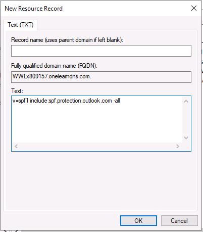

# [学習パス 1 - ラボ 1 - 演習 3 - カスタム ドメインの追加](https://github.com/ctct-edu/ms-102-lab/blob/main/Instructions/Labs/LAB_AK_01_Lab1_Ex3_Add_a_Domain.md#learning-path-1---lab-1---exercise-3---add-a-custom-domain)

すべての企業がドメインを 1 つだけ持っているわけではありません。実際、多くの企業は複数のドメインを持っています。Adatum は、Adatum のオンプレミス環境ではなく Microsoft Azure に存在する新しいドメイン (xxxUPNxxx.xxxCustomDomainxxx.xxx、正確な名前はラボ ホスティング プロバイダーによって提供されます) を購入したところです。Adatum の新しいカスタム ドメインをサポートするために、ラボ ホスティング プロバイダーが Adatum のサードパーティ ドメイン レジストラーの役割を引き受けました。

この演習では、このドメインを Adatum の Microsoft 365 展開に追加する経験を積みます。Microsoft 365 にドメインを追加すると、そのドメインは承認済みドメイン、またはカスタム ドメインと呼ばれます。カスタム ドメインを使用すると、企業は電子メールとアカウントに独自のブランドを設定できるため、顧客は電子メールの送信者 (@contoso.com など) を確認できます。新しいドメインの追加は、次の 3 つのステップからなるプロセスです。

- まず、オンプレミス DNS にドメインの新しいゾーンを追加する必要があります。
- Microsoft 365 にドメインを追加する必要があります。
- Microsoft 365 に新しいドメインを追加する場合は、対応する DNS レコードを DNS のドメインに追加する必要もあります。これらの DNS レコードは、会社が新しいドメインに対して必要とするサービスをサポートするために必要です。

ほとんどの企業は、ドメインの DNS レコード自体を個人的に管理していません。代わりに、これらのレコードを管理するサードパーティのリソースが用意されています。この取り組みを支援するために、Microsoft 365 は、企業の DNS レコードを自動的に追加および置換する自動化ツールを特定のサードパーティ ドメイン レジストラーに提供します。この自動化ツールは、サードパーティのレジストラーと Microsoft 365 のサインイン資格情報も連携します。ツールを使用して DNS レコードを自動的に維持することは、企業がこれらのレコードを手動で維持する必要があり、多くの場合人的労力が必要だった時代からの非常に歓迎される改善です。かなり複雑なプロセスにエラーが発生します。これらのツールを使用すると、DNS レコードを手動で追加する必要がなくなるため、プロセスから人的エラーが排除されます。

**ただし、このラボの目的では、DNS レコードの内容と、新しいドメインに DNS レコードが必要な理由について経験と理解を得るために、この新しいカスタム ドメインに必要な DNS レコードを手動で作成するように求められます 。**

### タスク 1 - カスタム ドメインの追加

ホストされたラボ環境では、Adatum には、 xxxxxZZZZZZ.onmicrosoft.comという名前の Microsoft 365 ドメインとともに、**adatum.com**という名前の既存のオンプレミス ドメインがすでにあります。このラボでは、 **xxxUPNxxx.xxxCustomDomainxxx.xxx**という名前の Adatum 用の 2 番目の Microsoft 365 ドメインを作成します。**xxxUPNxxx は、** ラボ ホスティング プロバイダーによってテナントに割り当てられた UPN 名 (テナント プレフィックス) に置き換えます。また、 **xxxCustomDomainxxx.xxx**は、ラボ ホスティング プロバイダーのカスタム ドメイン名に置き換えます。インストラクターは、ラボ ホスティング プロバイダーのカスタム ドメイン名を提供し、UPN 名の検索方法を説明します。

1. Adatum のドメイン コントローラー **LON-DC1**に切り替えます。

2. **LON-DC1**では、 **Ctrl+Alt+Delete**を選択してログインする必要があります(VM 環境でこのオプションを見つける方法については、インストラクターが説明します)。ラボ ホスティング プロバイダー ( Administrator )によって作成されたローカル Adatum 管理者アカウントとして、パスワード**Pa55w.rd**を使用して LON-DC1 にログインします。

3. LON-DC1 では、サーバー マネージャーが起動時に自動的に起動します。このタスクの後半で使用するため、閉じないでください。ここでは、サーバー マネージャー ウィンドウを最小化するだけです。

4. 新しいドメインを作成するには、まずオンプレミス DNS に新しい前方参照ゾーンを作成する必要があります。これを行うには、 Windows PowerShellの昇格されたインスタンスを開く必要があります。画面下部のタスクバーにある虫眼鏡 (検索) アイコンを選択し、表示される検索ボックスに「**power」と入力します。**検索結果のアプリの一覧で、**[Windows PowerShell]**を右クリックし([Windows PowerShell ISE] は選択しないでください)、ドロップダウン メニューで**[Run as administrator]を選択します。**

5. PowerShell ウィンドウを最大化します。**Windows PowerShell**で、コマンド プロンプトに次のコマンドを入力して、オンプレミス DNS に新しい前方参照ゾーンを作成します。その際、**WWLxZZZZZZ** をテナントプレフィックスに置き換えます。

   ```
    dnscmd /zoneadd WWLxZZZZZZ.onelearndns.com /DsPrimary
   ```

6. Windows PowerShell ウィンドウを最小化します (後で使用するため、閉じないでください)。

13. Microsoft 365 管理センターが、前のラボからブラウザーで開いたままになっているはずです。Microsoft 365 管理センター  の左側のナビゲーション ウィンドウで、 **[...すべて表示]**  を選択し、 **[設定]** を選択し、 [**設定]** グループで [**ドメイン]** を選択します。

14. [ドメイン]ページでは、ドメインのリストに**xxxxxZZZZZZ.onmicrosoft.com** ドメインのみが表示されることに注意してください。Adatum の新しい Microsoft 365 ドメインを追加するには、ドメインのリストの上に表示されるメニュー バーで **[+ドメインの追加]** を選択します。これにより、ドメインの追加セットアップ ウィザードが開始されます。

15. ドメインの追加 セットアップ ウィザードの[ドメインの追加]ページで、 **[ドメイン名] フィールドに新しいドメイン名を入力** します。これは、DNS に新しいゾーンを作成したときに手順 5 の PowerShell コマンドに入力したのと同じドメイン名(例：WWLxZZZZZZ.onelearndns.com )である必要があります。次に、ページの下部に表示される [**このドメインを使用する(Use this domain)]ボタンを選択します。**

16. [ドメインを所有していることを確認する] ページで、ドメインの所有者であることを証明するための確認方法を選択する必要があります。このラボでは、[ドメインの DNS レコードに TXT レコードを追加する(Add a TXT record to the domain's DNS records)]オプションがデフォルトで選択されていることを確認し (必要に応じてこのオプションを選択します)、 **[続行(Continue)]**　を選択します。

17. [レコードを追加して所有権を確認する] ページで、後で DNS マネージャーでドメインを構成できるように、TXT 値 (TXT 名ではありません)をコピーする必要があります。これを行うには、**TXT 値 の左側( MS=msXXXXXXXXの左側)に表示されるレコードのコピーアイコンを選択** します。 ダイアログ ボックスが表示された場合は、[アクセスを許可する] を選択して、この値を Web ページからクリップボードにコピーします。

    **重要:** この時点では [確認(Verify)]  ボタンを選択しないでください。代わりに、次のステップに進みます。

18. **LON-DC1**に切り替えます。ドメインの追加 ウィザードでこのドメインの所有者であることを確認する前に、まずサーバー マネージャーでこのドメインの DNS レコードを追加する必要があります。ページ下部のタスクバーに表示される **サーバー マネージャー** アイコンを選択します。必要に応じて、サーバー マネージャー ウィンドウを最大化します。

19. サーバー マネージャー ダッシュボード で、ウィンドウの右上隅にある **[ツール]** を選択します。表示されるドロップダウン メニューで **[DNS]** を選択すると、[DNS Manager] が開きます。DNS マネージャー ウィンドウを最大化します。

20. [DNS マネージャー] ウィンドウの左側のペインで、  **[LON-DC1]** を選択して展開します。LON-DC1 の下で、**Forward Lookup Zones** フォルダーを展開します。左側のペインの前方参照ゾーンの一覧で、以前に Windows PowerShell に追加した **WWLxZZZZZZ.onelearndns.comゾーンを選択します。** このゾーンは、右側の詳細ウィンドウではなく、左側のウィンドウで選択していることを確認してください。

21. 左側のペインで前に選択したこの **WWLxZZZZZZ.onelearndns.com** ゾーンを右クリックします。表示されるメニューで、**「Other New Record...」** を選択します。

22.  [Select a resource record type] フィールドで、下にスクロールして **[Text (TXT)] を選択し、** ウィンドウの下部にある **[Create Record...]** ボタンを選択します。

23. 表示される **[New Resource Record]**  ウィンドウの **[Text(TXT)]**  タブで、**[Record Name]**  フィールドを空白のままにします。 **「Text」**  フィールドに、Microsoft 365 管理センターでクリップボードにコピーした**MS=msXXXXXXXX** の TXT 値を貼り付けます。

    

24. **[OK]** を選択してレコードを作成します。

25. [Resource Record Type] ウィンドウで、**[Done]** を選択します。

    「DNS マネージャー」 ウィンドウは開いたままにしておきますが、このタスクの後の手順でこのウィンドウに戻るため、ウィンドウを最小化します。サーバー マネージャーウィンドウも最小化します。

26. TXT レコードを追加したので、LON-DC1からブラウザーのMicrosoft 365 管理センターに切り替えます。 [レコードを追加して所有権を確認する] ページの下部に表示される **「確認(Verify)」** ボタンを選択します。

    **警告:**　行ったばかりの DNS マネージャーの変更がシステムに反映されるまでに最大 5 ～ 10 分かかる場合があります。また、レジストラー (この場合はラボ ホスティング プロバイダー) によっては、かなり長い時間がかかる場合もあります。追加したレコードをシステムが検出できなかったことを示すエラーが表示された場合は、5 分待ってから [再試行]ボタンを選択します。TXT レコードが正常に検証されるまで、これを 5 分ごとに繰り返します。検証が完了すると、[ドメインにどのように接続しますか?] というメッセージが表示されます。ウィンドウが表示されます。

    **注意:** タイプミスやその他の設定ミスがある場合、ドメインは検証されません。この問題が発生した場合、「**ドメインにどのように接続しますか?」** 次の手順のウィンドウは表示されません。この場合、**「戻る」**  ボタンを選択してこのタスクを繰り返します。ドメインを構成するときは時間をかけて、プロセスのこのステップで同様の問題が発生しないようにしてください。

27. テキスト (TXT) レコードが正常に検証された場合は、「お使いのドメインにはどの方法で接続しますか?(How do you want to connect your domain?)」 ウィンドウが表示されます。**[続行(Continue)]** を選択します。

28. **[DNS レコードの追加(Add DNS records)]** ウィンドウでは、DNS がサポートする 3 つのサービス (Exchange と Exchange Online Protection、Skype for Business、Microsoft 365 の Intune とモバイル デバイス管理) の DNS レコードを追加できます。

     [Exchange および Exchange Online Protection]セクションで、   **[MX レコード (1)]** セクションの前向き矢印 ( **>** )を選択して展開します。これにより、DNS マネージャーでこのドメインに対して作成する MX レコードにドメイン セットアップ ウィザードが期待する期待値が表示されます。

    **次に、 [CNAME レコード (1)]** セクションと **[TXT レコード (1)]** セクションで前向き矢印 ( **>** )を選択します。これで、3 つのレコード タイプがすべて展開されるはずです。

23. まず、 Exchange および Exchange Online Protection サービスに必要なMX レコード を追加します。

    ａ．[MX レコード (1)] セクションの [**参照先のアドレスまたは値]** 列で、予想される値 (例: WWLxZZZZZZ-onelearndns-com.mail.protection.outlook.com) の左側に表示される **コピー アイコンを選択** します。この値をクリップボードにコピーします。

    b. ここで LON-DC1のDNS マネージャーに切り替えます。ページの下部にあるタスクバーで、**[DNS マネージャー]** アイコンを選択します。

    c. DNS マネージャー の左側ペインのForward Lookup Zones で、以前に中断したときからWWLxZZZZZZ.onelearndns.comドメインが選択されているはずです。 ここで、このドメインのMail Exchanger (MX) レコードを作成する必要があります。 **WWLxZZZZZZ.onelearndns.com ドメインを右クリック** し、**[New Mail Exchanger (MX)...]を選択します。**

    d. [New Resource Record\] ウィンドウの [Mail Exchanger (MX)] タブで、[Host or child domain] フィールドを空白のままにし、  [Fully qualified domain name (FQDN) of mail server] フィールドに、上記の手順 a でクリップボードにコピーした、参照先のアドレスまたは値を貼り付けます。

    

    e. [新しいリソース レコード]  ウィンドウで、**[OK]**  を選択します。

    f. Microsoft 365 管理センターの [ **DNS レコードの追加]** ページに戻ります。

30. 次の手順を実行して、Exchange および Exchange Online Protection サービスに必要な **CNAME レコードを追加します。**

    ａ．[DNS レコードの追加] ページの[CNAME レコード (1)]セクションの **[参照先のアドレスまたは値]** 列で、予想される値 (例: autodiscover.outlook.com) の左側に表示される **コピー アイコンを選択** します。

    b. LON-DC1に切り替え、DNS マネージャー の [前方参照ゾーン] で、 **WWLxZZZZZZ.onelearndns.comドメインを右クリック **し、**[New Alias (CNAME)...]を選択します。**

    c. [New Resource Record]  ウィンドウで、[Alias Name] フィールドに **「autodiscover」** と入力します。

    d.  **[Fully qualified domain name(FQDN)] フィールド ** に、以前にクリップボードにコピーした、参照先のアドレスまたは値 を貼り付けます。

    

    e. [New Resource Record] ウィンドウで、**[OK]** を選択します。

    f. Microsoft 365 管理センターに戻ります。

31. Exchange および Exchange Online Protection サービスに必要な **TXT レコード** を追加して終了します。

    ａ．[DNS レコードの追加] ページの[ TXT レコード (1)]セクションの **[TXT 値]** 列で、予想される値 (たとえば、 v=spf1 include:spf.protection.outlook.com -all) の左側に表示される **コピー アイコンを選択** して、この値をクリップボードにコピーします。

    b. LON-DC1に切り替えます。DNS マネージャーの[前方参照ゾーン]で、 **WWLxZZZZZZ.onelearndns.com**ゾーンを右クリックします。表示されるメニューで、**「Other New Record...」** を選択します。

    c. [Select a resource record type] フィールドで、下にスクロールして **[Text (TXT)] を選択し、** ウィンドウの下部にある **[Create Record...]** ボタンを選択します。

    d. 表示される [New Resource Record]  ウィンドウの **[Text(TXT)]**  タブで、 [Record Name]  フィールドを空白のままにします。 **「Text」** フィールドに、Microsoft 365 管理センターでクリップボードにコピーした参照先のアドレスまたは値の TXT 値を貼り付けます。

    

    e. [New Resource Record] ウィンドウで、**[OK]** を選択します。

    f. [Resource Record Type] ウィンドウで、**[Done]** を選択します。

32. DNS マネージャー には、ドメインを確認するために最初に作成した TXT レコードと、このドメイン内で Exchange サービスが動作するように作成した MX、CNAME、および TXT レコードが表示されます。

    DNS マネージャー ウィンドウを最小化します。

33. Microsoft 365 管理センターの [DNS レコードの追加(Add DNS Record)] ページに戻ります。**[続行(Continue)]** を選択して、新しいドメインのセットアップを完了します。この時点で 3 つのレコードすべてが検証されます。

    3 つのレコードすべてが正常に検証されると、[ドメインのセットアップが完了しました ] ページが表示されます。この問題が発生した場合は、**[完了]** ボタンを選択してドメインのセットアップ プロセスを完了します。

    ただし、3 つのレコードのいずれかが正常に検証されなかった場合は(数分後に再試行すると正常に検証されるケースもありますが)、[ DNS レコードの追加]ウィンドウに戻り、各レコード タイプの横にチェックマークまたは感嘆符が表示され、どのレコードが正常に検証され、どのレコードが検証されなかったかが示されます。赤い円内の感嘆符は、対応する DNS レコードに問題があり、正常に検証されなかったことを示します (レコードの実際の値が空白のままであることに注意してください)。この問題が発生した場合、、DNS マネージャーで対応するレコードのデータを修正し、もう一度[続行] を選択する必要があります。3 つのレコードすべてが正常に検証され、[ドメインのセットアップが完了しました] ページが表示されるまで、このプロセスを繰り返す必要があります。

34. ドメインのセットアップ プロセスが完了し、Exchange および Exchange Online Protection サービスに対して 3 つの DNS レコードが正常に検証されると、[ドメイン] ページが表示されます。**WWLxZZZZZZ.onelearndns.comドメインのドメイン ステータスが[正常]であることを確認** します。このドメインはドメインのリストに表示されます。この新しいドメインには、Adatum のデフォルト ドメインとしてもフラグを設定する必要があります。

35. Holly は、Adatum の Microsoft 365 展開に新しいドメインを実装する準備がまだ整っていません。したがって、 xxxxxZZZZZZ.onmicrosoft.com ドメインを既定の Microsoft 365 ドメインとしてリセットしたいと考えています。[ドメイン]ページで、 **xxxxxZZZZZZ.onmicrosoft.com ドメインの右側にある縦方向の省略記号 ( [その他のアクション ] ) アイコンを選択** します。ドロップダウン メニューに表示される **[既定に設定]** を選択します。

    

36. 「このドメインを既定に設定しますか?」表示されるダイアログ ボックスで、**[既定に設定]** ボタンを選択します。このドメインは、 [ドメイン] ページのデフォルト ドメインとして表示されます。

37. Microsoft EdgeとWindows PowerShell の両方を開いたままにして、LON-DC1 VM にログインしたままにしてください。ID 同期を実行する後のラボで LON-DC1 に戻ります。
