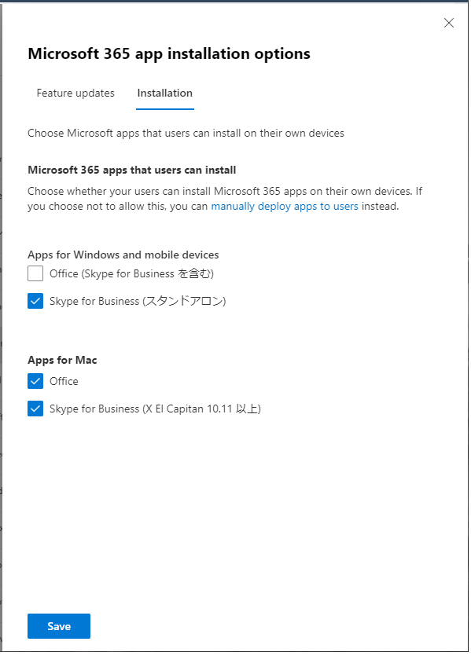

# [ラーニング パス 2 - ラボ 2 - 演習 3 - Microsoft 365 Apps for enterprise のインストールを管理する](https://github.com/ctct-edu/ms-102-lab/blob/main/Instructions/Labs/LAB_AK_02_Lab2_Ex3_M365_Apps.md#learning-path-2---lab-2---exercise-3---manage-a-microsoft-365-apps-for-enterprise-installation)

あなたは Adatum の新しい Microsoft 365 管理者である Holly Dickson になり、仮想化されたラボ環境に Microsoft 365 を展開しました。この演習では、ユーザー主導の Microsoft 365 Apps for enterprise インストールを管理するために必要なタスクを実行します。ユーザー主導の Microsoft 365 Apps for enterprise インストールの実行は、次の 2 段階のプロセスです。

- ユーザーが Office 365 展開ツールをダウンロードしてインストールできるようにユーザー アカウントを構成します。
- インストールを実行します。

この演習の最初の 2 つのタスクでは、ユーザーによる Microsoft 365 Apps for enterprise スイートのダウンロードをブロックできるかどうかに影響する次の条件を確認します。

- ユーザーが適切な Microsoft 365 ライセンスを持っているかどうか (タスク 1 で確認します)。
- 管理者が、すべてのユーザーのモバイル アプリとデスクトップ アプリのダウンロードを制御するグローバルな Office ダウンロード設定をオフにしているかどうか (タスク 2 で確認します)。

### タスク 1 – ライセンスがエンタープライズ向け Microsoft 365 Apps のインストールにどのような影響を与えるかを確認する

このタスクでは、Holly は、適切な Microsoft 365 ライセンスが割り当てられていないユーザーが Microsoft 365 Apps for enterprise をダウンロードできるかどうかをテストします。このテストでは、 Microsoft 365 管理センターのアクティブ ユーザーリストに表示される既存のユーザーを使用することはできません。これらのユーザーは Microsoft 365 アカウント (xxxxxZZZZZZ.onmicrosoft.com アカウント) のみを持っています。

したがって、ラボ ホスティング プロバイダーによってオンプレミス ドメイン (adatum.com) に読み込まれた Adatum のオンプレミス ユーザー アカウントの 1 つを使用する必要があります。 **このテストでは、 Laura Atkins** を使用します。Laura に Microsoft 365 ライセンスを割り当てる必要があります。ただし、使用可能なライセンスがないため、まず既存の Microsoft 365 ユーザー アカウントからライセンスの割り当てを解除する必要があります。この場合、Holly は Pradeep Gupta のライセンスの割り当てを解除します。これは、彼が新しい役割を引き受け、Adatum の Microsoft 365 パイロット プロジェクトに関与しなくなるためです。

1. お手元のPCでInPrivate ウィンドウ(Microsoft Edge) もしくは、シークレットウィンドウ (Google Chrome) で、Microsoft 365 管理センター (https://admin.microsoft.com) にアクセスし、Hollyの資格情報でサインインします。

2. Microsoft 365 管理センターの ナビゲーション ウィンドウで、**[ユーザー]** を選択し、  **[アクティブなユーザー]** を選択します。[アクティブ ユーザー] ページで、**[Pradeep Gupta]** を選択します。

3. 表示される[Pradeep Gupta]ペインには、デフォルトで[アカウント]タブが表示されます。**[ライセンスとアプリ]**タブを選択します。**[Microsoft 365 E5 (Teams なし)]** および **[Microsoft Teams Enterprise]** チェック ボックスをオフにし、 [**変更の保存]** を選択します。ウィンドウ右上の **[x]** を選択して「Pradeep Gupta」ペインを閉じます。以前に Pradeep に割り当てられていたライセンスが、Laura にも使用できるようになりました。

4. [アクティブなユーザー]ウィンドウの上部にあるメニュー バーで **[ユーザーの追加]** を選択します。これにより、ユーザーの追加ウィザードが開始されます。

5. ユーザーの追加ウィザードの 「基本のセットアップ」 ウィンドウで、次の情報を入力します。

   - 姓：**Laura**
   - 名: **Atkins**
   - 表示名:  **Laura Atkins** 
   - ユーザー名:**Laura**

   **重要:** [ユーザー名] フィールドの右側には、ドメイン フィールドがあります。この値を **xxxxxZZZZZZ.onmicrosoft.com**ドメインにします(xxxxxZZZZZZ は、ラボ ホスティング プロバイダーによって提供されるテナント プレフィックスです)。

   このフィールドを構成すると、Laura の**ユーザー名は**次のように表示されます: **[Laura@xxxxxZZZZZZ.onmicrosoft.com](mailto:Laura@xxxxxZZZZZZ.onmicrosoft.com)**

   - パスワード設定:  **[パスワードを自動作成する]** オプションをクリア (チェックを外します)
   - パスワード:テナント管理者アカウント (つまり、MOD 管理者アカウント) に対してラボ ホスティング プロバイダーから提供されたものと同じ**Microsoft 365 管理者 パスワードを入力します。**
   - [**初回サインイン時にこのユーザーにパスワードの変更を要求する] チェック ボックスをオフ** にします (チェックを外します)。

6. **「次へ」** を選択します。

7. [製品ライセンスの割り当て] ウィンドウで、 **[Microsoft 365 E5 (Teams なし)]** および **[Microsoft Teams Enterprise]** チェック ボックスをオンにし、**[次へ]** を選択します。

8. [オプションの設定] ウィンドウで、**[次へ]** を選択します。

9. [確認と終了] ウィンドウで、選択内容を確認します。変更する必要がある場合は、適切な 編集 リンクを選択し、必要な変更を加えます。それ以外の場合は、すべてが正常であれば、**[追加の完了]** を選択します。

10. [アクティブ ユーザーに追加された Laura Atkins] ページで、**[閉じる]** を選択します。

### タスク 2 – Office のグローバル ダウンロード設定が Microsoft 365 Apps for enterprise のインストールにどのような影響を与えるかを確認する

Microsoft 365 には、すべてのユーザーのモバイル アプリとデスクトップ アプリのダウンロードを制御するグローバルな Office ダウンロード設定が含まれています。ホリーはこれから、管理者がこの設定をオフにした場合に、ユーザーが Microsoft 365 Apps for enterprise をダウンロードすることを禁止できるかどうかをテストする予定です。このテストでは、ホリーはテスト ケースとして再びローラ アトキンスを使用します。

1. Adatum の Microsoft 365 管理者である Holly Dickson として 、ブラウザーでMicrosoft 365 管理センターにログインします。

2. ナビゲーション ウィンドウの[設定] グループ内で **[組織設定]** を選択します。

3. [組織の設定]ウィンドウで画面を下にスクロールし、**Microsoft 365‎ インストールオプションを**選択します。

4. 表示されるMicrosoft 365 インストール オプションウィンドウには、既定で[機能更新]タブが表示されます。その横に表示される **「インストール]** タブを選択します。

5. **[Office (Skype for Business を含む)]** チェック ボックスがオンになっていますが、オフにします。これにより、ユーザーは Microsoft 365 Apps for enterprise を通じて Office アプリをダウンロードできなくなります。

   

6. **[保存(Save)]** を選択します。

7. Microsoft 365 アプリのインストール オプションウィンドウの上部で、このウィンドウの右上隅にある **[X]** を選択してウィンドウを閉じます。

8. お手元のPCでブラウザーのInPrivate ウィンドウ(Microsoft Edge) もしくは、シークレットウィンドウ (Google Chrome) を起動し、Microsoft 365 ポータル (https://portal.office.com/) にアクセスし、**Laura Atkins として Microsoft 365 にサインイン** します。[サインイン]ウィンドウに「Laura@xxxxxZZZZZZ.onmicrosoft.com」と入力します(xxxxxZZZZZZ は、ラボ ホスティング プロバイダーによって提供されるテナント プレフィックスです)。[パスワードの入力]ウィンドウで、ラボ ホスティング プロバイダーからテナント管理者アカウント (つまり、MOD 管理者アカウント) 用に提供されたものと同じMicrosoft 365 管理者 パスワードを入力します。

9. ページの中央に[Microsoft 365 へようこそ] ダイアログ ボックスが表示された場合は、前向き矢印 (>) を 2 回選択してからチェック マークを選択してダイアログ ボックスを閉じます。

10. 「Microsoft 365 Apps で Copilot Chat のロックを解除する」というメッセージが表示される場合があります。その場合は **[今はスキップする]** を選択してください。 

11. **[Microsoft 365 へようこそ]** ウィンドウ (Laura の Microsoft 365 ホーム ページ)で **[インストールなど]** ボタンを選択し、表示されるドロップダウン メニューで **[Microsoft 365 アプリをインストールする]** を選択します。これにより、Laura の[マイ アカウント]ウィンドウが開きます。

12. Laura の[マイ アカウント] ウィンドウの **[アプリとデバイス]**   を選択します。

13. [アプリとデバイス]ウィンドウの[Office]セクションの下に、管理者が Office のインストールをオフにしたことを示すメッセージが表示されます。

    **重要:** Office のグローバル ダウンロード設定がオフになっている場合、ライセンスを取得したユーザーは Microsoft 365 Apps for enterprise をダウンロードできないことが確認されました。

14. この時点で、ホリーは、ローラがエンタープライズ向け Microsoft 365 アプリをダウンロードできるように、Office のグローバル ダウンロード設定をオンに戻したいと考えています。

    Holly Dickson として Microsoft 365 にログインしているブラウザーに切り替えます。Microsoft 365 管理センターのナビゲーション ウィンドウの[設定]セクションで、 **[組織の設定]** を選択します。

15. [組織設定]ウィンドウには、デフォルトで[サービス]タブが表示されます。サービスのリストを下にスクロールし、**‎Microsoft 365‎ インストールオプション** を選択します。

16. ‎Microsoft 365‎ installation optionsウィンドウで、**[インストール]**  タブを選択し、[ Windows およびモバイル デバイス用アプリ]セクションで、 **[ Office (Skype for Business を含む)]** チェック ボックスは現在空白です。このチェック ボックスを **オンにする** とチェック マークが表示され、この機能がオンに戻ります。

17. **[保存(Save)]** を選択し、更新が保存されたら、このウィンドウの右上隅にある **[X]** を選択してウィンドウを閉じます。

18. このグローバル Office ダウンロード オプションがオンに戻ったので、Laura が Microsoft 365 Apps for enterprise をダウンロードする機能に影響するかどうかを確認する必要があります。Laura Atkins  として Microsoft 365 にログインしているブラウザーに切り替えます。ブラウザ上部のアドレス バーの左側に表示される **[更新]** アイコンを選択してブラウザーを更新します。[Office アプリとデバイス] タイルの下で、**[アプリとデバイスを表示]** を選択します。

19. [Office のインストール] ボタンが表示されます 。（表示されない場合、再サインイン等お試しください）

​    

