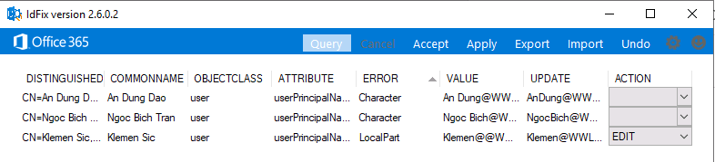

# [ラーニング パス 3 - ラボ 3 - 演習 1 - ID 同期の準備](https://github.com/ctct-edu/ms-102-lab/blob/main/Instructions/Labs/LAB_AK_03_Lab3_Ex1_Prepare_Identity_Synch.md#learning-path-3---lab-3---exercise-1---prepare-for-identity-synchronization)

前のラボ演習と同様に、Adatum Corporation の新しい Microsoft 365 管理者である Holly Dickson の役割を引き受けます。Adatum は最近 Microsoft 365 をサブスクライブし、あなたは Adatum の仮想化されたラボ環境にアプリケーションを展開する任務を与えられました。このラボでは、Microsoft 365 管理センターと Windows PowerShell の両方を使用して、Microsoft 365 ID 環境を管理するために必要なタスクを実行します。

この演習では、Azure AD Connect をセットアップして管理します。オンプレミス ユーザーを作成し、その ID がクラウドに移動されるように同期プロセスを検証します。ユーザーとグループのメンテナンス手順の中には、以前の演習でおなじみのものもあるかもしれません。ただし、この場合、同期プロセスを検証するために必要です。

### タスク 1: UPN サフィックスを構成する

Active Directory では、デフォルトのユーザー プリンシパル名 (UPN) サフィックス (つまり、テナント プレフィックス) は、ユーザー アカウントが作成されたドメインの DNS 名です。Azure AD Connect ウィザードでは UserPrincipalName 属性を使用するか、Azure AD でユーザー プリンシパル名として使用するオンプレミス属性 (カスタム インストールの場合) を指定できます。これは、Azure AD へのサインインに使用される値です。

思い出してください。VM 環境は、 adatum.com というタイトルのオンプレミス ドメインを使用して、ラボ ホスティング プロバイダーによって作成されました。このドメインには、Holly Dickson、Laura Atkins など、いくつかのオンプレミス ユーザー アカウントが含まれていました。次に、このコースの前半のラボで、 WWLxZZZZZZ.onelearndns.com という名前の Adatum 用のカスタム承認済みドメインを作成しました 。

 このタスクでは、PowerShell を使用して、最初に確立されたadatum.com ドメインをカスタム WWLxZZZZZZ.onelearndns.com ドメインに置き換えることにより、Adatum Corporation 全体のドメインのユーザー プリンシパル名を変更します。その際、プライマリ ドメインの UPN サフィックスと、AD DS のすべてのオンプレミス ユーザー アカウントの UPN を @WWLxZZZZZZ.onelearndns.com で更新します。

1. **Adatum のドメイン コントローラーであるLON-DC1** に切り替えます。ここでも **ADATUM\Administrator** およびパスワード **Pa55w.rd** としてログインしているはずです。

2. Windows PowerShell がまだ開いている場合は、タスクバーの **PowerShellアイコンを選択します。** それ以外の場合は、タスクバーの虫眼鏡 (検索) アイコンを選択し、表示される検索ボックスに「power」と入力し、Windows PowerShellを右クリックし、 [Run as administrator] を選択して、 Windows PowerShell を開く必要があります。ドロップダウン メニュー。Windows PowerShell が開いたら、ウィンドウを最大化します。

3. PowerShell の実行ポリシー設定は、Windows システム上でどの PowerShell スクリプトを実行できるかを決定します。このポリシーを **unrestricted** に設定すると、Holly はすべての構成ファイルをロードし、すべてのスクリプトを実行できるようになります。コマンド プロンプトで次のコマンドを入力し、Enter キーを押します。

   ```
    Set-ExecutionPolicy unrestricted
   ```

   実行ポリシーを変更するかどうかを確認するメッセージが表示されたら、   **「A 」と入力して**  **[A] すべてはいを** 選択します。

4. Windows PowerShell を使用して、オンプレミスの adatum.com ドメインを WWLxZZZZZZ.onelearndns.com ドメインに置き換える必要があります。その際、プライマリ ドメインの UPN サフィックスと、AD DS 内のすべてのユーザーの UPN を WWLxZZZZZZ.onelearndns.com で更新します。

   次の PowerShell コマンドでは、 Set-ADForest コマンドレットは Active Directory フォレストのプロパティを変更し、 -identity パラメーターは変更する Active Directory フォレストを指定します。 このタスクを実行するには、**次のコマンドを実行して、 adatum.comフォレストの  UPNSuffixes プロパティを設定します (WWLxZZZZZZ を一意の UPN 名に変更することを忘れないでください) 。** 

   ```
    Set-ADForest -identity adatum.com -UPNSuffixes @{replace="WWLxZZZZZZ.onelearndns.com"}
   ```

5. 次に、**次のコマンドを実行して、既存のすべての adatum.com アカウントを新しい UPN @xxxUPNxxx.xxxCustomDomainxxx.xxx ドメインに変更する必要があります  (WWLxZZZZZZ を一意の UPN 名に変更することを忘れないでください) 。**

   ```
    Get-ADUser -Filter * -Properties SamAccountName | ForEach-Object { Set-ADUser $_  -UserPrincipalName ($_.SamAccountName + "@WWLxZZZZZZ.onelearndns.com" )}
   ```

6. 次のタスクでは、引き続き LON-DC1 で PowerShell を使用します。

### タスク 2: 問題のあるユーザー アカウントを準備する

オンプレミスの Active Directory を Azure AD と統合すると、クラウドとオンプレミスの両方のリソースにアクセスするための共通の ID が提供され、ユーザーの生産性が向上します。ただし、ID データが Windows Server Active Directory (AD DS) から Azure Active Directory (Azure AD) に同期されるときにエラーが発生する可能性があります。

たとえば、オンプレミスの Active Directory では、2 つ以上のオブジェクトの ProxyAddresses 属性または UserPrincipalName属性が同じ値を持つ場合があります。 同期エラーが発生する可能性のあるさまざまな条件が多数あります。組織は、Microsoft の IdFix ツールを実行することでこれらのエラーを修正できます。このツールは、Azure Active Directory への移行に備えて、オンプレミスの Active Directory 環境で ID オブジェクトとその属性の検出と修復を実行します。

このタスクでは、オンプレミスのユーザー アカウントを破壊するスクリプトを実行します。Adatum パイロット プロジェクトの一環として、次のタスクで IdFix ツールを実行して壊れたアカウントを修正する方法を確認できるように、意図的に ID オブジェクトを破壊します。

1. ドメイン コントローラー VM (LON-DC1) の Windows PowerShell ウィンドウで **次のコマンドを実行してルート ソースを  C:\labfiles  に変更** し、その場所から任意のファイルにアクセスできるようにします。

   ```
    CD C:\labfiles\
   ```

2. **次のコマンドを入力** すると、問題のあるユーザー アカウントを作成する PowerShell スクリプトが実行されます。このスクリプトは C:\labfiles フォルダーに保存されており、Klemen Sic のオンプレミス ユーザー アカウントの UserPrincipalName に意図的に問題を引き起こします。これにより、次のタスクで IdFix ツールを使用してこのアカウントのトラブルシューティングを行うことができます。

   ```
    .\CreateProblemUsers.ps1
   ```

    **重要:** スクリプトが完了するまで待ってから、次のタスクに進みます。この Windows PowerShell スクリプトは、AD DS に次の変更を加えます。

   - Klemen の UserPrincipalName を更新して、追加の「@」文字を含めます。

3. Windows PowerShell ウィンドウを最小化します。

### タスク 3: IdFix ツールを実行し、特定された問題を修正する

このタスクでは、IdFix ディレクトリ同期エラー修復ツールをダウンロードして使用し、前のタスクで意図的に破損した Klemen Sic のオンプレミス ユーザー アカウントを修正します。IdFix ツールを実行すると、オンプレミス環境と Azure AD の間で ID データを同期する前に、ユーザー アカウントのエラーが修正されます。

1. 前のタスクで 管理者 として LON-DC1 にログインしたままである必要があります。

2. LON-DC1 で、タスクバーの **Microsoft Edgeアイコンを選択します。**  Microsoft Edge ブラウザーで新しいタブを開き、アドレス バーに次の URL を入力して、Microsoft -IdFix の概要ページにアクセスします。

   **https://microsoft.github.io/idfix**

3. [Microsoft - IdFix] ページの画面左側のナビゲーション ウィンドウで、 **[Step2: Install IdFix]** を選択します。

4.  [Step2: Install IdFix] ページの最初の行にある、 **「setup.exe」** ハイパーリンクを選択してIdFix アプリケーションをマシンにダウンロードします。

5. setup.exeファイルがダウンロードされると、ページの右上に[ダウンロード]ウィンドウが表示されます。このウィンドウの setup.exe で、 **「Open file」** を選択してLON-DC1 にファイルをインストールします。これにより、アプリケーション インストールウィザードが開始されます。

6. 「このアプリケーションをインストールしますか?」アプリケーション インストールウィザードのページで、 **[Install]** を選択します。

7. [IdFix Privacy Statement] メッセージ ボックスで **[OK]** を選択します。IDFix ツールがインストールされると、アプリケーション インストールウィザードが閉じ、IDFixツールが自動的に開きます。

8. 表示されるIdFixツールで、ウィンドウを最大化します。画面の最上部にあるメニュー バーで、 **[Query]** を選択してディレクトリをクエリします。少し待つと、いくつかのエラーが表示されるはずです。

    **注:** [Schema Warning] ダイアログ ボックスが表示された場合は、 **[Yes]** を選択して続行します。

9. **ERROR** 列見出しを選択して、レコードをアルファベット順のエラー順に並べ替えます。

   **注:** トップレベル ドメイン エラーが表示された場合は、IdFix ツールでは修正できないため、無視してください。

10. **Klemen Sic** 行の **VALUE** 列のテキストに注目してください。現在、これには 2 つの **@@** 記号が含まれています。これらは、Klemen の UserPrincipalName を意図的に破壊する前のタスクでスクリプトを実行したときに発生しました。 **UPDATE** 列のテキストに注目してください。これは、IDFix ツールに指示した場合に、IDFix ツールが UPN 名を変更する値です。

     IDFix ツールで Klemen の UPN 値を修正する必要があるため、**Klemen の[ACTION] フィールドのドロップダウン矢印を選択** し、  **[EDIT]** を選択します。

    

    **注:** 残りの 2 つのユーザー アカウントはどちらも更新しないでください。今のところは無視してください。

11. ウィンドウの上部にあるメニュー バーで、 **[Apply]** を選択します。

12.  表示される[Apply Pending] ダイアログ ボックスで、 **[Yes]** 選択します。

     **注:** Klemen Sic の場合、 [アクション] 列の値が  EDIT  から  COMPLETE  に変更されていることに注目してください。これは、IdFix ツールが Klemen Sic のユーザー オブジェクトを更新することでエラーを修正したことを示しています。

13. ページ上部のメニュー バーで、**[Query]** を選択します。 **「Schema Warning」** ダイアログ・ボックスが表示された場合は、**「Yes」** を選択して続行します。未処理の例外が発生したことを示すダイアログ ボックスが表示された場合は、**[Continue]** を選択します。

    IdFix ツールがこのユーザー レコードを修正したばかりなので、クエリ結果で Klemen Sic 行が結果に表示されなくなっていることに注目してください。

    ご覧のとおり、エラーが修正されていないユーザーがまだ 2 人います (  **An Dung Dao** と **Ngoc Bich Tran** )。次の演習で、これらの条件のユーザーを処理するときに Azure AD Connect ツールを使用して同期プロセス中に何が起こるかを確認できるように、これらのエラーは意図的にそのままにしておきます。

14. IdFix ウィンドウを閉じます。

15. Edge ブラウザを開いたままにしておきます。
