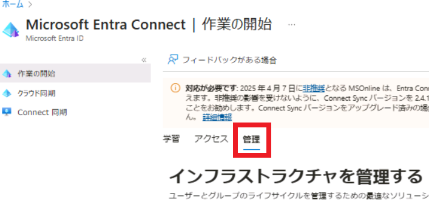
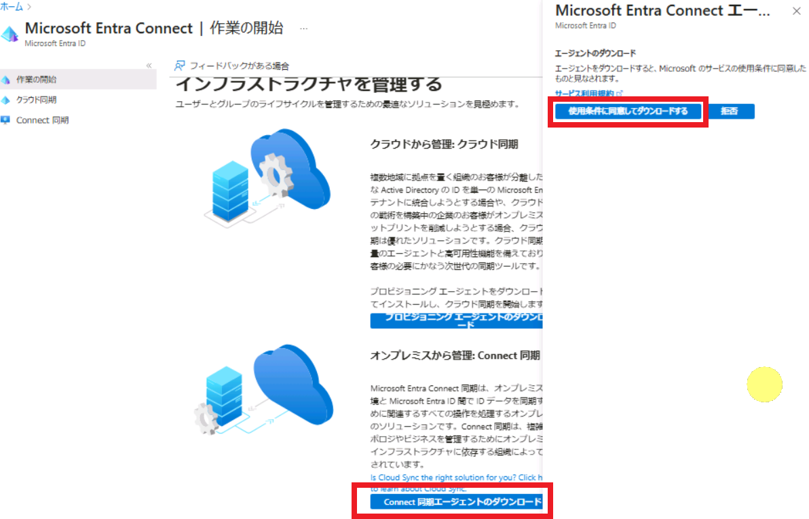

# [ラーニング パス 3 - ラボ 3 - 演習 2 - ID 同期の実装](https://github.com/ctct-edu/ms-102-lab/blob/main/Instructions/Labs/LAB_AK_03_Lab3_Ex2_Implement_Identity_Synch.md#learning-path-3---lab-3---exercise-2---implement-identity-synchronization)

この演習では、Azure AD Connect を使用して、Adatum のオンプレミス Active Directory と Azure Active Directory 間の同期を有効にします。その後、Azure AD Connect は 30 分ごとにデルタ変更を同期し続けます。次に、ユーザーとグループの更新をいくつか行ってから、Azure AD Connect が自動的に更新を同期するのを待つのではなく、手動で強制的に即時同期を実行します。次に、更新が同期されたかどうかを確認します。

**重要:** この演習を開始するときは、Azure AD Connect が ID オブジェクトに加えた変更を自動的に同期しないように、最初の 4 つのタスクを遅延なく実行する必要があります。

### タスク 1: Azure AD Connect をインストールし、同期を開始する

このタスクでは、Azure AD Connect セットアップ ウィザードを実行して、Adatum のオンプレミス Active Directory と Azure Active Directory 間の同期を有効にします。構成が完了すると、同期プロセスが自動的に開始されます。

1. 前のタスクのローカル**adatum\administratorとして** **LON-DC1** にログインしている必要があります。 LON-DC1 でEdgeブラウザーを起動し、**[Microsoft 365 管理センター]**  (https://admin.microsoft.com) にアクセスし、Holly Dickson として Microsoft 365 にログインしてください。

2. [Microsoft 365 管理センター] のナビゲーション ウィンドウで  **[ユーザー(Users)]** 、 **[アクティブ ユーザー(Active users)]** の順に選択します。

3. [アクティブ ユーザー]ウィンドウで、メニュー バーの最後に表示される **省略記号アイコンを選択し、表示されるドロップダウン メニューで**  **[ディレクトリ同期(Directory synchronization)]** を選択します。

   

   これにより、 Azure AD へのユーザーの追加または同期ウィザード が開始されます。

4. Azure AD にユーザーを追加または同期するウィザードの [ユーザー同期について]ページで、内容を最後までお読みください。[ユーザー ステータス]セクションで、既存の Adatum クラウド ユーザーとハイブリッド ユーザーの数に注目してください。 **「次へ(Next)」** を選択します。

5. [移行オプションの選択]ページで各オプションの説明を読み、使用可能な移行オプションを理解します。 **[継続的同期(Continuous sync)]** オプションを選択し、  **[次へ(Next)]** を選択します。

6. 「IdFix を実行して準備」 ページでは、前のラボ演習で IdFix をすでに実行しているため、再度ダウンロードして実行する必要はありません。**「次へ(Next)」** を選択します。

7. **[Microsoft Entra Connect同期(Microsoft Entra Connect Sync)]**  を選択します (誤ってMicrosoft Entra *Cloud* Syncを選択しないように注意してください)。 **「次へ(Next)」** を選択します。

8. [ユーザーの同期]ページで、  **[Microsoft Entra Connect をダウンロード]** ボックスを選択します。これにより、ブラウザーで新しいタブが開き、Microsoft ダウンロード センターに移動します。画面の上部に[ダウンロード]ウィンドウが表示されたら、ダウンロードが完了したAzureADConnect.msiファイルの下に表示される  **[Open file]リンクを選択します。** 

9. Microsoft Azure Active Directory Connect ウィザードが開始され、 Microsoft Azure Active Directory Connectツールのインストールが開始されます。ウィザードの最初のページが表示されてから突然消える場合や、まったく表示されない場合があります。いずれかの状況が発生した場合は、タスクバーのウィザード アイコンを選択します。

10. セットアップ ウィザードの　[Welcome to Azure AD Connect]　ウィンドウで、 **[I agree to the license terms and privacy notice]** チェック ボックスをオンにし、 **[Continue]** を選択します。

11. [Express Settings]ページで、単一の Windows Server AD フォレストに関する手順を読み、 **[Use express settings]** を選択します。

12. [Connect to Azure AD ]ウィンドウで、[USERNAME]フィールドに **[Holly@xxxxxZZZZZZ.onmicrosoft.com](mailto:Holly@xxxxxZZZZZZ.onmicrosoft.com)**  (xxxxxZZZZZZ はラボ ホスティング プロバイダーによって提供されるテナント プレフィックス) を入力します。

    [PASSWORD]フィールドに、ラボ ホスティング プロバイダーからテナント管理者アカウント (MOD 管理者アカウント) 用に提供されたのと同じ**Microsoft 365 管理者パスワード**を入力し、  **[Next]** を選択します。

13. [Connect to AD DS]ページで、[ USERNAME]フィールドに **「adatum\Administrator」** と入力し、[ PASSWORD]フィールドに　**「Pa55w.rd」**　と入力して、 **[Next]**  を選択します。

14. Azure AD sign-in configuration ウィンドウで、ページの下部にある  **[Continue without matching all UPN suffixes to verified domains] チェック ボックスをオンにし、**  **[Next]** を選択します。

15. [Ready to configure]画面で、 **[Start the synchronization process when configuration completes]**  チェック ボックスがまだ選択されていない場合は選択し、 **[Install]**　を選択します。

    **重要:**  Holly は最終的に Exchange ハイブリッド展開を今はインストールする予定はありません。このラボでは、Exchange hybrid deployment オプションを選択しないでください。

16. 構成が完了するまで待ちます (数分かかる場合があります)。**[Configuration complete]** ページで、**[Exit]** 選択します。

17. タスクバーの左下隅にある**Windows (スタート)**アイコンを選択します。 **[All Apps]** アイコンを選択してすべてのアプリを表示します。**[Azure AD Connect]** を選択してグループを展開し、**[Synchronization Service]** を選択してこのデスクトップ アプリケーションを開始します。

18. xxxxxZZZZZZ.onmicrosoft.com-AAD の Export  プロファイルが完了するまで待ちます。完了すると、**ステータスは**  **completed-export-errors**になるはずです。完了してこのステータスが表示されたら、この行を選択します。

    

19. 画面の下部に、選択した操作の詳細情報を示す詳細ペインが表示されます。

    - 左側の [Export Statistics]ウィンドウで、Azure Active Directory に追加されたオンプレミス ユーザーの数と更新された数をメモします。

    - 右側の[Export Errors]ペインで、表示されるエラーに注目してください。前回のラボ演習で IdFix ツールを実行したときを思い出してください。意図的に修正しなかった検証エラーが発生したユーザーが 2 人いました ( Ngoc Bich TranとAn Dung Dao )。

      最初のDataValidationFailedエラーに該当する[エクスポート エラー]列の下の最初のリンク (CN={xxxxxx...) を選択します。これにより、Azure AD Connect ツールによって同期されなかった 2 人のユーザーのうち最初のユーザーが表示されます。エラーを確認して、このアカウントが壊れている理由を確認してください。**ヒント:**   **[Export Error]** タブを選択します。**「Error Information」** セクションで、 **「Detail」** ボタンを選択します。詳細なエラー情報を確認し、 **[Close]** を選択します。もう一度 **「Close」** を選択します。

      2 番目のデータ検証エラー リンクを選択し、このエラーが意図的に修正しなかった 2 番目のユーザーのものであることを確認します。前と同じ手順に従って、このユーザーのエラーを確認します。

20. LON-DC1 の Synchronization Service Manager ウィンドウを閉じます。Azure AD Connect が完全同期を完了したことが確認できたので、次のタスクでは、いくつかの更新を行って、30 分ごとに更新が同期されるのを待つのではなく、手動で強制的に即時同期を実行します。

21. LON-DC1 は次の演習で使用するため、開いたままにしておきます。

### タスク 2 - 同期をテストするためのグループ アカウントを作成する

手動の強制同期プロセスをテストするには、いくつかのグループ シナリオをセットアップして、強制同期機能が Azure AD Connect で機能しているかどうかを確認します。新しいセキュリティ グループを作成し、既存の組み込みセキュリティ グループのグループ メンバーをすべて Adatum のオンプレミス環境内で更新します。

各グループには複数のメンバーが割り当てられます。強制同期後、Microsoft 365 の各セキュリティ グループが表示され、そのメンバーがオンプレミス グループからクラウド グループに同期されたことを検証します。また、Adatum のオンプレミス環境でメンバーを追加した場合でも、ビルトインセキュリティ グループが Microsoft 365 で作成されていないことも検証します。

1. 前のタスクでadminとしてLON-DC1にログインしたままである必要があります。

2. サーバー マネージャーが閉じている場合は、ここで再度開きます。

3. サーバー マネージャーで、画面右上の　**[Tools]を選択し、ドロップダウン メニューで**  **[Active Directory Users and Computers] を選択します。** 

4. まず、組み込みのオンプレミス セキュリティ グループの 1 つにメンバーを追加します。「Active Directory ユーザーとコンピュータ」ウィンドウを最大化します。左側のペインのコンソール ツリーで、Adatum.comの下にある **Builtin** フォルダーを選択します。これにより、 Adatum.comドメインの作成時に自動的に作成されたすべてのビルトインセキュリティ グループ フォルダーが表示されます。

5. 右側の詳細ペインで、**Print Operators**セキュリティ グループをダブルクリックします。

6. 「Print Operators Propaties」 ウィンドウで、 **「Members」タブを選択し、**   **「Add」** ボタンを選択します。

7. [Select Users, Contacts, Computers, Service Accounts, or Groups]  ウィンドウの **[Enter the object names to select]** フィールドに次の名前を入力します (セミコロンで区切って 3 つすべてを一度に入力します)。

   - **Ashlee Pickett**
   - **Juanita Cook**
   - **Morgan Brooks**

8. **[Check Names]** を選択します。すべての検証が完了したら、**「OK」** を選択して「Print Operators Propaties」 ウィンドウに戻ります。

9. [Print Operators Properties]ウィンドウで **[OK]** を選択して、[Active Directory Users and Computers]ウィンドウに戻ります。

10. ここで、新しいセキュリティ グループを作成します。**Adatum.com**の下のコンソール ツリーで、 **Research**フォルダー(OU:組織単位)を右クリックし、**[New]** を選択し、 **[Group]** を選択します。

    

11. [新しいオブジェクト - グループ]ウィンドウで、次の情報を入力します。

    - グループ名 : **Manufacturing**
    - グループ範囲 : **Universal**
    - グループの種類 : **Security**

12. **[OK]** を選択します。

13. **Adatum.com** の下のコンソール ツリーで **Research** フォルダーを選択し、右側の詳細ペインで**Manufacturing** セキュリティ グループをダブルクリックします。

14. 「Manufacturing Propaties」ウィンドウで、 「E-mail」 フィールドに **Manufacturing@adatum.com** と入力します。(英語キーボードのため @ は Shift + 2 で入力)

15. **[メンバー]**  タブを選択し、手順 6 ～ 9 を繰り返して、次のメンバーをこのグループに追加します。

    - **Bernardo Rutter**
    - **Charlie Miller**
    - **Dawn Williamson**

16. 次のタスクのために[Active Directory Users and Computers]ウィンドウを開いたままにしておきます。

### タスク 3 - 同期をテストするためにグループ メンバーシップを変更する

このタスクでは、同期プロセスが Azure AD Connect で機能しているかどうかをテストするための別のシナリオを設定します。このタスクでは、グループのメンバーを変更して、グループが同期された後にそのメンバーがクラウドに反映されるかどうかを確認します。

1. このタスクは、LON-DC1 で前のタスクが中断したところから継続します。[Active Directory Users and Computers]ウィンドウのAdatum.comの下のコンソール ツリーでは、Research組織単位が選択されたままです。

   右側の詳細ペインで、**Research セキュリティ グループをダブルクリック**します。

   

2. Research Propertiesウィンドウで、 **[members]** タブを選択して、このグループのメンバーを表示します。

3. 次のユーザーをグループから削除したいと考えています:

   - **Cai Chu**
   - **Shannon Booth**
   - **Tia Zecirevic**

   **ヒント:** 各ユーザーを個別に削除することもできますが、最も簡単な方法は、3 人全員を一度に削除することです。最初のユーザーを選択し、**Ctrl** キーを押したまま下にスクロールして、他の 2 人を選択します。3 人のユーザーをすべて選択した状態で、**[Remove]ボタンを選択し、**  **Yes**を選択して削除を確認します。3 人のユーザーが削除されたことを確認し、 **[OK] を選択します。**

4.  「Active Directory Users and Computers」 ウィンドウを閉じます。

5. 次のタスクで引き続き使用するため、LON-DC1 は開いたままにしておきます。

   **重要:** 前のタスクで ID オブジェクトに加えた変更が Azure AD Connect によって自動的に同期されないように、このタスクを完了したらすぐに次のタスクを実行する必要があります。

### タスク 4 - 手動同期を強制する

このタスクでは、Azure AD Connect が ID オブジェクトを同期するまで 30 分待つ代わりに、Adatum のオンプレミス AD と Azure AD の間の同期を強制します。強制同期を実行するには、PowerShell を使用する必要があります。

**重要 - PowerShell に関する注意:**　前のラボ演習では、その演習のタスクで Microsoft Graph PowerShell ではなく MSOnline モジュールを使用した理由を示す免責事項が提供されていました。Microsoft は、MSOnline と Azure Active Directory (Azure AD) PowerShell の 2 つの古い PowerShell モジュールを Microsoft Graph PowerShell に置き換える作業を進めていますが、古いモジュールには Microsoft Graph PowerShell にまだ組み込まれていない機能がいくつかあります。前の演習のコマンドとこのタスクで使用したコマンドは、このカテゴリに分類されます。前の演習では MSOnline モジュールに接続しましたが、このモジュールも Start-ADSyncSyncCycle コマンドに従ってこのタスクで使用されます。

1. LON-DC1 で、前の演習で **Windows PowerShellアプリケーションがまだ開いている場合は、**  **ここで閉じる必要があります**。

   **警告:** この手順を実行する理由は、Azure AD Connect のセットアップ前に Windows PowerShell を開いた場合、手順 3 で使用したコマンドレット Start-ADSyncSyncCycle が使用できなくなり、コマンドレットが認識されないことを示すエラーが表示されるためです。実行しようとすると。したがって、このステップでは、Windows PowerShell が開いている場合は閉じることをお勧めします。

2. この時点では、Windows PowerShell は開いてはいけません。今、それを再度開きたいと考えています。これを開くには、タスク バーの **虫眼鏡 (検索)アイコンを選択し、検索ボックスに**   **「power」** と入力し、メニューで **Windows PowerShell**  を右クリックし、 **[Run as administrator]** を選択します。Windows PowerShell ウィンドウが開いたら、最大化します。

3. Windows PowerShell で **次のコマンドを実行** して、Adatum のオンプレミス AD と Azure AD の間で同期サイクルを手動で実行します。ここではデルタスイッチを使用して、更新のみが同期されるようにします **。**

   ```
    Start-ADSyncSyncCycle -PolicyType Delta
   ```

   **注:** Start-ADSyncSyncCycle コマンドが見つからない場合は、PowerShell モジュールのインストールを完了するためにドメイン コントローラーを再起動する必要があります。

   **注:** 何らかの理由で、最初の完全同期の実行後にドメイン コントローラー VM が再起動された場合、Microsoft Azure AD Sync サービスが再起動していない可能性があります。この問題が発生した場合、上記の強制同期を実行しようとするとエラーが発生します。この問題が発生した場合は、まず Microsoft Azure AD Sync サービスを開始してから、強制同期を実行する必要があります。

4. 同期プロセスが正常に完了したら、PowerShell ウィンドウを最小化し (閉じないでください)、次のタスクに進みます。次のタスクでは PowerShell を使用して、ディレクトリ同期の結果の一部を検証します。

5. LON-DC1 に留まり、次のタスクに進みます。

### タスク 5 - ディレクトリ同期の結果を検証する

このタスクでは、以前に行った変更が Adatum のオンプレミス Active Directory から Azure Active Directory に同期されたかどうかを検証します。Microsoft 365 管理センターを使用して変更を検証し、次に Windows PowerShell を使用して同じ検証を実行します。これにより、Microsoft 365 管理センター GUI と PowerShell の両方を使用して同期を検証する経験が得られます。

**重要 - PowerShell に関する注意:** このタスクでは、Microsoft Graph PowerShell でサポートされている、グループとユーザーに対する基本的な PowerShell クエリを使用します。Microsoft Graph PowerShell は、MSOnline と Azure Active Directory (Azure AD) PowerShell という 2 つの古い PowerShell モジュールを置き換えるものであるため、このタスクでは Microsoft Graph PowerShell を使用します。

1. ローカルのadatum\administratorとしてパスワードPa55w.rd を使用して LON-DC1 にログインしている必要があります。

2. Microsoft 365 管理センターにアクセスし、ナビゲーション ウィンドウで **[チームとグループ(Teams & groups)]** を選択し、  **[アクティブなチームとグループ(Active teams & groups)]** を選択します。

3. [アクティブなチームとグループ] ウィンドウで **「セキュリティグループ(Security Groups)」** タブを選択します。Print Operatorsグループがセキュリティ グループのリストに表示されないことを確認します。前述したように、 Print Operatorsグループなどの組み込みセキュリティ グループは、前のタスクで行ったようにグループにメンバーを追加した場合でも、オンプレミス AD から Azure AD に同期されません。

4. Manufacturingグループが表示されることを確認します。前のタスクでオンプレミス グループに 電子メール アドレス ( **[Manufacturing@adatum.com](mailto:manufacturing@adatum.com)** )を追加したため、このグループはメールが有効なセキュリティ グループとして表示されます。

   **注:** [Manufacturing]グループが表示されるまで、最大 10 分間待つ必要がある場合があります。グループが表示されるまでリストを更新し続けます。

   Manufacturingグループの場合、 [メール(Email)]列に表示される値を確認します。ディレクトリ同期中にグループの電子メール アドレスが、 Manufacturing@adatum.comから、Exchange Online のグループのメールボックスである **Manufacturing@xxxxxZZZZZZ.onmicrosoft.com** に変更されたことを確認します。

   **[同期の状態]** 列のアイコンの上にマウスを置き、 [オンプレミスからの同期(Synced from on-remises)]と表示されることを確認します。

5. [Manufacturing]グループの右側には、垂直の省略記号アイコン (ピリオドが 3 つ垂直に並んでいます) があります。このアイコンの上にマウスを置きます。このグループはオンプレミス環境でのみ管理できることを示すメッセージが表示されることに注意してください。

6. Manufacturingグループでは、以前に次のメンバーをオンプレミスの Active Directory のグループに追加しました。同期後、この Microsoft 365 グループにこれらの各グループ メンバーが表示されるようになります。**([Manufacturing]グループが表示されても、メンバーが表示されるまでさらに時間がかかることがあります。表示されない場合は少々お待ちください。)**

   - Bernardo Rutter
   - Charlie Miller
   - Dawn Williamson

7. 次に、Research グループのメンバーのリストに、次のユーザーが含まれて **いない** ことを確認します。前のタスクで、グループを Microsoft 365 に同期する前に、オンプレミスの Active Directory のリサーチ グループからこれら 3 人のユーザーを削除したことを思い出してください。

   - Cai Chu

   - Shannon Booth

   - Tai Zecirevic


これで、テスト グループとユーザー アカウントが適切に同期されたことが検証されました。検証手順が完了したら、PowerShell ウィンドウを閉じます。
