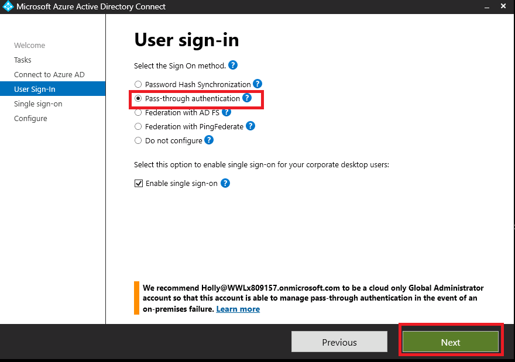
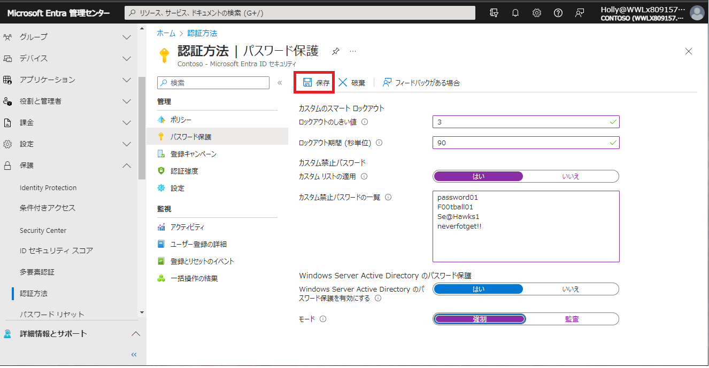

# [ラーニング パス 3 - ラボ 3 - 演習 3 - 安全なユーザー アクセスの管理](https://github.com/MicrosoftLearning/MS-102T00-Microsoft-365-Administrator-Essentials/blob/master/Instructions/Labs/LAB_AK_03_Lab3_Ex3_Manage_secure_user_access.md#learning-path-3---lab-3---exercise-3---manage-secure-user-access)

Adatum の Microsoft 365 管理者である Holly Dickson は、Adatum の CTO から、組織全体のパスワード管理を強化する手段としてパススルー認証 (PTA) と Azure AD スマート ロックアウトを展開するように依頼されました。

### タスク 1: Azure AD パススルー認証を展開する

パススルー認証を使用すると、ユーザーはオンプレミスのパスワードを使用してクラウドベースのサービスにサインインできます。すべてのユーザー パスワードはオンプレミス ドメインにローカルにのみ保存され、クラウドに同期されることはありません。ユーザーがサインインすると、PTA エージェントは資格情報をユーザーのオンプレミス環境に取り込み、パスワードが正しいかどうかを確認します。次に、結果を Azure AD に送り返します。

Adatum の CTO は、同社のユーザーにより良いサインイン エクスペリエンスを提供したいと考えています (PTA では覚えておくべきパスワードが 1 つ少なくて済むため)。また、PTA を使用するとユーザーがサインイン方法を忘れる可能性が低くなるため、Adatum の IT ヘルプデスクのコストを削減したいと考えています。これは、パスワード ハッシュ同期や Active Directory フェデレーション サービスを採用することによっても実現できますが、Adatum は Microsoft 365 パイロット プロジェクトで PTA をテストすることを選択しました。

1. 前のタスクのローカル**adatum\administratorとして**  **LON-DC1** にログインしている必要があります。

2. LON-DC1 では、デスクトップにある、 **[Azure AD Connect]** ショートカットをダブルクリックします。これにより、Microsoft Azure Active Directory Connectウィザードが開始されます。

3. [Azure AD Connect へようこそ]ウィンドウに、このセットアップ ウィザードが閉じるまで同期サービス スケジューラーが一時停止されていることを示すページが表示されます。これは、Azure AD Connect インストール ウィザードを開始すると (前のタスクで実行しました)、スケジューラが一時的に停止されるためです。**Configure** を選択します。

4. [追加タスク]ページで、**[Change user sign-in]** タスクを選択し、**[Next]** を選択します。

5. [Connect to Azure AD]ページで、Azure AD にサインインします。USERNAMEフィールドには、すでにHolly@xxxUPNxxx.onmicrosoft.comが入力されています。[PASSWORD]フィールドに、ラボ ホスティング プロバイダーからテナント管理者アカウント (MOD 管理者アカウント) 用に提供されたのと同じ**Microsoft 365 管理者 パスワード** を入力し、 **[Next]** を選択します。

6. [User sign-in]ページ で、**[Pass-through authentication]**を選択し、**[Next]** を選択します。

   

7. [enable singre sign-on]ページで、**[Enter credentials]** を選択します。

8. [Forest Credentials]ダイアログ ボックスで、ユーザー名として**adatum\administrator を** 入力し、パスワードとして **Pa55w.rd** を入力し、**[OK]** を選択します。

9.  [Enter credentials]ボタンの右側にチェック マークが表示されます。**「Next」** を選択します。

10. Ready to configure ページで、**[Configure]** を選択します。構成が完了するまでに 1 分ほどかかる場合があります。

11. [Configuration complete]ページで、Azure AD の現在のサインオン方法が PTA であることを示すメッセージに注目してください。**[Exit]** を選択します。これでパススルー認証が有効になりました。

12. パススルー認証が正常に有効になっていることを確認するには、Microsoft Entra 管理センターにアクセスします。ブラウザで新しいタブを選択し、アドレス バーに次の URL を入力します: **https://entra.microsoft.com**

13. 左側のナビゲーション ウィンドウで、 **[ID] - [表示数を増やす]** をクリックして、 **[ハイブリッド管理] - [Microsoft Entra Connect]** を選択します。

14. ページ中央のナビゲーション ウィンドウで、**[Connect同期]** を選択します。

15. 詳細ペインの [ユーザー サインイン]セクションで、パススルー認証のステータスが [有効] であることを確認し、**[パススルー認証]** を選択します。

16. [パススルー認証]ページで、パススルー認証エージェントがインストールされているサーバーのリストを確認します。これにより、LON-DC1.Adatum.comが表示されるはずです。

17. [パススルー認証]ページの右上隅にある **[X]** を選択してページを閉じる操作を2回行うと、Microsoft Entra 管理センターに戻っているはずです。

18.  Microsoft Entra 管理センターは 次のタスクで使用するため、開いたままにしておきます。

### [タスク 2: Azure AD スマート ロックアウトを展開する](https://github.com/MicrosoftLearning/MS-102T00-Microsoft-365-Administrator-Essentials/blob/master/Instructions/Labs/LAB_AK_03_Lab3_Ex3_Manage_secure_user_access.md#task-2-deploy-azure-ad-smart-lockout)

Adatum の CTO は、ユーザーのパスワードを推測したり、ネットワークへの侵入を許可するためにブルート フォース手法を使用したりしようとする悪意のある攻撃者をロックアウトするのに役立つ Azure AD Smart Lockout を展開するようあなたに依頼しました。Smart Lockout は、有効なユーザーからのサインインを認識し、攻撃者やその他の不明なソースからのサインインとは異なる方法で処理します。

CTO は、Adatum のユーザーが自分のアカウントにアクセスし続けて生産性を維持できる一方で、攻撃者をロックアウトできるため、Smart Lockout の実装に熱心です。CTO は、ユーザーが同じパスワードを複数回使用できないように、また、単純すぎるまたは一般的すぎると考えられるパスワードを使用できないように Smart Lockout を構成するようホリーに依頼しました。

1. Microsoft Entra 管理センターの左側のナビゲーション ウィンドウで、[保護]サブメニューの　**[認証方法]**　を選択します。

2. 認証方法| 「ポリシー」ページの「管理」セクションで、**「パスワード保護」** を選択します。

3. 認証方法| パスワード保護ウィンドウの右側の詳細ペインに、次の情報を入力します。

   - [カスタム スマート ロックアウト]セクション:
     - ロックアウトしきい値:このフィールドは、最初のロックアウトまでにアカウントで許可されるサインイン失敗の回数を示します。デフォルトは 10 です。テスト目的で、Adatum はこれを **3** に設定するように要求しました。
     - ロックアウト期間 (秒):これは、各ロックアウトの長さ (秒) です。デフォルトは 60 秒 (1 分) です。Adatum は、これを **90** 秒に変更するようリクエストしました。
   - 「カスタム禁止パスワード」セクション:
     - カスタム リストを強制する:  **[はい]** を選択します。
     - カスタム禁止パスワード リスト: 次の値を入力します (各値が別の行に表示されるように、各値を入力した後に Enter キーを押します)。
       - **password01**
       - **F00tball01**
       - **Se@Hawks1**
       - **neverfotget!!**
   - 「モード」セクションで、 **「強制」** を選択します。

4. ページ上部のメニュー バーで **[保存]** を選択します。

   

5. 次に、禁止されたパスワードの機能をテストする必要があります。画面の右上隅にある Holly Dickson のユーザー(丸い) アイコンを選択し、[アカウントの表示]を選択します。表示される「マイアカウント」画面で **[パスワードの変更]** を選択します。

6. 新しいタブが開き、「パスワードの変更」ウィンドウが表示されます。[古いパスワード]フィールドに、Holly の既存のパスワードを入力します。これは、ラボ ホスティング プロバイダーからテナント管理者アカウント (つまり、MOD 管理者アカウント) 用に提供される**Microsoft 365 テナント パスワード**と同じです。

    [新しいパスワードの作成] フィールドと[新しいパスワードの確認]フィールドに**Se@Hawks1** を入力し、**[送信]** を選択します。表示されるエラー メッセージに注目してください。

7. ブラウザで、 [パスワードの変更] タブを閉じます。

8. 次に、ロックアウトしきい値機能をテストする必要があります。[認証方法 - Azure Active Directory 管理センター]タブで、画面の右上隅にある Holly Dickson のユーザー アイコンを選択し、表示されるメニューで  　　**[サインアウト]** を選択します。

9. Holly としてサインアウトすると、[Microsoft Azure へのサインイン]タブに[アカウントの選択]ウィンドウが表示されます。あるユーザーとして Microsoft オンライン サービスからサインアウトし、別のユーザーとしてサインインし直すときのベスト プラクティスとして、[サインアウト]タブまたは[サインイン]タブを除くすべてのブラウザー タブを閉じます。この場合は、他のタブを閉じて、[サインイン]タブを開いたままにしてください。

   [アカウントの選択]ウィンドウで、 **[別のアカウントを使用する]** を選択します。

10. [サインイン]ウィンドウに **laura@xxxxxZZZZZZ.onmicrosoft.com** と入力し(xxxxxZZZZZZ は、ラボ ホスティング プロバイダーによって割り当てられたテナント プレフィックスです)、 **[次へ]** を選択します。

11. [パスワードの入力]ウィンドウで、**ランダムに組み合わせた文字を入力** し、**[サインイン]** を選択します。無効なパスワードのエラー メッセージが表示されることに注意してください。

    この手順をさらに 2 回繰り返します。

    **ロックアウトしきい値を** **3** に設定したため、3 回目のサインイン試行の失敗後にアカウントがロックされていることを示すエラー メッセージが表示されます。

    **ユーザー:** 3 回目の試行後にこのロックアウト メッセージを受信しない場合、システムはこのロックアウトしきい値の変更をサービス全体に伝達することをまだ完了していません。変更が有効になるまでに数分かかる場合があります。数分待ってから、偽のパスワードを使用して再度サインインします。このラボのテストではさまざまな結果が得られました。場合によっては、変更がほぼ即座に反映され、3 回目のサインイン試行後にロックアウトされることがあります。また、ロックアウト メッセージが表示されるまでに 5 ～ 10 分かかる場合もありました。ロックアウト メッセージを受信するまでこのプロセスを続けます。ロックアウト メッセージを受信すると、不正アクセスを防ぐために Laura のアカウントが一時的にロックされます。

12. 前に設定した**90 秒のロックアウト期間**が経過するまで、Laura として再ログインすることは禁止されます。

    [ロックアウトされたら、90 秒待ってから、 laura@xxxxxZZZZZZ.onmicrosoft.com](mailto:laura@xxxxxZZZZZZ.onmicrosoft.com)としてサインインし直します(xxxxxZZZZZZ は、ラボ ホスティング プロバイダーによって割り当てられたテナント プレフィックスです)。[パスワード]フィールドに、Laura のパスワードを入力します。これは、ラボ ホスティング プロバイダーからテナント管理者アカウント (つまり、MOD 管理者アカウント) 用に提供される **Microsoft 365 管理者パスワード** と同じです。Laura として正常にサインインできることを確認します。

13. ログインが成功したら、開いているアプリケーションをすべて閉じることができます。これは、LON-DC1 ドメイン コントローラーを使用した最後の実習となります。
