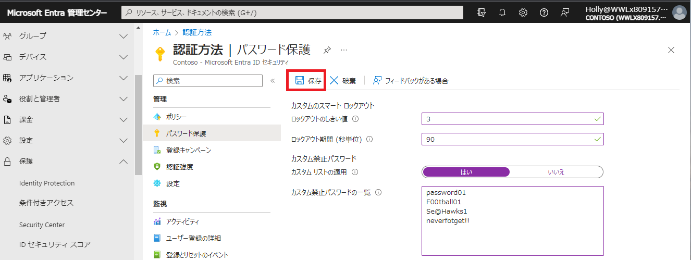

# [ラーニング パス 3 - ラボ 3 - 演習 3 - 安全なユーザー アクセスの管理](https://github.com/MicrosoftLearning/MS-102T00-Microsoft-365-Administrator-Essentials/blob/master/Instructions/Labs/LAB_AK_03_Lab3_Ex3_Manage_secure_user_access.md#learning-path-3---lab-3---exercise-3---manage-secure-user-access)

Adatum の Microsoft 365 管理者である Holly Dickson は、Adatum の CTO から、組織全体のパスワード管理を強化する手段として Azure AD スマート ロックアウトを展開するように依頼されました。

### [タスク 1: スマート ロックアウトを展開する](https://github.com/MicrosoftLearning/MS-102T00-Microsoft-365-Administrator-Essentials/blob/master/Instructions/Labs/LAB_AK_03_Lab3_Ex3_Manage_secure_user_access.md#task-2-deploy-azure-ad-smart-lockout)

Adatum の CTO は、ユーザーのパスワードを推測したり、ネットワークへの侵入を許可するためにブルート フォース手法を使用したりしようとする悪意のある攻撃者をロックアウトするのに役立つ Azure AD Smart Lockout を展開するようあなたに依頼しました。Smart Lockout は、有効なユーザーからのサインインを認識し、攻撃者やその他の不明なソースからのサインインとは異なる方法で処理します。

CTO は、Adatum のユーザーが自分のアカウントにアクセスし続けて生産性を維持できる一方で、攻撃者をロックアウトできるため、Smart Lockout の実装に熱心です。CTO は、ユーザーが同じパスワードを複数回使用できないように、また、単純すぎるまたは一般的すぎると考えられるパスワードを使用できないように Smart Lockout を構成するようホリーに依頼しました。

1. Microsoft Entra 管理センターの左側のナビゲーション ウィンドウで、 **[Entra ID]** - **[認証方法]** を選択します。

2. 認証方法| 「ポリシー」ページの「管理」セクションで、**「パスワード保護」** を選択します。

3. 認証方法| パスワード保護ウィンドウの右側の詳細ペインに、次の情報を入力します。

   - [カスタム スマート ロックアウト]セクション:
     - ロックアウトしきい値:このフィールドは、最初のロックアウトまでにアカウントで許可されるサインイン失敗の回数を示します。デフォルトは 10 です。テスト目的で、Adatum はこれを **3** に設定するように要求しました。
     - ロックアウト期間 (秒):これは、各ロックアウトの長さ (秒) です。デフォルトは 60 秒 (1 分) です。Adatum は、これを **90** 秒に変更するようリクエストしました。
   - 「カスタム禁止パスワード」セクション:
     - カスタム リストを強制する:  **[はい]** を選択します。
     - カスタム禁止パスワード リスト: 次の値を入力します (各値が別の行に表示されるように、各値を入力した後に Enter キーを押します)。
       - **password01**
       - **F00tball01**
       - **Se@Hawks1**
       - **neverfotget!!**
   
4. ページ上部のメニュー バーで **[保存]** を選択します。

   

5. 次に、禁止されたパスワードの機能をテストする必要があります。画面の右上隅にある Holly Dickson のユーザー(丸い) アイコンを選択し、[アカウントの表示]を選択します。表示される「マイアカウント」画面で **[パスワードの変更]** を選択します。

6. 新しいタブが開き、「パスワードの変更」ウィンドウが表示されます。[古いパスワード]フィールドに、Holly の既存のパスワードを入力します。これは、ラボ ホスティング プロバイダーからテナント管理者アカウント (つまり、MOD 管理者アカウント) 用に提供される**Microsoft 365 テナント パスワード**と同じです。

    [新しいパスワードの作成] フィールドと[新しいパスワードの確認]フィールドに **Se@Hawks1** (前後のスペースを含めないでください)を入力し、**[送信]** を選択します。表示されるエラー メッセージ「推測されにくいパスワードを選択してください。」に注目してください。

7. ブラウザで、 [パスワードの変更] タブを閉じます。

8. 次に、ロックアウトしきい値機能をテストする必要があります。画面の右上隅にある Holly Dickson のユーザー アイコンを選択し、表示されるメニューで **[サインアウト]** を選択します。

9. [アカウントを選択する]ウィンドウで、 **[別のアカウントを使用する]** を選択します。

10. [サインイン]ウィンドウに **laura@xxxxxZZZZZZ.onmicrosoft.com** と入力し(xxxxxZZZZZZ は、ラボ ホスティング プロバイダーによって割り当てられたテナント プレフィックスです)、 **[次へ]** を選択します。

11. [パスワードの入力]ウィンドウで、**ランダムに組み合わせた文字を入力** し、**[サインイン]** を選択します。無効なパスワードのエラー メッセージが表示されることに注意してください。

    この手順をさらに 2 回繰り返します。

    **ロックアウトしきい値を** **3** に設定したため、3 回目のサインイン試行の失敗後にアカウントがロックされていることを示すエラー メッセージが表示されます。

    **ユーザー:** 3 回目の試行後にこのロックアウト メッセージを受信しない場合、システムはこのロックアウトしきい値の変更をサービス全体に伝達することをまだ完了していません。変更が有効になるまでに数分かかる場合があります。数分待ってから、偽のパスワードを使用して再度サインインします。このラボのテストではさまざまな結果が得られました。場合によっては、変更がほぼ即座に反映され、3 回目のサインイン試行後にロックアウトされることがあります。また、ロックアウト メッセージが表示されるまでに 5 ～ 10 分かかる場合もありました。ロックアウト メッセージを受信するまでこのプロセスを続けます。ロックアウト メッセージを受信すると、不正アクセスを防ぐために Laura のアカウントが一時的にロックされます。
