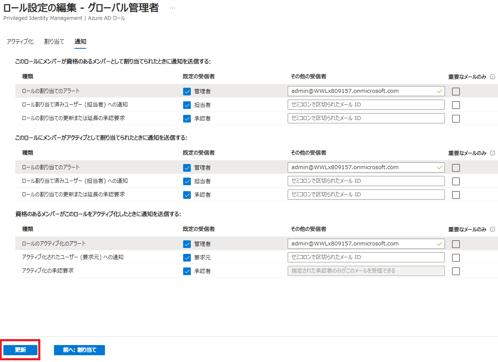
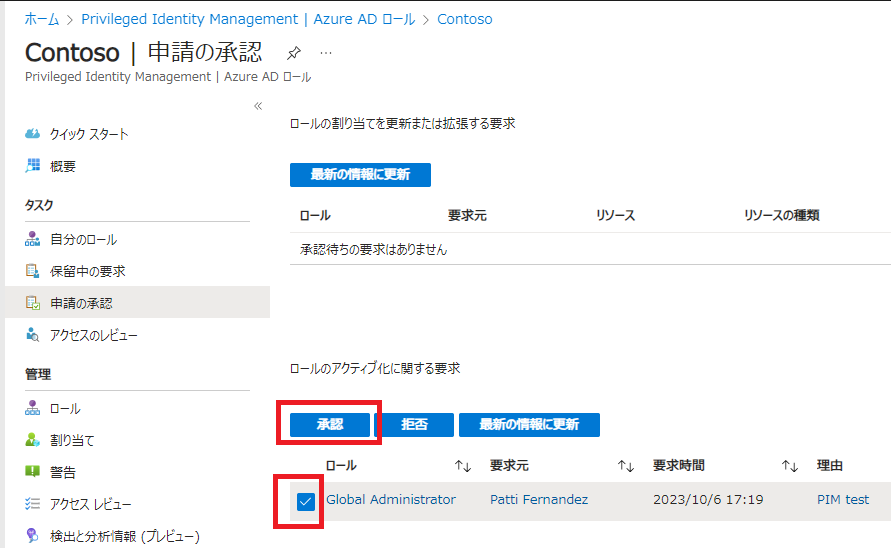

# [ラーニング パス 4 - ラボ 4 - 演習 1 - PIM 管理者の承認](https://github.com/MicrosoftLearning/MS-102T00-Microsoft-365-Administrator-Essentials/blob/master/Instructions/Labs/LAB_AK_04_Lab4_Ex1_PIM_Admin_Approval.md#learning-path-4---lab-4---exercise-1---pim-administrator-approval)

Microsoft 365 パイロット プロジェクトの一環として、Adatum の新しい Microsoft 365 管理者である Holly Dickson は、Azure Active Directory 内に Privileged Identity Management (PIM) を実装したいと考えています。PIM は、組織内の重要なリソースへのアクセスを管理、制御、監視できるようにする Azure AD サービスです。これらのリソースには、Azure だけでなく、Microsoft 365 や Microsoft Intune などの他の Microsoft Online Services も含まれます。

Adatum の既存システムの問題点の 1 つは、管理者の役割が割り当てられているユーザーが多すぎることです。これは経営陣の間で懸念を引き起こしており、経営陣はこの状況が Adatum のデータ セキュリティに対する存続の脅威であると認識しています。彼らは、本来割り当てられるべきでない管理者ロールを割り当てられている人が多すぎるため、これらのユーザーが組織を侵害する可能性のある安全な情報やリソースにアクセスできるようになっていると感じています。

永続的な管理者ロールを持つユーザーの数を減らしながらも、ビジネス上の正当な理由がある場合には選択したユーザーに管理者特権を提供する必要があるため、Holly は Azure Active Directory の Privileged Identity Management サービスを実装する任務を負っています。PIM を実装することで、Adatum は管理者ロールを持つユーザーの数を減らしながらも、必要に応じて必要に応じてユーザーに管理者権限を割り当てることができます。

このラボでは、特定の管理者ロールに対する PIM の実装に関連する基本的な手順を実行します。

- 承認を必要とするロールを構成し、承認者を割り当てる
- 適格なユーザーをロールに割り当てます
- ロールを割り当てる資格のあるユーザーからのリクエストを送信します。
- 役割のリクエストを承認する

この演習では、全体管理者ロールに対して次のタスクを実行します。Holly が承認者の役割を引き受け、Patti Fernandez がその役割へのアクセスを要求するユーザーになります。

**重要:** タスク 3 では、Patti Fernandez が全体管理者の役割を割り当てるリクエストを送信します。アクティベーション要求プロセスは、多要素認証 (MFA) を要求するように設定されています。このプロセスを完了するための電話がない場合は、インストラクターに通知してください。タスク 1 と 2 は引き続き完了できます。また、他の生徒と協力して残りのタスクを完了する様子を観察できる場合もあります。

### タスク 1 - 承認を必要とするように全体管理者ロールを構成する

Microsoft 365 グローバル管理者ロールでは、ユーザーは基本的にすべての Microsoft 365 リソースに無制限にアクセスできるため、セキュリティ上の理由から、このロールに割り当てられるユーザーの数は明らかに最小限に抑える必要があります。

Adatum の新しい Microsoft 365 管理者である Holly Dickson は、Privileged Identity Management を使用して、グローバル管理者ロールへのアクセスを制限したいと考えています。そのためには、ユーザーに適格なロールとして割り当てる前に、まず承認が必要なロールを構成する必要があります。その後、適格なユーザーがロールのアクティブ化を要求したときは常に、自分自身を承認者として割り当てたいと考えています。

ホリーは、全体管理者ロールの通知設定も更新したいと考えています。Privileged Identity Management (PIM) を使用すると、ロールが割り当てられたときやアクティブ化されたときなど、Azure Active Directory (Azure AD) 組織で重要なイベントが発生したときにそれを知ることができます。PIM は、あなたと他の参加者に電子メール通知を送信することで、常に最新の情報を提供します。これらの電子メールには、役割のアクティブ化や更新など、関連するタスクへのリンクも含めることができます。このタスクでは、Holly は通知を更新して、承認がリアルタイムで事前に追跡されるようにしたいと考えています。

1. Microsoft Entra 管理センターにアクセスします。ブラウザで新しいタブを選択し、アドレス バーに次の URL を入力します: **https://entra.microsoft.com**  Hollyの資格情報でサインインしてください。

2. Microsoft Entra 管理センターの左側のナビゲーション ウィンドウで、 **[Identity  Governance]** サブメニューの　**「Privileged Identity Management」** を選択します。

3. Privileged Identity Management | クイック スタートウィンドウの中央ペインの[管理]セクションの下にある **[Microsoft Entra ロール]** を選択します。

4. ウィンドウの中央ペインの[管理]セクションの下にある　**[設定]** を選択します。

5. 設定ウィンドウで、 **グローバル管理者** の役割を選択します。

6. [ロール設定の詳細 - グローバル管理者] ウィンドウで、ページをスクロールし、役割のアクティブ化、割り当て、および通知に関する情報を確認します。次に、ページ上部のメニュー バーで **[編集]** を選択します。([編集]がグレーアウトしている場合は、ブラウザーの画面更新等をお試しください)

7. 「ロール設定の編集 - グローバル管理者」ウィンドウには、アクティブ化スライダーの下で、[アクティブ化で必要]の設定に**Azure MFA**オプションが既定で選択されていることを確認します(選択されていない場合は、ここで選択します)。

8. ウィンドウには 3 つの設定のグループが表示され、それぞれに対応するチェック ボックスが付いています。 **[アクティブにするには承認が必要です]** チェック ボックスをオンにします。これにより、「承認者の選択」セクションが有効になります。他の 2 つのチェック ボックスのデフォルト設定は変更しないでください。

9. **「承認者の選択」** セクションでは、特定の承認者が選択されていません。ホリーは自分自身をこのロールの承認者として割り当てたいので、このセクションを選択します。右側に開く **[メンバーの選択]** ウィンドウで、Holly Dickson を選択します。ただし、前のラボ演習では 200 を超えるユーザーがオンプレミスの Active Directory から Azure AD に同期されたため、ユーザー リストをスクロールするのは非常に時間がかかります。

   したがって、検索ボックスに **「Holly」** と入力します。名前が Holly で始まるユーザーのリストで、onmicrosoft.com ドメインに属する Holly Dickson のユーザー アカウント ( **[Holly@xxxxxZZZZZZ.onmicrosoft.com](mailto:Holly@xxxxxZZZZZZ.onmicrosoft.com)** ) を選択します。カスタム ドメインに適用される Holly のユーザー アカウントを選択しないでください。次に、**「選択」**　ボタンを選択します。

10. [ロール設定の編集 - グローバル管理者] ウィンドウで、ページの上部にある **[通知]** タブを選択します。

11. [通知]タブで、通知の送信をトリガーできる 3 つのアクティビティに注目してください。次の場合に通知を送信します。

    - このロールにメンバーが資格のあるメンバーとして割り当てられたときに通知を送信する
    - このロールにメンバーがアクティブとして割り当てられたときに通知を送信する
    - 資格のあるメンバーがこのロールをアクティブ化したときに通知を送信する

    これら 3 つのアクティビティごとに、アラートを送信できます。ホリーは、各アクティビティのアラートを MOD 管理者アカウントに送信することを望んでいます。

    3 つのアラート (最初の 2 つのロールの割り当てのアラートと最後のアクティビティのロールのアクティブ化のアラート)のそれぞれの [その他の受信者] フィールドに、MOD 管理者の電子メール ID  **admin@xxxxxZZZZZZ.onmicrosoft.com** を入力します(xxxxxZZZZZZ はラボ ホスティング プロバイダーによって提供されるテナント プレフィックス)。

12. [役割設定の編集 - グローバル管理者]ウィンドウの下部で、 **[更新]** を選択します。

    

13. 次のタスクのためにブラウザのタブはすべて開いたままにしておきます。

### タスク 2 - 適格なグループを全体管理者ロールに割り当てる

Adatum の PIM パイロット プロジェクトにおいて、Holly は、グローバル管理者の役割を割り当てる資格のある唯一のユーザーとして Patti Fernandez を選択しました。ただし、今後の役割の割り当てを簡素化するために、ホリーはセキュリティ グループを作成し、そのグループに Patti を割り当ててから、そのグループを全体管理者役割に割り当てたいと考えています。

グループにロールを割り当てると、Azure AD でのロール割り当ての管理が簡素化されます。グローバル管理者 (Holly など) または特権ロール管理者が複数のユーザーにロールを個別に割り当てることを要求する代わりに、セキュリティ グループを作成して、そのグループがその特定のロールに適格となるようにすることができます。ユーザーがグループのメンバーとして割り当てられると、間接的にその役割を割り当てる資格が得られます。企業の既存のガバナンス ワークフローは、グループのメンバーシップの承認プロセスと監査を処理して、正当なユーザーのみがグループのメンバーであることを保証し、特定の役割が割り当てられるようにします。

このタスクでは、Holly は、グローバル管理者ロールの資格のあるユーザー向けに、ロールを割り当て可能な新しいセキュリティ グループを作成します。次に、Patti をグループに割り当て、そのグループが全体管理者の役割に適格になるようにします。

1. まず、Azure AD にPIM-Global-Administratorsというロール割り当て可能な新しいセキュリティ グループを作成し、Patti をグループのメンバーとして割り当てます。

   Microsoft Entra 管理センターが開いているはずです。左側のナビゲーション ウィンドウで、**ID**  の下にある   **[グループ]** を選択し、 **[すべてのグループ]** を選択します。

3. 右側の詳細ペインで、メニュー バーの **[新しいグループ]** を選択します。

4.  **[新しいグループ]** ウィンドウで、次の情報を入力します。

   - グループタイプ -**セキュリティ**
   - グループ名 - **PIM-Global-Administrators**
   - グループの説明 - **PIM のグローバル管理者ロールに割り当てることができる適格なユーザーのグループ**
   - Microsoft Entra ロールをグループに割り当てることができます -**はい**
   - メンバーシップの種類 -**割り当て済み**
   - 所有者 - **[所有者が選択されていません]** を選択します。[所有者の追加]ウィンドウで、検索フィールドに **「Holly」** と入力し、**Holly@xxxxxZZZZZZ.onmicrosoft.com** ユーザー アカウントを選択します。
   - メンバー - **「メンバーが選択されていません」** を選択します。[メンバーの追加]ウィンドウで、検索フィールドに **「Patti」** と入力し、Patti Fernandez のユーザー アカウントを選択します。

5. ページの下部にある **「作成」** ボタンを選択します。

6. ページの上部に、「Microsoft Entra ロール割り当ての対象となるグループの作成は、後で変更できない設定です。この機能を追加しますか?」という内容のダイアログ ボックスが表示されます。 **[はい]** を選択します。

7. ここで、PIM-Global-Administratorsグループを役割の割り当てに適格にする必要があります。左側のナビゲーションペインで、 **「Identity Governance」** を選択してセクションを展開し、**「Privileged Identity Management」** を選択します。

8. Privileged Identity Management | クイック スタートウィンドウの中央ペインの[管理]セクションの下にある **[Microsoft Entra ロール]** を選択します。

9. ウィンドウの右側の詳細ペインに、Privileged Identity Management ウィンドウが表示されます。このウィンドウには、「割り当て」、「アクティブ化」、「承認」、および「監査」のセクションが表示されます。「割り当て」セクションで、**「資格の割り当て」** ボタンを選択します。

10. ロールのリストを下にスクロールし、**[グローバル管理者]** を選択します。

11. [グローバル管理者| [割り当て]ウィンドウで、メニュー バーの **[+割り当ての追加]** を選択します。

12. [メンバーの選択]で、**[メンバーが選択されていない]** を選択します。

13. 右側に表示される「メンバーの選択」ペインで、 「検索」フィールドに **「PIM」** と入力します。これにより、名前がPIMで始まる対象となるユーザーおよびグループのリストが表示されます。 **表示されるPIM-Global-Administrators** グループを選択し、 **[選択]** ボタンを選択します。

14. [割り当ての追加]ウィンドウで、**[次へ]** を選択します。

15. [割り当ての追加]ウィンドウの[設定]タブで、 [割り当ての種類]オプションが **[対象]** に設定されていることを確認します。また、**[永続的に有資格]** チェック ボックスが選択されていることを確認し (選択されていない場合は、すぐに選択してください)、 **[割り当て]** を選択します。

16. グローバル管理者| [割り当て]ウィンドウで、PIM-Global-Administratorsグループがグローバル管理者ロールへの適格な割り当てであることに注意してください。PIM-Global-Administratorsはグループであるため、このグループ (Patti Fernandez で構成される) のすべてのメンバーがグローバル管理者の役割を割り当てる資格があることを意味します。

    注:ラボでのテストでは、新しい割り当てが[対象となる割り当て]タブに表示されるまでに最大 30 分かかる場合があることがわかっています。PIM-Global-Administrators がすぐに表示されない場合は、数分間待ってから、メニュー バーの[更新]オプションを選択します。PIM-Global-Administrators が[適格な割り当て]のリストに表示されるまで、数分ごとに **[更新]** オプションを選択し続けます。

17. 次のタスクのためにブラウザのタブはすべて開いたままにしておきます。

### タスク 3 - グローバル管理者ロールのリクエストを送信する

PIM-Global-Administratorsグループがグローバル管理者ロールの資格を取得したので、グループのメンバー (この場合は Patti Fernandez) に、Azure AD Privileged Identity Management を使用してグローバル管理者ロールを割り当てることができます。ホリーは、パイロット プロジェクトで PIM プロセスをテストしたいと考えています。このタスクでは、全体管理者ロールの権限を割り当てるリクエストを送信する Patti の役割を引き受けます。次のタスクでは、ホリーは自分のリクエストを確認して承認します。

注:アクティベーション要求プロセスは、多要素認証 (MFA) を要求するように設定されています。このプロセスを完了するための電話がない場合は、インストラクターに通知してください。他の生徒と協力して、残りの 2 つのタスクを完了するのを観察できる場合があります。

1. Hollyをサインアウトし、ブラウザーを閉じます。

2. ブラウザーを起動し、アドレス バーに次の URL を入力します: **[https://portal.azure.com](https://portal.azure.com/)**

3. 次に、Patti Fernandez として Azure にログインします。[サインイン]ウィンドウで、**[「PattiF@xxxxxZZZZZZ.onmicrosoft.com](mailto:PattiF@xxxxxZZZZZZ.onmicrosoft.com)**」 (xxxxxZZZZZZ はラボ ホスティング プロバイダーによって提供されるテナント プレフィックス) と入力し、 [次へ]を選択します。[パスワードの入力]ウィンドウで、ラボ ホスティング プロバイダーから提供されたのと同じ**Microsoft 365 管理者 パスワードを**テナント管理者アカウント (つまり、MOD 管理者アカウント) に入力し、 **[サインイン]** を選択します。サインインした状態で滞在しますか? ダイアログ ボックスで、 **[いいえ]** を選択します。

4. 表示される[Microsoft Azure へようこそ]ダイアログ ボックスで、 **[後で行う]** を選択してツアーをスキップします。

5. ページ上部の検索ボックスに **「privi」** と入力します。検索結果のリストで、 **[Microsoft Entra Privileged Identity Management]** を選択します。

7. 左側のナビゲーション ペインの[タスク]セクションで、  **[自分のロール]** を選択します。

8. 前のタスクで、Holly が Patti をPIM-Global-Administratorsグループのメンバーとして割り当て、その後、Holly がそのグループをグローバル管理者ロールの資格のあるグループとして割り当てたことを思い出してください。そのため、このロールは[資格のある割り当て]のリストに表示されます。

   グローバル管理者ロールの[アクション]列で、 **[アクティブ化]** を選択します。

9. 「アクティブ化 - グローバル管理者」ペインでは、追加認証が必要であることを示す警告メッセージ がペインの上部に表示された場合、このメッセージを選択してください。

10. 表示される「詳細情報が必要」ウィンドウで、**「次へ」** を選択します。

11. Microsoft Authenticatorページでは、このモバイル アプリをダウンロードすることも、MFA 検証に別の方法を使用することもできます。このラボでは、このトレーニング クラス後に再度使用することのない Microsoft Authenticator アプリのインストールに時間を費やす必要がないように、携帯電話を使用することをお勧めします。

    ページの下部にある **「別の方法を設定します」** というハイパーリンク付きメッセージを選択します。

12. 表示される[別の方法を選択します]ダイアログ ボックスで、 **[どの方法を使用します]** のドロップダウン矢印を選択します。フィールドで **[電話]** を選択し、 **[確認]** を選択します。

13. 表示される[電話]ウィンドウで、国または地域を選択し、その隣のフィールドに電話番号を入力します ( **nnn-nnnn-nnnn**の形式)。**[コードをSMS送信する]**　オプションが選択されていることを確認し、**[次へ]**　を選択します。

14. 携帯電話に送信されたテキスト メッセージから確認コードを取得します。

15. [電話]ウィンドウの[コードの入力] フィールドに 6 桁の確認コードを入力し、**[次へ]** を選択します。

16. 確認が完了し、電話が正常に登録されたことを示すメッセージを受信したら、**[次へ]** を選択します。

17. 成功ページで、 **「完了」** を選択します。

19. 画面の右側に表示される[アクティブ化 - グローバル管理者]ペインで、 [理由]フィールドに **「PIM のテスト」** と入力し、ペインの下部にある **[アクティブ化]** ボタンを選択します。

19. [適格な割り当て]タブが表示されます。その横に表示される **[アクティブな割り当て]** タブを選択します。全体管理者の役割はまだ表示されていないことに注意してください。ロールはアクティブ化されていますが、ホリーがパティのリクエストをまだ承認していないため、パティのアカウントには割り当てられていません

### タスク 4 - グローバル管理者ロールのリクエストを承認する

タスク 1 に戻り、ホリーは自分自身を全体管理者ロールの承認者として設定しました。パティはこの役割を割り当てるリクエストを送信したため、ホリーはリクエストを確認して、それを受け入れるか拒否するかを決定する必要があります。

1. Pattiをサインアウトし、ブラウザーを閉じます。

2. Microsoft Entra 管理センターにアクセスします。ブラウザで新しいタブを選択し、アドレス バーに次の URL を入力します: **https://entra.microsoft.com**  Hollyの資格情報でサインインしてください。

3. Microsoft Entra 管理センターの左側のナビゲーション ウィンドウで、[Identity  Governance]サブメニューの　**「Privileged Identity Management」** を選択します。

4. Privileged Identity Management | クイック スタートウィンドウの中央ペインの[管理]セクションの下にある **[Microsoft Entra ロール]** を選択します。

5. ウィンドウの中央ペインの[タスク]セクションの下にある　**[申請の承認]** を選択します。

6. **Global Administrator**  のチェックボックスをオンにし、**[承認]** を選択します。

   

7. 画面の右側に表示される「承認～」ペインで、 「理由」フィールドに **「PIM テスト」と入力し、「確認」** を選択します。

8. Hollyをサインアウトし、ブラウザーを閉じます。

9. ブラウザーを起動し、アドレス バーに次の URL を入力します: **[https://portal.azure.com](https://portal.azure.com/)** 

   Patti Fernandez の資格情報で ログインします。

10. 表示される[Microsoft Azure へようこそ]ダイアログ ボックスで、 **[後で行う]** を選択してツアーをスキップします。

11. ページ上部の検索ボックスに **「privi」** と入力します。検索結果のリストで、 **[Microsoft Entra Privileged Identity Management]** を選択します。

13. 左側のナビゲーション ペインの[タスク]セクションで、 **[自分のロール]** を選択します。

14.  **[アクティブな割り当て]** タブを選択し、グローバル管理者が表示されることを確認します。

15. サインアウトし、ブラウザーを閉じます。

    

