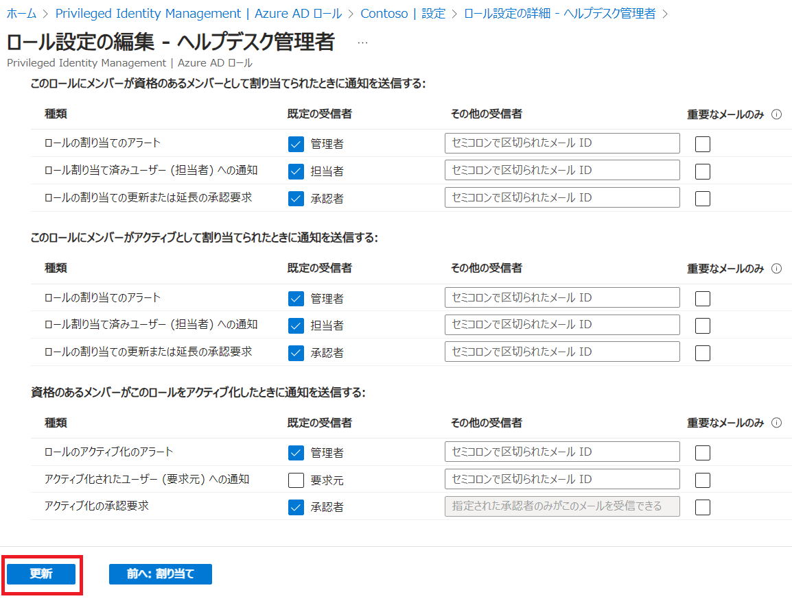

# [ラーニング パス 4 - ラボ 4 - 演習 2 - PIM 自己承認](https://github.com/ctct-edu/ms-102-lab/blob/main/Instructions/Labs/LAB_AK_04_Lab4_Ex2_PIM_Self_Approval.md#learning-path-4---lab-4---exercise-2---pim-self-approval)

Adatum の Microsoft 365 管理者としての役割を引き受けて以来、Holly Dickson は、ユーザー サポートのリクエストによって何度か中断され、会社の Microsoft 365 パイロット プロジェクトから注意をそらされてしまいました。ホリーにはタイムリーにリクエストに応答するための帯域幅がないため、アレックス ウィルバーとジョニ シャーマンにこれらのリクエストに応答し始めてもらいたいと考えています。これには、Alex と Joni がヘルプデスク管理者ロールの権限を持っている必要があります。ただし、ホリーは、これが通常の役割ではなく、この役割が他のサービスに影響を与えることを望まないため、この役割をアレックスとジョニに永続的に割り当てたくありません。また、ホリーは、アレックスとジョニにヘルプデスク管理者の役割を割り当てる必要があるたびに承認リクエストを送信してほしくないと考えています。

これらの要件を考慮して、Holly は、ユーザーが必要に応じて Azure AD ロールを自己アクティブ化できるようにする Privileged Identity Management (PIM) 機能を活用したいと考えています。グローバル管理者 (Holly など) または特権ロール管理者が複数のユーザーに個別にロールを割り当てる必要があるのではなく、PIM を使用すると、組織がセキュリティ グループを作成し、そのグループがその特定のロールに適格となるようにすることができます。ユーザーがグループのメンバーとして割り当てられると、間接的にその役割を割り当てる資格が得られます。Holly は、ヘルプデスク管理者の役割に適格なユーザー (Alex と Joni) のセキュリティ グループを作成して、Adatum でこの機能を採用したいと考えています。この機会は、Holly のパイロット プロジェクトにおけるこの機能の良いテストになります。

Alex と Joni がこのロールの資格を取得すると、最初のユーザー要求に応答する必要があるときは常に、ロールの割り当てを自己アクティブ化または自己承認します。そうすることで、あらかじめ決められた期間、ヘルプデスク管理者を制御できるようになります。この場合、ホリーは、彼らに 15 日間その役割を割り当てたままにしてほしいと考えています。

さらに、ホリーは、アレックスとジョニがこの役割の割り当てを要求するたびに、役割の割り当ての承認を強制されることを望んでいません。代わりに、ホリーは、アレックスまたはジョニがその役割を自己承認するたびに通知を受け取りたいだけです。PIM は、ロールの割り当てやアクティブ化など、Azure Active Directory 組織で重要なイベントが発生したときに、選択した個人に電子メール通知を送信できます。

### タスク 1 - ヘルプデスク管理者の役割に適格なグループを作成する

前のラボ演習では、Holly Dickson は Privileged Identity Management を使用してグローバル管理者ロールへのアクセスを制限しました。彼女はまず、ユーザーに適格なロールとして割り当てる前に承認が必要になるようにロールを構成し、その後、適格なユーザーがロールのアクティブ化を要求するたびに自分自身を承認者として割り当てました。

Adatum のパイロット プロジェクトにおける PIM の次のテストのために、Holly はヘルプデスク管理者の役割に適格な Alex Wilber と Joni Sherman を選択しました。ただし、将来の役割の割り当てを簡素化するために、ホリーはセキュリティ グループを作成し、Alex と Joni をそのグループに割り当て、そのグループをヘルプデスク管理者の役割に割り当てたいと考えています。その後、Holly はグループがヘルプデスク管理者ロールの資格を得ることができるようにします。

1. Microsoft Entra 管理センターにアクセスします。ブラウザで新しいタブを選択し、アドレス バーに次の URL を入力します: **https://entra.microsoft.com**  Hollyの資格情報でサインインしてください。

2. Microsoft Entra 管理センターの左側のナビゲーション ウィンドウで、**[グループ]** を選択し、  **[すべてのグループ]** を選択します。

3. グループ内| [すべてのグループ]ウィンドウで、メニュー バーの **[新しいグループ]** を選択します。

4. [新しいグループ]ウィンドウで、次の情報を入力します。

   - グループタイプ -**セキュリティ**
   - グループ名 - **PIM-Helpdesk-Administrators**
   - グループの説明 - **PIM でヘルプデスク管理者の役割を割り当てることができる資格があるユーザーのグループ**
   - Azure AD ロールをグループに割り当てることができます -**はい**
   - メンバーシップの種類 -**割り当て済み**
   - 所有者 -  **[所有者が選択されていません]** を選択します。[所有者の追加]ウィンドウで、[検索]フィールドに **「Holly」** と入力し、**Holly@xxxxxZZZZZZ.onmicrosoft.com** ユーザー アカウントを選択します。
   - メンバー - **「メンバーが選択されていません」**を選択します。[メンバーの追加]ウィンドウで、**[Alex Wilber]** を選択します。[検索] フィールドに **「Joni」** と入力し、 **[Joni Sherman]** を選択します。

5. [新しいグループ]ウィンドウで、ページの下部にある **[作成]** ボタンを選択します。

6. ページの上部に、「Microsoft Entra ロール割り当ての対象となるグループの作成は、後で変更できない設定です。この機能を追加しますか?」という内容のダイアログ ボックスが表示されます。 **[はい]** を選択します。

7. グループについて| [すべてのグループ]ウィンドウで、前のタスクで作成した PIM-Global-Administrators グループの下に PIM- **Helpdesk-Administrators**グループが表示されない場合は、メニュー バーの **[更新]** を選択します。

8. ここで、PIM-Helpdesk-Administratorsグループが役割の割り当て資格を得られるようににする必要があります。左側のナビゲーションペインで、**「Identity Governance」** を選択してセクションを展開し、**「Privileged Identity Management」** を選択します。

9. Privileged Identity Management | クイック スタートウィンドウの中央ペインの[管理]セクションの下にある **[Azure AD ロール]** を選択します。

10.  [割り当て]セクションで、 **[資格の割り当て]** ボタンを選択します。

11. ロールのリストを下にスクロールし、**「ヘルプデスク管理者」** を選択します。

12. ヘルプデスク管理者 | [割り当て]ウィンドウで、メニュー バーの **[+割り当ての追加]** を選択します。

13. [メンバーの選択]で、**[メンバーが選択されていない]** を選択します。

14. 右側に表示される **「メンバーの選択」** ペインで、 「検索」フィールドに **「PIM」** と入力します。表示される　**PIM-Helpdesk-Administrators**　グループを選択し、**[選択]** ボタンを選択します。

15. [割り当ての追加]ウィンドウで、**[次へ]** を選択します (これは、  [設定] タブを選択するのと同じことを行います)。

16. [割り当ての追加]ウィンドウの[設定]タブで、 [割り当ての種類]オプションが **[対象]** に設定されていることを確認します。また、**[永続的に有資格]** チェック ボックスが選択されていることを確認し (選択されていない場合は、すぐに選択してください)、 **[割り当て]** を選択します。

17. ヘルプデスク管理者 | [割り当て]ウィンドウで、PIM-Helpdesk-Administratorsグループがヘルプデスク管理者ロールへの適格な割り当てであることに注意してください。PIM-Helpdesk-Administrators はグループであるため、このグループ (Alex Wilber と Joni Sherman で構成される) のすべてのメンバーがヘルプデスク管理者の役割を割り当てる資格があることを意味します。

    注:ラボでのテストでは、新しい割り当てが[対象となる割り当て]タブに表示されるまでに最大 30 分かかる場合があることがわかっています。PIM-Helpdesk-Administrators がすぐに表示されない場合は、数分間待ってから、メニュー バーの[更新]オプションを選択します。PIM-Helpdesk-Administrators が[対象となる割り当て]のリストに表示されるまで、数分ごとに[更新]オプションを選択し続けます。

18. 次のタスクのためにブラウザのタブはすべて開いたままにしておきます。

### タスク 2 - セルフアクティベーション用にヘルプデスク管理者ロールを構成する

次に、Holly は、Azure AD でヘルプデスク管理者のロール設定と通知設定を構成したいと考えています。Privileged Identity Management (PIM) を使用すると、ロールが割り当てられたときやアクティブ化されたときなど、Azure Active Directory (Azure AD) 組織で重要なイベントが発生したときにそれを知ることができます。PIM は、あなたと他の参加者に電子メール通知を送信することで、常に最新の情報を提供します。これらの電子メールには、役割のアクティブ化や更新など、関連するタスクへのリンクも含めることができます。このタスクでは、Holly は通知を更新して、自己承認がリアルタイムで事前に追跡されるようにしたいと考えています。

グローバル管理者ロールに関する以前のラボ演習では、ホリーはロールを更新して、そのロールのアクティブ化リクエストを承認する必要があるようにしました。ただし、ヘルプデスク管理者ロールの場合、グローバル管理者ロールと比較してロールの範囲がより限定されているため、ホリーは対象となるユーザーがロールの権限を乱用することについてあまり心配していません。ホリーは、サポート リクエストに応答するために必要な場合を除き、アレックスとジョニがロールをアクティブ化しないことを信頼しています。したがって、ホリーは、ロールをアクティブ化する必要がある場合は、アレックスとジョニに正当な理由を提供することのみを要求します。ホリーは、アレックスとジョニのためにその役割を 15 日間有効にしたいと考えています。こうすることで、Holly がアクティベーション リクエストを承認するのを待つ必要がなく、この役割を引き受ける必要があるときにいつでも正当な理由を提示して開始することができます。

1. ブラウザーでは、前のタスクで使用したMicrosoft Entra 管理センターが開いたままになっているはずです。左側のナビゲーションペインの「Identity Governance」セクションで、 **「Privileged Identity Management」** を選択します。

2. Privileged Identity Management | クイック スタートウィンドウの中央ペインの[管理]セクションの下にある　**[Azure AD ロール]**　を選択します。

3. 中央ペインの[管理]セクションの下にある  **[設定]** を選択します。

4. **ヘルプデスク管理者** を選択します。

5. ページ上部のメニュー バーで **[編集]** を選択します。

6. アクティベーションの最大期間 (時間)設定のスライダーが8に設定されています。ホリーは、これを最大許容時間である24時間まで延長したいと考えています。**スライダーを行末に移動するか、スライダーの隣のフィールドに「24」と入力します。**

   **注:** 24 より大きい値を入力しようとすると、自動的に 24 にリセットされます。

7. アクティベーション スライダーの下で、 [アクティブ化で必要]  を **[なし]** に設定します。

8. 次に、画面には 3 つの設定のグループが表示され、それぞれにチェック ボックスが付いています。3 つのチェック ボックスがすべて空白であることを確認します。デフォルトでチェック ボックスがオンになっている場合は、ここでチェックを外します (クリアします)。

   **注:** [アクティブ化に理由が必要]設定をオフのままにすると、資格のあるユーザーが自己承認するか、別のユーザーの承認を必要とせずに自己アクティブ化できるようになります。

9. 現在、「アクティブ化」タブが表示されています。隣に表示される **「割り当て」** タブを選択します。この役割がアレックスまたはジョニに割り当てられている場合、ホリーは 15 日後に割り当てが期限切れになることを望んでいます。この要件を実装するには、このタブで次の設定を構成します。

   - **[永続的に資格のある割り当てを許可する] チェック ボックスをオフ**  (クリア) にします。次に、[次の後に、資格のある割り当ての有効期限が切れる] で表示されるドロップダウン メニューで **[15 日間]** を選択します。
   - **[アクティブな割り当てに理由が必要]** チェック ボックスがオンになっていることを確認します(オンになっていない場合は、ここでオンにします)。

10. ウィンドウの上部で、**「通知」** タブを選択します。

11. **[通知]** タブで、通知の送信をトリガーできる 3 つのアクティビティに注目してください。次の場合に通知を送信します。

    - このロールにメンバーが資格のあるメンバーとして割り当てられたときに通知を送信する
    - このロールにメンバーがアクティブとして割り当てられたときに通知を送信する
    - 資格のあるメンバーがこのロールをアクティブ化したときに通知を送信する

    [資格のあるメンバーがこのロールをアクティブ化したときに通知を送信する]セクションで、Holly は、Alex または Joni がこのロールを自己承認したときに通知を受け取ることを希望しています。したがって：

    -  **[ロールのアクティブ化のアラート]**  チェック ボックスがオンになっていることを確認します。
    - ロールのアクティブ化アラートのデフォルトの受信者は**管理者**です。これは、グローバル管理者 (Holly) および任意の特権ロール管理者を指します。
    - **[アクティブ化されたユーザー (要求元) への通知] のチェックを外します (クリアします)**  。Alex と Joni は自己承認するため、自己承認するときに通知を受け取る必要はありません。

12. ウィンドウの下部にある **「更新」** ボタンを選択します。

    

13. 次のタスクのためにブラウザのタブはすべて開いたままにしておきます。

### タスク 3 - ヘルプデスク管理者ロールを自己アクティブ化する

Holly のパイロット プロジェクトのこの時点で、PIM-Helpdesk-Administratorsグループはヘルプデスク管理者ロールの資格を与えられています。Azure AD Privileged Identity Management を使用して、グループのメンバー (Alex Wilber と Joni Sherman) にヘルプデスク管理者ロールを割り当てることができるようになりました。ホリーは、パイロット プロジェクトで PIM プロセスをテストしたいと考えています。このタスクでは、ユーザー アカウントにヘルプデスク管理者の役割を割り当てる自己承認リクエストを送信する Alex Wilber の役割を引き受けます。

1. Hollyをサインアウトし、ブラウザーを閉じます。

2. ブラウザーを起動し、アドレス バーに次の URL を入力します: **[https://portal.azure.com](https://portal.azure.com/)**

3. 次に、Alex Wilber (「AlexW@xxxxxZZZZZZ.onmicrosoft.com」)として Azure にログインします。[サインイン]ウィンドウで **[「AlexW@xxxxxZZZZZZ.onmicrosoft.com」](mailto:AlexW@xxxxxZZZZZZ.onmicrosoft.com)** と入力し(xxxxxZZZZZZ はラボ ホスティング プロバイダーによって提供されるテナント プレフィックス) と入力し、 **[次へ]** を選択します。[パスワードの入力]ウィンドウで、ラボ ホスティング プロバイダーから提供されたのと同じ　 **Microsoft 365 管理者 パスワードを入力し、 [サインイン]を選択** します。サインインした状態で滞在しますか? ダイアログ ボックスで、[いいえ] を選択します。

4. 表示される[Microsoft Azure へようこそ]ダイアログ ボックスで、 **[後で行う]** を選択してツアーをスキップします。

6. **Microsoft Azure**ポータルでは、画面の中央に**Azure サービス**のセクションがあります。このセクションには、一連の Azure サービスとそれに関連するアイコンが表示されます。行の最後で、**[その他のサービス]** (前方向矢印アイコン付き) を選択します。これにより、**「すべてのサービス」** ウィンドウが開きます。

7. [すべてのサービス]ウィンドウで、ページ上部の **[サービスのフィルター]** 検索ボックスに  **「priv」** と入力します。検索結果のリストで、 **[Azure AD Privileged Identity Management]** を選択します。

8. Privileged Identity Management | クイック スタートウィンドウの左側のナビゲーション ペインの[タスク]セクションで、 **[自分のロール]** を選択します。

9. 私の**役割 | Azure AD ロール**ウィンドウでは、既定で **[資格のある割り当て]** タブが表示されます。

   **[アクティブな割り当て]** タブを選択します。Alex のアカウントにはまだ Azure AD ロールが割り当てられていないことに注意してください。

10. Alex は、ヘルプデスク管理者の役割を自己承認または自己アクティブ化する準備ができました。**[資格のある割り当て]** タブを選択します。ヘルプデスク管理者ロールの  [アクション]列で、 **[アクティブ化]** を選択します。

11. 表示される[アクティブ化 - ヘルプデスク管理者]ペインで、**「解決が必要な営業チーム メンバーからのサポート リクエスト」と**  **[理由]** フィールドに入力します。これが、アレックスがこの役割を自らアクティブ化したい理由です。次に、ペインの下部にある **「アクティブ化」** ボタンを選択します。

    [アクティブ化 - ヘルプデスク管理者]ペインに表示されるアクティブ化の 3 つの段階と、各段階での進行状況に注目してください。3 つのステージすべてが自動的に完了するまで待ちます (通常、ステージ 2 に最も時間がかかります)。最終段階が完了すると、「アクティブ化 - ヘルプデスク管理者」ペインが自動的に閉じ、 自分のロール | Azure AD ロールウィンドウに戻ります。

12. 自分のロール| Azure AD ロール　ウィンドウでは、まだ [資格のある割り当て] タブが表示されていることに注意してください。また、ウィンドウの上部に **「アクティブなロールが変更されました」** というメッセージが表示されることにも注目してください。現在の役割を表示するには、このメッセージを選択してください。これは単に[アクティブな割り当て]タブを表示するだけです。

13. 「アクティブな割り当て」タブに、「ヘルプデスク管理者」ロールが表示されることに注目してください。このロールをアクティブ化する前に、以前にこのタブをチェックしたが、Azure AD ロールが表示されなかったことを思い出してください。Alex がヘルプデスク管理者の役割を自己承認したので、その役割が彼のユーザー アカウントに割り当てられました。

Alex Wilber として、ヘルプデスク管理者の役割を自己承認しました。これにより、Alex のユーザー アカウントにロールが自動的に割り当てられました。

### タスク 4 - PIM 通知が発行されたことを確認する

以前にヘルプデスク管理者の役割を構成したときに、対象となるユーザーがその役割をアクティブ化するたびに Holly に通知されるように通知機能を設定しました。Alex Wilber がロールを自己アクティブ化したばかりなので、Holly はこのアクティビティの通知を受け取るはずです。このタスクでは、Holly が通知を受信したことを確認します。

1. Alex Wilber をサインアウトし、ブラウザーを閉じます。

2. Officeポータルにアクセスします。ブラウザーを起動し、アドレス バーに次の URL を入力します: **https://portal.office.com**  Hollyの資格情報でサインインしてください。

3. [Microsoft 365 へようこそ]ページの画面左側にあるアプリケーション アイコンの列で、**Outlook**アイコンを選択します。これにより、Holly Dickson の Outlook メールボックスが新しいタブで開きます。

4. ホリーの Outlook メールボックスには、デフォルトで受信トレイが表示されます。Holly が、**Alex Wilber がヘルプデスク管理者の役割の割り当てを有効にした**ことを示す、PIM で生成された電子メールを受信したことを確認します。以下のような件名のメールになります。

   **PIM: Alex Wilber activated the Helpdesk Administrator role assignment**

5. 電子メールを選択して開きます。電子メール内の情報を確認して、電子メールを閉じます。

6. Alex のヘルプデスク管理者ロールの自己承認に関連するアクティビティの監査済みリストを確認するには、ブラウザーで **[Microsoft Entra 管理センター]** **https://entra.microsoft.com**  にアクセスします。

7. 左側のナビゲーションペインの **「Identity Governance」** セクションで、 **「Privileged Identity Management」** を選択します。

8. Privileged Identity Management | クイック スタートウィンドウの中央ペインの[管理]セクションの下にある　**[Azure AD ロール]**　を選択します。

9. 中央ペインのページ下部にある「アクティビティ」セクションで、 **「リソースの監査」** を選択します。

10. PIM アクティビティのリストを確認します。最新の 2 つのアクティビティに注目してください。これには、ヘルプデスク管理者の役割への割り当てを求める Alex のリクエストと、Alex のリクエストの完了が含まれます。

11. 次のタスクのためにブラウザとすべてのタブを開いたままにしておきます。
