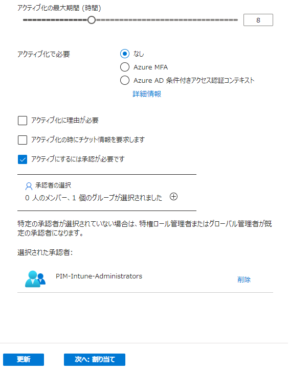

# [ラーニング パス 4 - ラボ 4 - 演習 3 - PIM チームメイトの承認リクエスト](https://github.com/ctct-edu/ms-102-lab/blob/main/Instructions/Labs/LAB_AK_04_Lab4_Ex3_PIM_Teammate_Approval.md#learning-path-4---lab-4---exercise-3---pim-teammate-approval-request)

ここまでに、次の 2 つの形式の PIM 承認を実施しました。

- 1 つは管理者 (Holly) によるもので、グローバル管理者ロールのアクティブ化と Patti Fernandez への割り当てを承認しました。
- もう 1 つは、ユーザー アカウントへのヘルプデスク管理者の役割の割り当てを自己承認した Alex Wilber によるものです。

この演習では、PIM 承認の 3 番目の形式を実行します。これは、管理者以外のユーザーに別のユーザーへのロールの割り当てを承認してもらいます。

オーバーヘッドを削減しながら、管理者ロールを安全に管理する方法を維持するために、Holly は、Alex Wilber と Patti Fernandez が Intune 管理者ロールをアクティブ化するための互いの要求を承認できるようにすることにしました。これにより、Alex と Patti は、Holly による要求の承認を待つことなく、Intune 内でデバイス管理タスクを実行できるようになります。

### タスク 1 - Intune 管理者ロールに適したグループを作成する

Adatum のパイロット プロジェクトにおける PIM の最終テストのために、Holly は、Intune 管理者ロールの資格のある Alex Wilber と Patti Fernandez を選択しました。今後のロールの割り当てを簡素化するために、ホリーはセキュリティ グループを作成し、そのグループに Alex と Patti を割り当ててから、そのグループを Intune 管理者ロールに割り当てたいと考えています。これは、以前のヘルプデスク管理者ロールのラボ演習で行ったのと同じです。

1. Microsoft Entra 管理センターにアクセスします。ブラウザで新しいタブを選択し、アドレス バーに次の URL を入力します: **https://entra.microsoft.com**  Hollyの資格情報でサインインしてください。

2. Microsoft Entra 管理センターの左側のナビゲーション ウィンドウで、 **[グループ]** を選択し、**[すべてのグループ]** を選択します。

3. グループ| [すべてのグループ]ウィンドウで、メニュー バーの **[新しいグループ]** を選択します。

4. [新しいグループ] ウィンドウで、次の情報を入力します。

   - グループタイプ -**セキュリティ**
   - グループ名 - **PIM-Intune-Administrators**
   - グループの説明 - **PIM で Intune 管理者ロールに割り当てることができる適格なユーザーのグループ**
   - Microsoft Entra ロールをグループに割り当てることができます -**はい**
   - メンバーシップの種類 -**割り当て済み**
   - 所有者 -  **[所有者が選択されていません]** を選択します。[所有者の追加]ウィンドウで、[検索]フィールドに **「Holly」** と入力し、**Holly@xxxxxZZZZZZ.onmicrosoft.com** ユーザー アカウントを選択します。
   - メンバー -  **「メンバーが選択されていません」** を選択し、２人のメンバーを追加します。[メンバーの追加]ウィンドウで、まず **[Alex Wilber]** を選択します。次に[検索] フィールドに **「patti」** と入力し、 **[Patti Fernandez]** を選択します。

5. [新しいグループ]ウィンドウで、**[作成]** を選択します。

6. ページの上部に、「Microsoft Entra ロールを割り当てることができるグループの作成は、後で変更できない設定です。この機能を追加してもよろしいですか? 」という内容のダイアログ ボックスが表示されます。**[はい]**　を選択します。

7. グループについて| [すべてのグループ]ウィンドウで、PIM-Intune-Administratorsグループが表示されない場合は、メニュー バーの **[更新]** を選択します。グループが表示されるまでに数分かかる場合があります。

8. ここで、PIM-Intune-Administratorsグループにロールの割り当てに資格を与えるにする必要があります。Microsoft Entra 管理センターのナビゲーション ウィンドウの [ID Governance] セクションで、 **[ Privileged Identity Management]** を選択します。

9. Privileged Identity Management | クイック スタートウィンドウの中央ペインの[管理]セクションの下にある **[Microsoft Entra ロール]** を選択します。

10. ウィンドウの[割り当て]セクションで、 **[資格の割り当て]** ボタンを選択します。

11. アダタムコーポレーションでは| [ロール]ウィンドウでロールのリストを下にスクロールし、**[Intune 管理者]** を選択します。

12. Intune管理者 | [割り当て]ウィンドウで、メニュー バーの **[+割り当ての追加]** を選択します。

13. 「割り当ての追加」 ウィンドウには、デフォルトで「メンバーシップ」 タブが表示されます。[メンバーの選択]で、 **[メンバーが選択されていない]**  を選択します。

14. 右側に表示される 「メンバーの選択」ペインで、 「検索」フィールドに  **「PIM」** と入力します。これにより、名前がPIMで始まる対象となるユーザーおよびグループのリストが表示されます。表示される **PIM-Intune-Administrators** グループを選択し、 **[選択]** ボタンを選択します。

15. [割り当ての追加]ウィンドウで、**[次へ]** を選択します。

16. [割り当ての追加]ウィンドウの[設定]タブで、 [割り当ての種類]オプションが  **[対象]** に設定されていることを確認します。また、 **[永続的に有資格]** チェック ボックスが選択されていることを確認し (選択されていない場合は、すぐに選択してください)、 **[割り当て]** を選択します。

17. Intune管理者 | [割り当て]ウィンドウで、**PIM-Intune-Administrators**グループが 表示されることに注意してください。**PIM-Intune-Administrators は**グループであるため、このグループ (Alex Wilber と Patti Fernandez で構成される) のすべてのメンバーが Intune 管理者ロールを割り当てる資格があることを意味します。

    **注:**　ラボでのテストでは、新しい割り当てが[対象となる割り当て]タブに表示されるまでに最大 30 分かかる場合があることがわかっています。PIM-Intune-Administrators がすぐに表示されない場合は、数分間待ってから、メニュー バーの[更新]オプションを選択します。PIM-Intune-Administrators が[対象となる割り当て]のリストに表示されるまで、数分ごとに[更新]オプションを選択し続けます。

18. 次のタスクのためにブラウザのタブはすべて開いたままにしておきます。

### タスク 2 - 承認を必要とするように Intune 管理者ロールを構成する

この演習では、Holly は PIM-Intune-Administrators グループが Intune 管理者ロールの資格を得ることができるようにします。ただし、ホリーはグループに役割の資格を与えるだけでなく、そのメンバーに役割のリクエストを承認させることになります。次に、ホリーは、PIM からこのロールに対するすべての承認が通知されるようにロールを構成します。

ヘルプデスク管理者ロールに関する以前の PIM 演習と同様に、ホリーは、要求されない限り、Alex と Patti が Intune 管理者ロールをアクティブ化しないことを信頼しています。したがって、ホリーは、アレックスとジョニがロールをアクティブ化する必要がある場合にのみ、正当な理由を提供することを要求します。さらに、ホリーは、アレックスとジョニがお互いのロールのアクティブ化要求を承認できるようにロールを構成したいと考えています。ホリーは、どちらかのユーザーがもう一方のユーザーからのリクエストを承認するたびに通知を受け取りたいだけです。

1. ブラウザーで、Holly Dickson として Microsoft 365 にログインしているはずです。

2. ブラウザーでは、前のタスクで使用したMicrosoft Entra 管理センターが開いたままになっているはずです。左側のナビゲーションペインの「Identity Governance」セクションで、 **「Privileged Identity Management」** を選択します。

3. ウィンドウの中央ペインの[管理]セクションの下にある **[Microsoft Entra ロール]** を選択します。

4. ウィンドウの中央ペインの[管理]セクションの下にある **[設定]** を選択します。

5. ウィンドウで、**Intune 管理者**　ロールを選択します。

   ヒント:役割がアルファベット順に表示されない場合は、「役割」見出しを選択してアルファベットの昇順に並べ替えます。これにより、Intune 管理者ロールを見つけやすくなります。

6. ページ上部のメニュー バーで **[編集]** を選択します。

7. アクティベーション スライダーの下で、[アクティブ化で必要] を **[なし]** に設定します。

8. パイロット プロジェクトの場合、Holly は **[アクティブ化に理由が必要]** チェック ボックスをオンにしたくないと考えています。このチェック ボックスがオンになっている場合は、今すぐ選択を解除 (クリア) してください。

9. **[アクティブ化するには承認が必要]** チェック ボックスをオンにします。これにより、「承認者の選択」セクションが有効になります。

10. 「承認者の選択」セクションでは、特定の承認者が選択されていません。ホリーは、PIM-Intune-Administrators グループのメンバーをこのロールの承認者として割り当てたいと考えているため、このセクションを選択します。

11. 表示される[メンバーの選択]ウィンドウで、検索ボックスに **「PIM」** と入力します。名前がPIMで始まるユーザーとグループの一覧で、**PIM-Intune-Administrators**  を選択し、 **[選択]** ボタンを選択します。このグループを選択すると、グループのメンバーは、このロールに対して適格なユーザーによるリクエストを承認するための通知を受け取ります。

    

12. [ロール設定の編集 - Intune 管理者]ウィンドウでは、現在[アクティブ化]タブが表示されています。隣に表示される **「割り当て」** タブを選択します。 **[アクティブな割り当てに理由が必要]** チェック ボックスがオンになっていることを確認します(オンになっていない場合は、ここでオンにします)。

13. **[ロール設定の編集 - Intune 管理者]** ウィンドウで、**[通知]** タブを選択します。

14.  **[通知]** タブの **[資格のあるメンバーがこのロールをアクティブ化したときに通知を送信する]** セクションで、 **[アクティブ化されたユーザー (要求元) への通知] のチェック を外します (クリアします)。** 

15. [ロール設定の編集 - Intune 管理者]ウィンドウの下部で、 **[更新]** ボタンを選択します。

16. 次のタスクのためにブラウザのタブはすべて開いたままにしておきます。

### タスク 3 - Intune 管理者ロールの要求を送信する

Holly のパイロット プロジェクトのこの時点で、**PIM-Intune-Administrators** グループは Intune 管理者ロールの資格を与えられています。このグループのメンバー (この場合は他のメンバー) に承認を要求することで、グループの各メンバー (この場合は Alex Wilber と Patti Fernandez) に Intune 管理者の役割を割り当てることができます。ホリーは、パイロット プロジェクトで PIM プロセスをテストしたいと考えています。このタスクでは、Patti Fernandez の役割を引き受けます。Patti Fernandez は、自分のアカウントに Intune 管理者ロールを割り当てる承認要求を送信します。

1. Hollyをサインアウトし、ブラウザーを閉じます。

2. ブラウザーを起動し、アドレス バーに次の URL を入力します: **[https://portal.azure.com](https://portal.azure.com/)**

3. これから、Patti Fernandez として Azure にログインします。**[サインイン]** ウィンドウで、**[「pattif@xxxxxZZZZZZ.onmicrosoft.com](mailto:pattif@xxxxxZZZZZZ.onmicrosoft.com)**」 (xxxxxZZZZZZ はラボ ホスティング プロバイダーによって提供されるテナント プレフィックス) と入力し、 [**次へ]** を選択します。[パスワードの入力]ウィンドウで、ラボ ホスティング プロバイダーから提供されたのと同じ**Microsoft 365 管理者 パスワードを** テナント管理者アカウント (つまり、MOD 管理者アカウント) に入力し、  **[サインイン]** を選択します。多要素認証を要求された場合は、Microsoft Authenticatorによる多要素認証をセットアップしてください。サインインした状態で滞在しますか? ダイアログ ボックスで、  **[いいえ]** を選択します。

12. **[Microsoft Azure へようこそ]** ダイアログ ボックスが表示された場合は、**[キャンセル]** を選択してツアーをスキップします。

13. ページ上部の **[サービスのフィルター]** 検索ボックスに **「privi」** と入力します。検索結果のリストで、 **[Microsoft Entra Privileged Identity Management]** を選択します。

14. Privileged Identity Management | クイック スタートウィンドウの左側のナビゲーション ペインの  [タスク]セクションで、 **[自分のロール]** を選択します。

15. ウィンドウでは、既定で[資格のある割り当て]タブが表示されます。前のタスクで、ホリーはジョニとアレックスをPIM-Intune-Administratorsグループのメンバーとして割り当て、ホリーは後で Intune 管理者ロールの適格グループとして割り当てたことを思い出してください。そのため、このリストに表示されます。Intune 管理者ロールの[アクション]列で、 **[アクティブ化]**　リンクを選択します。

16. 表示される[アクティブ化 - Intune 管理者]ウィンドウの下部にある **[アクティブ化]** ボタンを選択します。

17. ウィンドウのメニュー バーに[資格のある割り当て]タブが表示されます。その横に表示される **[アクティブな割り当て]** タブを選択します。役割が表示されないことに注意してください。

    **注:** 前のタスクの場合、Holly は、ユーザー アカウントのアクティブ化に PIM-Intune-Administrators グループのメンバーによる承認が必要になるように、Intune 管理者ロールをセットアップしました。Patti が行ったのは、自分のユーザー アカウントに対して Intune 管理者ロールをアクティブ化するよう要求したことです。これにより、PIM-Intune-Administrators グループのメンバーに通知要求が送信され、Patti の要求を承認します。Alex Wilber はグループのメンバーであるため、Patti の役割アクティブ化の要求を承認または拒否できます。Alex は次のタスクでこのリクエストを確認します。

18. 次のタスクのために、InPrivate ブラウザー セッションを開いたままにしておきます。

### タスク 4 - Intune 管理者ロールの要求を承認する

タスク 2 に戻り、ホリーは PIM-Intune-Administrators グループを Intune 管理者ロールの承認者として割り当てました。これは、ジョニとアレックスの両方がグループのメンバーとして役割の割り当てのリクエストを承認できることを意味します。ジョニは前のタスクで役割の割り当てリクエストを送信したため、アレックスはリクエストを確認して、それを受け入れるか拒否するかを決定する必要があります。

Patti は、PIM-Intune-Administrators グループのメンバーとして、Intune 管理者ロールの要求を承認できます。しかし、ジョニもこの役割の割り当てを要求したため、彼女自身の要求を自己承認することはできないはずです。グループの別のメンバー (この場合は Alex) だけが彼女のリクエストを承認できる必要があります。このタスクでは、まず、Patti が自分のリクエストを自己承認できないことを確認します。

1. 画面上の検索欄に  **「privi」** と入力し、**Microsoft Entra Privileged Identity Management** を選択します。

2. まず、Patti が Intune 管理者ロールに対する自分の要求を自己承認できないことを確認することから始めます。ウィンドウの左側のナビゲーション ペインの[タスク]セクションで、 **[申請の承認]** を選択します。

3. ウィンドウには、「ロールの割り当ての更新または拡張する要求」と「ロールのアクティブ化に関する要求」という2 つのセクションがあります。Patti には承認待ちのリクエストがないことに注意してください。

   **重要:**  Patti は、PIM-Intune-Administrators グループのメンバーであっても、Intune 管理者ロールに対する自分の要求を自己承認できないことが確認されました。グループの他のメンバーの 1 人がジョニのリクエストを承認する必要があります。これは、このタスクの残りの手順で実行し、Alex がリクエストを承認します。

4. Pattiをサインアウトし、ブラウザーを閉じます。

5. ブラウザーを起動し、アドレス バーに次の URL を入力します: **https://portal.azure.com**

6. これから、Alex Wilber として Azure にログインします。[サインイン]ウィンドウに **AlexW@xxxxxZZZZZZ.onmicrosoft.com** と入力し(xxxxxZZZZZZ はラボ ホスティング プロバイダーによって提供されるテナント プレフィックス) と入力し、 [**次へ]** を選択します。[パスワードの入力]ウィンドウで、ラボ ホスティング プロバイダーから提供されたのと同じ**Microsoft 365 管理者 パスワードを** テナント管理者アカウント (つまり、MOD 管理者アカウント) に入力し、  **[サインイン]** を選択します。多要素認証を要求された場合は、Microsoft Authenticatorによる多要素認証をセットアップしてください。サインインした状態で滞在しますか? ダイアログ ボックスで、  **[いいえ]** を選択します。

7. [Microsoft Azure へようこそ]ダイアログ ボックスが表示された場合は、**[後で行う]** を選択してツアーをスキップします。

8. Microsoft Azureポータルでは、画面の中央にAzure サービスのセクションがあります。 **[その他のサービス]**  (前向き矢印アイコン)を選択します。これにより、「すべてのサービス」ウィンドウが開きます。

9. 「すべてのサービス」ウィンドウで、ページ上部の検索ボックスに **「priv」** と入力します。検索結果のリストで、 **[Microsoft Entra Privileged Identity Management]** を選択します。

10. ウィンドウの左側のナビゲーション ペインの[タスク]セクションで、  **[申請の承認]** 選択します。

11. ウィンドウの **[ロールのアクティブ化に関する要求]** クションで、Patti Fernandez からのIntune 管理者要求の左側にある **チェック ボックスをオン** にし、 **[承認]**  ボタンを選択します。

12. 画面の右側に表示されるウィンドウで、 「理由」フィールドに **「PIM テスト」** と入力し、 **「確認」** を選択します。

13. Alexをサインアウトし、ブラウザーを閉じます。

14. Patti に Intune 管理者ロールが割り当てられていることを確認します。ブラウザーを起動し、アドレス バーに次の URL を入力します: **[https://portal.azure.com](https://portal.azure.com/)**

15. これから、Patti Fernandez として Azure にログインします。**[サインイン]** ウィンドウで、 **pattif@xxxxxZZZZZZ.onmicrosoft.com**  (xxxxxZZZZZZ はラボ ホスティング プロバイダーによって提供されるテナント プレフィックス) と入力し、 [**次へ]** を選択します。[パスワードの入力]ウィンドウで、ラボ ホスティング プロバイダーから提供されたのと同じ**Microsoft 365 管理者 パスワードを** テナント管理者アカウント (つまり、MOD 管理者アカウント) に入力し、  **[サインイン]** を選択します。サインインした状態で滞在しますか? ダイアログ ボックスで、 **[いいえ]** を選択します。

16. **[Microsoft Azure へようこそ]** ダイアログ ボックスが表示された場合は、**[後で行う]** を選択してツアーをスキップします。

17. Microsoft Azureポータルでは、画面の中央にAzure サービスのセクションがあります。このセクションには、一連の Azure サービスとそれに関連するアイコンが表示されます。行の最後で、**[その他のサービス]** (前方向矢印アイコン付き) を選択します。これにより、**「すべてのサービス」** ウィンドウが開きます

18. 「すべてのサービス」ウィンドウで、ページ上部の検索ボックスに **「priv」** と入力します。検索結果のリストで、 **[Microsoft Entra Privileged Identity Management]** を選択します。

19. 左側のナビゲーション ペインの[タスク]セクションで、 **[自分のロール]** を選択します。

20. **[アクティブな割り当て]** タブを選択し、グローバル管理者が表示されることを確認します。Privileged Identity Management | クイック スタートウィンドウの左側のナビゲーション ウィンドウの[タスク]セクションで、　 **[自分のロール]**　を選択します。Intune 管理者ロールが Patti に対してアクティブ化されたことに注意してください。

### タスク 5 - PIM 通知が発行されたことを確認する

以前に Intune 管理者ロールを構成したときに、対象となるユーザーがロールをアクティブ化するたびに Holly に通知されるように通知機能を設定しました。Alex Wilber が Patti Fernandez のロールをアクティブ化したばかりなので、Holly はこのアクティビティの通知を受け取るはずです。このタスクでは、Holly がこの通知を受信したことを確認します。

1. Patti をサインアウトし、ブラウザーを閉じます。

2. Officeポータルにアクセスします。ブラウザーを起動し、アドレス バーに次の URL を入力します: **https://outlook.office.com/** Hollyの資格情報でサインインしてください。これにより、Holly Dickson の Outlook メールボックスが開きます。

4. ホリーの Outlook メールボックスには、デフォルトで受信トレイが表示されます。Holly が、**PIM: Patti Fernandez が Intune 管理者ロールの割り当てをアクティブ化した**ことを示す、PIM で生成された電子メールを受信したことを確認します。以下のような件名のメールになります。

   **PIM: Patti Fernandez activated the Intune Administrator role assignment**

5. 電子メールを選択して開きます。電子メール内の情報を確認して、電子メールを閉じます。

6. Patti による Intune 管理者ロールの承認に関連するアクティビティの監査済みリストを確認するには、ブラウザーで **[Microsoft Entra 管理センター]** **https://entra.microsoft.com**  にアクセスします。

7. 左側のナビゲーションペインの **「Identity Governance」** セクションで、 **「Privileged Identity Management」** を選択します。

8. Privileged Identity Management | クイック スタートウィンドウの中央ペインの[管理]セクションの下にある　**[Microsoft Entra ロール]**　を選択します。

9. 中央ペインのページ下部にある「アクティビティ」セクションで、 **「リソースの監査」** を選択します。

10. PIM アクティビティのリストを確認します。最近の 2 つのアクティビティに注目してください。要求者が Alex Wilber である 2 番目のアクティビティを選択します。表示される監査の詳細ウィンドウで、件名が Patti Fernandez であり、アクションは、Intune 管理者ロールに対する Patti のロール要求を Alex が承認したことを示していることに注意してください。**[閉じる]**　を選択します。
