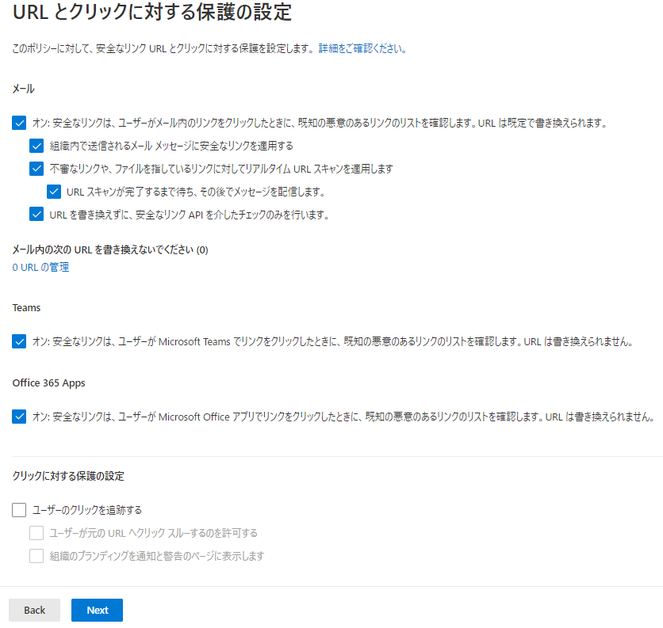
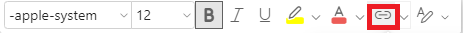
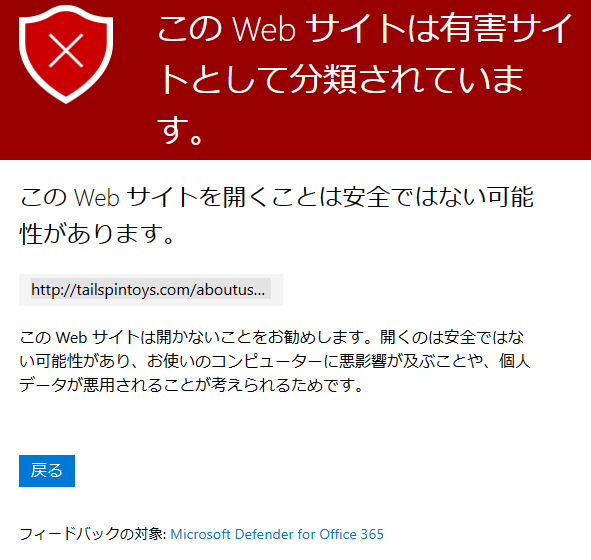

# [ラーニング パス 5 - ラボ 5 - 演習 2 - 安全なリンク ポリシーを実装する](https://github.com/ctct-edu/ms-102-lab/blob/main/Instructions/Labs/LAB_AK_05_Lab5_Ex2_Safe_Links.md#learning-path-5---lab-5---exercise-2---implement-a-safe-links-policy)

安全な添付ファイル ポリシーを作成した後、Holly Dickson は安全なリンク ポリシーを作成し、そのポリシーが適切に機能することを確認するために検証したいと考えています。

**重要:**このラボ演習は 2 つのタスクで構成されています。最初のタスクで安全なリンク ポリシーを作成し、次に 2 番目のタスクでポリシーを検証します。このラボの問題は、安全なリンク ポリシーを作成すると、新しいポリシーがシステムに反映されるまでに少なくとも 30 分かかることです。**これは、タスク 1 を実行した後、タスク 2 を実行するまで少なくとも 30 分待つ必要があることを意味します。タスク 1 を実行した直後にタスク 2 を実行すると、タスク 2 は失敗します。**タスク 1 を完了したら、トレーニング クラスを続行する必要があります。クラススケジュールで発生する次の休憩に応じて、インストラクターがタスク 2 をいつ実行できるかについてガイダンスを提供します。

### タスク 1 – 安全なリンク ポリシーを作成する

このタスクでは、テナント内のすべてのユーザーに適用される安全なリンク ポリシーを作成します。次に、安全なリンクのグローバル設定で定義する全社的なブロック URL リストに **http://tailspintoys.com** URLを追加します。安全なリンクのグローバル設定で定義されたブロックされた URL およびその他のオプションは、アクティブな安全なリンク ポリシーに含まれているユーザーにのみ適用されます。組み込みまたはデフォルトの安全なリンク ポリシーはないため、これらのグローバル設定を有効にするには、少なくとも 1 つの安全なリンク ポリシーを作成する必要があります。

1. 前のタスクを完了した後も、**Holly Dickson**として Microsoft 365 にログインし、Microsoft 365 Defenderポータルが表示されたままになっているはずです。そうでない場合は、ブラウザのアドレス バーにhttps://security.microsoft.comと入力します。

2. Microsoft 365 Defenderポータルでは、前のタスクを完了した後も[安全な添付ファイル]ページが表示されているはずです。ページ上部のナビゲーション スレッド ( [ポリシーとルール] > [脅威ポリシー] > [安全な添付ファイル]) で、**[脅威ポリシー]**を選択します。

   **注:** 前のタスクの後に[安全な添付ファイル]タブを閉じた場合は、左側のナビゲーション ペインで[ポリシーとルール]を選択し、次に [脅威ポリシー] を選択して、 [脅威ポリシー] ページに移動します。

3. [脅威ポリシー]ウィンドウの [ポリシー] セクションで、**[安全なリンク]** を選択します。

4. [安全なリンク]ページで、メニュー バーの **[+作成]** を選択します。これにより、安全なリンクの作成ポリシーウィザードが開始されます。

5. [ポリシーに名前を付けます]ページで、[名前]フィールドに**LinkPolicy1** と入力し、**[Next]** を選択します。

6. [ユーザーとドメイン] ページでは、新しいポリシーが適用される特定のユーザー、グループ、およびドメインを定義できます。 **xxxxxZZZZZZ.onmicrosoft.com** ドメイン内のすべてのユーザーとグループに適用されるため、ドメイン欄にそのドメイン名のみを入力し, **「Next」** を選択します。

7. [URL とクリック保護の設定]ページで、次の設定を更新し、 **「Next」** を選択します。

   - **[メール]** セクションで、すべてのチェック ボックスがオンになっていることを確認します (デフォルトでオンになっていない場合は、ここでオンにします)。
   - [**クリックに対する保護の設定**]セクションで次の操作を行います。
   - **ユーザーのクリックを追跡**-はユーザーのクリックを追跡したくないため、デフォルトでオンになっている場合はこのチェック ボックスを **オフ** にします。

   

8. [通知] ページで、 **[既定の通知テキストを使用]** オプションが選択されていることを確認し (必要に応じて、今すぐ選択します)、 **[Next]** を選択します。

9. [レビュー]ページで、選択したオプションを確認します。修正する必要がある場合は、適切な編集オプションを選択し、必要な修正を加えます。すべて正しいことが確認できたら、**[Submit]** を選択します。

10. [新しい安全なリンク ポリシーが作成されました] ページで、**[Done]** を選択します。LinkPolicy1ポリシーが作成されると、安全なリンクのリストに表示されます。

11. ページ上部のナビゲーション スレッド ( [ポリシーとルール] > [脅威ポリシー] > [安全なリンク]) で、**[脅威ポリシー]**を選択します。

12. [脅威ポリシー]ページの[ルール]セクションで、 **[テナントの許可/ブロック リスト]** を選択します。

13. [テナントの許可/ブロック リスト]ページには、デフォルトで[ドメインとアドレス]タブが表示されます。**「URL」** タブを選択します。

14. [URL]タブのメニュー バーで **[+ブロック]** を選択します。表示される[URLをブロック]ペインで、フィールドに**http://tailspintoys.com** と入力し、 **[追加]** を選択します。

**注意！！** この実習の冒頭で述べたように、安全なリンク ポリシーを作成したので、この実習の次のタスクを実行する前に、ポリシーがシステムに伝達されるまで少なくとも 30 分待つ必要があります。

**次のタスクに進まないでください。** インストラクターがクラスのトレーニング スケジュールを考慮して適切であると判断した場合は、トレーニング コースを続行し、次のタスクを実行できます。

### タスク 2 – 安全なリンク ポリシーを検証する

タスク 1 を完了してから少なくとも 30 分待った後、 http://tailspintoys.comURL へのリンクをブロックする作成した安全なリンク ポリシーをテストします。

1. Officeポータルにアクセスします。ブラウザーを起動し、アドレス バーに次の URL を入力します: **https://portal.office.com**  Hollyの資格情報でサインインしてください。

2. [Microsoft 365 へようこそ]ページの画面左側にあるアプリケーション アイコンの列で、**Outlook**アイコンを選択します。これにより、Holly Dickson の Outlook メールボックスが新しいタブで開きます。

3. 画面左上にある **「新規メール」** ボタンを選択します。

4. 右側のペインに表示される電子メール フォームに、次の情報を入力します。

   - 宛先: MOD 管理者に電子メールを送信するため、[宛先]フィールドに **「mod」** と入力し、ユーザー リストから **MOD 管理者の** 電子メール アドレスを選択します。
   - 件名を追加: **Adatum ユーザー向けの無料コンテンツ**
   - メッセージ本文: **Tailspin Toys の無料おもちゃを入手するには、このリンクをクリックしてください。**

   ※ Tailspin Toyはおもちゃを販売している企業というシナリオです。

5. メッセージ本文に追加したテキスト文字列全体を選択します。

6. 書式設定アイコンの行が表示されます。**[リンク]** アイコンを選択します。このアイコンは、間に線が入った 2 つの半楕円を表します。

   

7. 表示される[リンクの挿入]ウィンドウで、メッセージ本文で強調表示したテキストが [表示形式]フィールドに表示されます。「Web アドレス (URL)」フィールドに、次の URL を入力します: **http://tailspintoys.com/aboutus/freetoys** 。

8. **[OK]** を選択します。電子メールの本文で、メッセージにハイパーリンクが設定されているはずです。

9. **「送信」** ボタンを選択します。Holly の **送信済みアイテム** フォルダーを選択して、メッセージが送信されたことを確認します。

10. 送信済みアイテム フォルダーでメッセージ本文のハイパーリンクを選択し、サイトに移動します。

11. ブラウザーで新しいタブが開き、前の手順で確認した URL に移動します。このサイトには次の警告メッセージが表示されます。「この Web サイトは有害サイトとして分類されています。」これは、この Web サイトを開くのが安全ではない可能性があることを示すだけでなく、作成したばかりの安全なリンク ポリシーが適切に機能していることも検証します。

    

    

    **注:以下の手順はオプションとなります。ここで本演習を終了しても構いません。**

12. 次に、Outlook で MOD 管理者の受信トレイに移動し、前のタスクで作成した安全なリンク ポリシーが、Holly から MOD 管理者に送信したばかりの電子メールに対して機能したかどうかを検証します。

    これを行うには、まずHollyをサインアウトし、ブラウザーを閉じます。

13. Officeポータルにアクセスします。ブラウザーを起動し、アドレス バーに次の URL を入力します: **https://portal.office.com**  MOD 管理者でサインインしてください。

14. [Microsoft 365 へようこそ]ページの画面左側にあるアプリケーション アイコンの列で、**Outlook**アイコンを選択します。これにより、MOD 管理者 の Outlook メールボックスが新しいタブで開きます。

15. MOD 管理者の受信箱で、Adatum ユーザー向けの無料コンテンツに関して Holly から送信された電子メールを選択します。

16. メッセージ本文のハイパーリンクを選択して、サイトに移動します。

17. ブラウザーで新しいタブが開き、前の手順で確認した URL に移動します。このサイトには次の警告メッセージが表示されます。「この Web サイトは有害サイトとして分類されています。」これは、この Web サイトを開くのが安全ではない可能性があることを示すだけでなく、作成したばかりの安全なリンク ポリシーが適切に機能していることも検証します。

18. MOD 管理者をサインアウトし、ブラウザーを閉じます。
