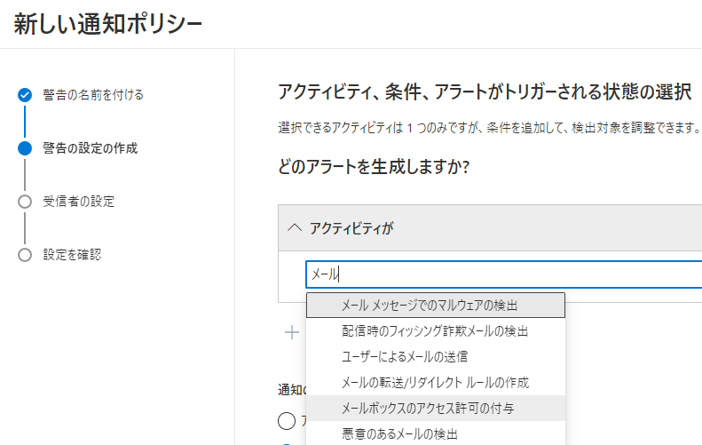

# [ラーニング パス 6 - ラボ 6 - 演習 2 - メールボックスのアクセス許可アラートの実装](https://github.com/ctct-edu/ms-102-lab/blob/main/Instructions/Labs/LAB_AK_06_Lab6_Ex2_Mailbox_Permission_Alert.md#learning-path-6---lab-6---exercise-2---implement-mailbox-permission-alert)

この演習では、Adatum 内のメールボックスにフルアクセス許可が付与されたときに Lynne Robbins に通知するアラートを構成してテストします。

### タスク 1 – メールボックスのアクセス許可アラートを作成する

1. ブラウザーで、Holly Dickson として Microsoft 365 にログインしているはずです。

2. Microsoft 365 Defender は、前のタスクからブラウザーで開いたままになっているはずです。左側のナビゲーション ウィンドウの[電子メールとコラボレーション]セクションで、**[ポリシーとルール]** を選択します。

3. [ポリシーとルール] ウィンドウで、**[アラート ポリシー]** を選択します。アラート ポリシー ポータルが更新されたことを示すダイアログ ボックスが表示された場合は、**[閉じる]** ボタンを選択します。

4. [アラート ポリシー]ウィンドウで、メール フロー アラートが Exchange 管理センターに移動されたことを示すページ上部のメッセージに注目してください。メール フロー アラートは、Microsoft 365 Defender セキュリティ ポータルで維持できなくなりました。メール フロー アラートではなくメールボックス アクセス許可アラートを作成するため、Microsoft 365 Defender ポータルでこのタスクを続行できます。

   [アラート ポリシー]ウィンドウで、Microsoft 365 で使用できる事前構成されたアラート ポリシーのリストを確認します。メニュー バーで **[+新しい通知ポリシー]** を選択します。これにより、新しいアラート ポリシーウィザードが開始されます。

5. [アラートに名前を付け、分類し、重大度を選択してください]ページで、次の情報を入力します。

   - 名前: **メールボックス権限の変更**
   - 説明: **このアラートは、Adatum Corporation のメールボックスにフルアクセス許可が付与された場合に、Lynne Robbins に通知します。**
   - 重大度: **中**
   - カテゴリ: **アクセス許可**

6. **「次へ」** を選択します。

7. **[アクティビティ、条件、アラートがトリガーされる状態の選択]** ページで、次の情報を入力します。

   - アクティビティ: フィールドのドロップダウン矢印を選択し、「アクティビティが」の フィールドに **「メール」** と入力し、メールを含むアクティビティのリストから **「メールボックスのアクセス許可の付与」** を選択します。

     

   - アラートをどのようにトリガーしますか?:  **アクティビティがルールに一致するたびに毎回**

8. **「次へ」** を選択します。

9. [このアラートがトリガーされたときに人々に通知するかどうかを決定しますこのアラートがトリガーされたときにユーザーに通知するかどうかを決定します] ページで、次の情報を入力します。

   - 電子メール受信者: Holly Dickson のアカウントの右側にある **「X」** を選択して彼女を削除し、フィールドに **Lynne** と入力して、名前がLynneで始まるユーザーのリストから**Lynne Robbins** を選択します。
   - 1 日あたりの通知制限:  **制限なし** 

10. **「次へ」** を選択します。

11. [設定の確認]ページで設定を確認し、修正する必要がある場合は、対応する[編集]オプションを選択して必要な修正を加えます。

    すべてが正しい場合は、[ポリシーをすぐにオンにしますか?] の下に表示されます。設定で、**「はい、すぐに有効にします」** を選択します。 **[送信]** を選択します。

12. **[**新しい通知ポリシー**]** ウィンドウで、 **[完了]** を選択します。

13. 新しいアラート ポリシーが [アラート ポリシー]ページのリストに表示され、その[タイプ]が[カスタム]に設定され、そのステータスが有効に設定されていることを確認します。

14. 次のタスクのために、Edge ブラウザの [アラート ポリシー] タブを開いたままにしておきます。

これで、メールボックスにフルアクセス許可が付与されたときにトリガーされるアクティビティ アラートが Microsoft 365 Defender に作成されました。

### タスク 2 – メールボックスのアクセス許可アラートを検証する

前のタスクでは、Adatum 内のメールボックスにフルアクセス許可が付与されたときに Lynne Robbins に通知するアラートを構成しました。このアラートをテストするために、Holly Dickson は、Joni Sherman に彼のメールボックスへのフルアクセスを許可することで、Alex Wilber のメールボックスに対するフルアクセスのアクセス許可を変更します。このアクティビティにより、先ほど作成したアラート ポリシーがトリガーされ、Lynne Robbins のメールボックスにアラート通知電子メールが送信されます。次に、Lynne Robbins として LON-CL2 にログインし、彼女がこの電子メールを受信したかどうかを確認します。

1. ブラウザーで、Holly Dicksonとして Microsoft 365 にログインしているはずです。ブラウザーで **[Microsoft 365 管理センター]** タブを選択し、左側のナビゲーション ウィンドウの **[管理センター]** グループで **[Exchange]** を選択します。これにより、Exchange Online の Exchange 管理センターが開きます。

2. Exchange 管理センターでは、**[メールボックスの管理]** ウィンドウがデフォルトで表示されます (表示されない場合は、左側のナビゲーション ウィンドウの [受信者]グループで [メールボックス]を選択します)。

3. [メールボックスの管理] ウィンドウで、メールボックスのリストから **Alex Wilber** を選択します(Alex の名前を選択します。名前の左側のチェック ボックスは選択しないでください)。

4. 表示されるAlex Wilberペインには、デフォルトで「全般」タブが表示されます。**「委任」** タブを選択します。

5. [委任]タブには、更新できる 3 つのメールボックス アクセス許可があります: **メールボックス所有者として送信する** 、 **代理人として送信する** 、および **読み取りと管理 (フル アクセス)** 。Alex のメールボックスに対するこれらの各アクセス許可をJoni Shermanに追加します。権限ごとに、次の手順を実行して、Joni をその権限に追加します。

   - 権限の **「編集」** ボタンを選択します。
   - **[メールボックス委任の管理]** ウィンドウで、**[+メンバーの追加]** を選択します。
   - **表示されるユーザーのリストで、 Joni Sherman** のチェックボックスを選択し、 **[保存]** を選択します。
   - [アクセス許可の委任を追加しますか?] ペインで、**[確認]** を選択します。
   - メールボックスのアクセス許可が Alex のメールボックスに追加されたら、ウィンドウの上部にある戻る矢印を選択します。
   - これにより、 [Alex Wilber]ペインの[委任]タブに戻り、3 つの権限が表示されます。残りの 2 つの権限ごとにこれらの手順を繰り返します。

6. [委任]タブの 3 つの権限のそれぞれに Joni を割り当てたら、右上隅の **[X]** を選択して、 [Alex Wilber]ペインを閉じます。

7. ホリー ディクソンは、ジョニ シャーマンに自分のメールボックスへのフル アクセス許可を与えることで、アレックス ウィルバーのメールボックス アクセス許可を変更したため、このイベントを通知するアラート電子メールがリン ロビンスの受信箱に自動的に送信されるはずです。

8. Holly をサインアウトし、ブラウザーを閉じます。

9. Officeポータルにアクセスします。ブラウザーを起動し、アドレス バーに次の URL を入力します: **https://portal.office.com**  

   Lynne Robbins(LynneR@xxxxxZZZZZZ.onmicrosoft.com)の資格情報でサインインしてください。

10. [Microsoft 365 へようこそ]ページの画面左側にあるアプリケーション アイコンの列で、**Outlook**アイコンを選択します。これにより、 Lynne Robbins の Outlook メールボックスが新しいタブで開きます。

11. Lynne Robbins の受信トレイには、Holly Dickson がメールボックスのアクセス許可を変更したことを通知する、アラート通知システム ( Office365Alerts@microsoft.com ) からの電子メールが含まれている必要があります。

    **警告:**　ラボでのテストでは、場合によっては、Lynne の受信箱に電子メールが受信されるまでに最大 15 分程度かかることがわかっています。電子メールを受信するまで、Outlook を 1 回以上更新する必要がある場合があります。

12. 通知メールが Lynne の受信箱に到着したら、メールを開いて内容を確認します。電子メールの一番下までスクロールし、 **[View alert details]** ボタンを選択します。これにより、新しいタブでMicrosoft 365 Defenderポータルが開きます。

13. Microsoft 365 Defenderポータルに[アラート]ウィンドウが表示され、Lynne への電子メール通知をトリガーしたこのアラート アクティビティの [メールボックス アクセス許可の変更]ウィンドウが自動的に開きます。[メールボックスのアクセス許可の変更]ペインを下にスクロールし、このアクティビティのすべての情報を確認します。完了したら **「閉じる」** を選択してペインを閉じます。

14. Lynne Robbinsをサインアウトし、ブラウザーを閉じます。

ユーザーのメールボックスへのフルアクセスの付与に関してアラーム メッセージを送信するメールボックス アクセス許可アラートのテストが正常に完了しました。
