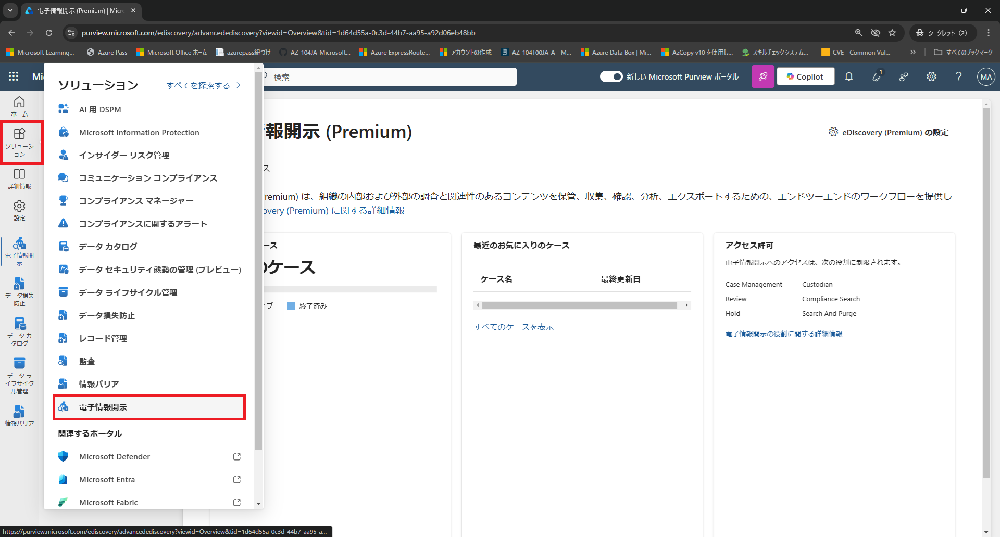
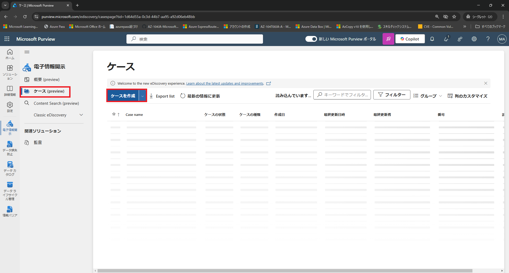
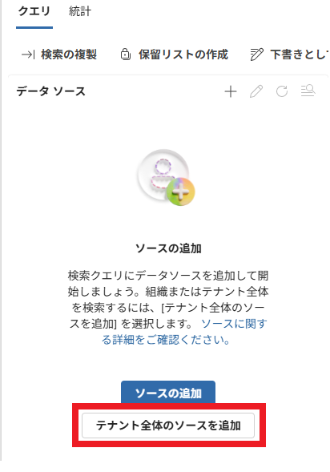
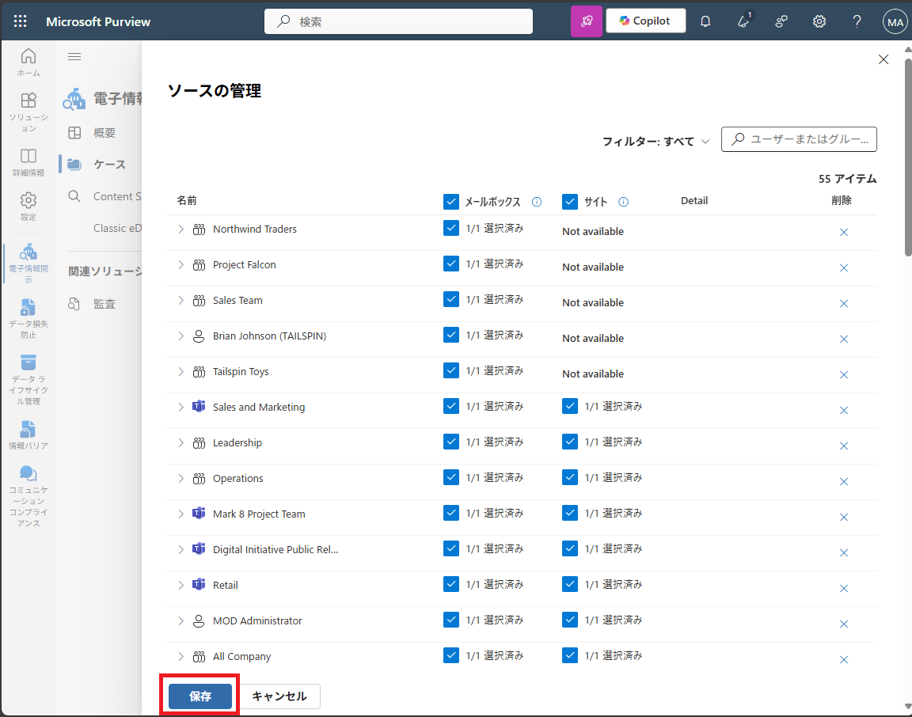
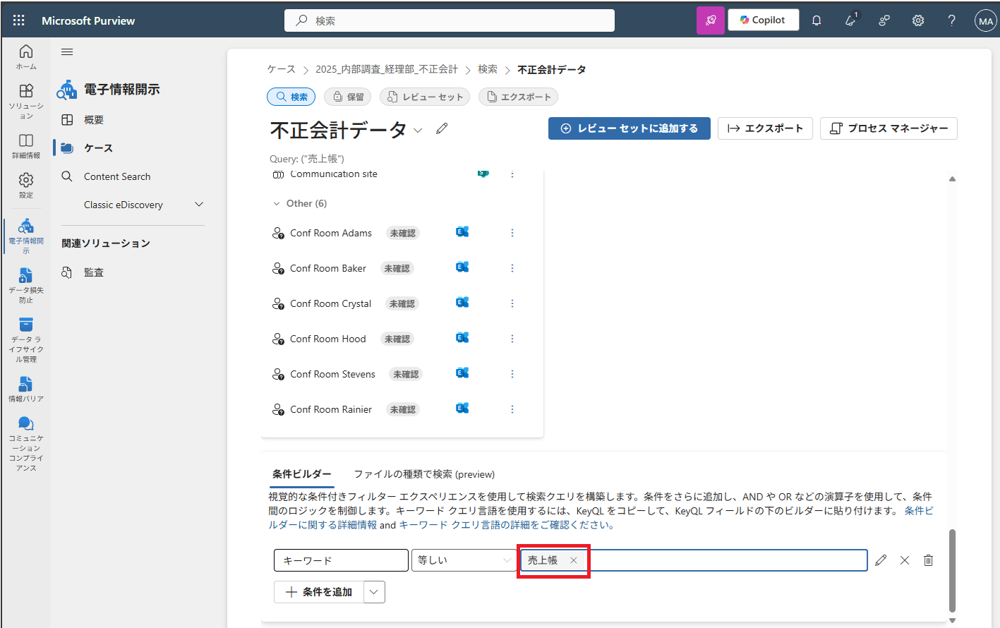
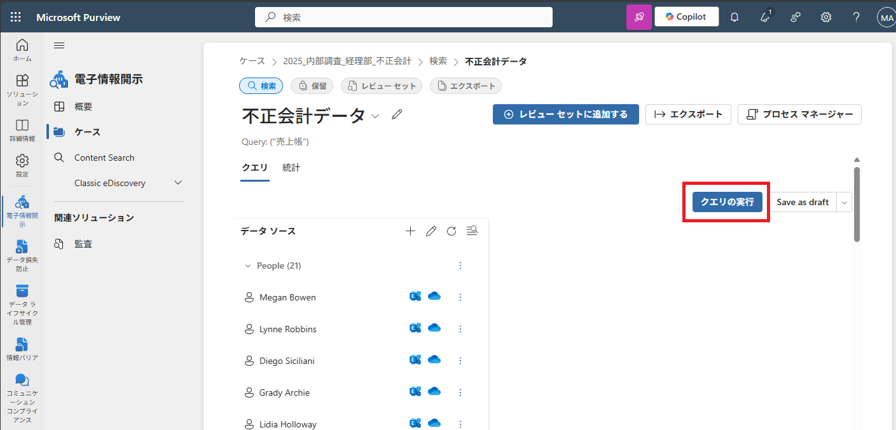
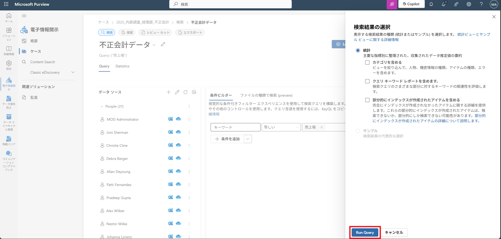

# [ラーニング パス 6 - ラボ 6 - 演習 4 - デフォルトの電子情報開示アラートをテストする](https://github.com/MicrosoftLearning/MS-102T00-Microsoft-365-Administrator-Essentials/blob/master/Instructions/Labs/LAB_AK_06_Lab6_Ex4_eDiscovery_Alert.md#learning-path-6---lab-6---exercise-4---test-the-default-ediscovery-alert)

この演習では、電子情報開示検索が作成またはエクスポートされるたびに、Holly Dickson などのすべてのテナント管理者に通知する、既定の Microsoft 365 アラート ポリシーをテストします。

**注:**この種の電子情報開示アラートを作成することは重要です。電子情報開示の検索が規制されていない場合、機密コンテンツが抽出され、不正なソースにエクスポートされる可能性があるためです。

### タスク 1 – デフォルトの電子情報開示アラートを確認する

このタスクでは、テナント内の誰かが電子情報開示検索を作成するとき、または既存の検索からデータをエクスポートするときに、既定の Microsoft 365 アラートがトリガーされるかどうかを確認します。Holly Dickson にはグローバル管理者の役割が割り当てられているため、自動的にテナント管理者のメンバーとなり、このアラートの受信者の 1 人になります。

1. お手元のPCでInPrivate ウィンドウ(Microsoft Edge) もしくは、シークレットウィンドウ (Google Chrome) で、Microsoft 365 管理センター ([https://admin.microsoft.com](https://admin.microsoft.com/)) にアクセスし、Hollyの資格情報でサインインします。

2. 左側のナビゲーション ウィンドウの [管理センター]で、 **[セキュリティ]**　を選択します。これにより、ブラウザーにMicrosoft 365 Defenderの新しいタブが開きます。

3. ブラウザーで左側のナビゲーション ウィンドウで **[ポリシーとルール]** を選択し、  **[通知ポリシー]** を選択します。

4. [アラート ポリシー] ページで、デフォルトのシステム ポリシーを検索して「eDiscovery search started or exported」という名前のポリシーを検索します。既存のシステム ポリシーが非常に多いため、ポリシーを見つける最も簡単な方法は検索することです。画面上部の検索フィールドに **「eDiscovery」** と入力し、Enter キーを押します。

5. ポリシー リストで、表示される **eDiscovery search started or exported** ポリシーを選択します。

6. 「eDiscovery search started or exported」 ウィンドウが表示されます。ペインを下にスクロールし、この事前定義ポリシーのデフォルト設定が次のように構成されていることを確認します。

   - ステータス:オン
   - 条件: [警告の設定の作成]セクションの下矢印を選択して展開し、次の設定を確認します。
     - 条件:アクティビティが eDiscoverySearchStartedOrExported 
     - 集約:シングルイベント
     - 範囲:すべてのユーザー
   - 電子メール受信者: [受信者の設定]セクションの下矢印を選択して展開し、次の設定を確認します。
     - 受信者:TenantAdmins
     - 1 日あたりの通知制限:制限なし

7. ペインの上部にある **[ポリシーの編集]** ボタンを選択します。

8. 表示される[eDiscovery search started or exported]ウィンドウで、この既定のポリシーで編集できる設定は [電子メール受信者]設定のみです。このウィンドウでは、このポリシーがトリガーされたときに通知を受ける電子メール受信者を編集できます。ここでは値を変更しません。この手順の目的は、実際の実装でデフォルトのシステム ポリシーの受信者リストを変更する方法を示すことです。

   ウィンドウの下部にある **[キャンセル]** ボタンを選択します。

9. [eDiscovery search started or exported]ウィンドウで、右上隅の  **[X]** を選択してウィンドウを閉じます。

これで、電子情報開示検索が作成またはエクスポートされたときにテナント管理者に通知する、既定の Microsoft 365 電子情報開示アラートを確認しました。

### タスク 2 – デフォルトの電子情報開示アラートを検証する

このデフォルトのアラートをテストするために、Holly Dickson は電子情報開示検索を作成します。このアクティビティによりアラート ポリシーがトリガーされ、すべてのテナント管理者にアラート通知電子メールが送信されます。Holly はグローバル管理者であり、デフォルトでは Tenant Admin グループのメンバーです。したがって、このアラートによって生成された電子メール通知を受信する必要があります。

1. ブラウザーで、**Holly Dickson**として Microsoft 365 にログインしているはずです。

2. ブラウザーで、 **[Microsoft 365 管理センター]** のタブを選択します。

3. Microsoft 365 管理センターの左側のナビゲーション ウィンドウで、[管理センター]グループの下にある　 **[Microsoft Purview]** を選択します。

4. 左側のナビゲーション メニューの [ソリューション]をクリックし、[電子情報開示]をクリックします。

   

5. [ケース]をクリックし、さらに[ケースを作成]をクリックします。

   

6. [名前]には[2026_内部調査_経理部_不正会計]と入力し、[作成]をクリックします。

7. [検索の作成]をクリックし、さらに検索名には[不正会計データ]と入力し、[作成]をクリックします。

8. [不正会計データ]では[ソースの追加]をクリックし、[すべて選択]をクリックし、[管理]をクリックします。

   

9. [保存]をクリックします。

   

10. [条件ビルダー] の [キーワード]に[売上帳]と入力します。

    

11. [クエリの実行] [Run Query]とクリックします。

    

    

    > 注：本来はデータがあれば、検索結果が表示されます。

12. このアラートをテストするには、ブラウザーで **Outlook(https://outlook.office.com/)** にアクセスします。

13. ホリーの Outlook メールボックスで、受信トレイに件名「Informational-severity alert: eDiscovery search started or exported」のアラートがないか監視します。電子情報開示検索が開始されたか、アラート通知システムによって自動的に送信されたエクスポートされた電子メールです。このメッセージの目的は、電子情報開示検索が作成またはエクスポートされたことを Holly に通知することです。必要に応じて、URL アドレスの左側にある[更新]アイコンを選択します。メールを受信したら、メールを開いて内容を確認し、メッセージを閉じます。

 **注:** 電子メールが Holly の受信箱に到着するまでに最大 10 分程度かかる場合があります。

これで、電子情報開示検索の作成または完了した検索からのデータのエクスポートを監視する Microsoft 365 電子情報開示システム アラートのテストが正常に完了しました。
