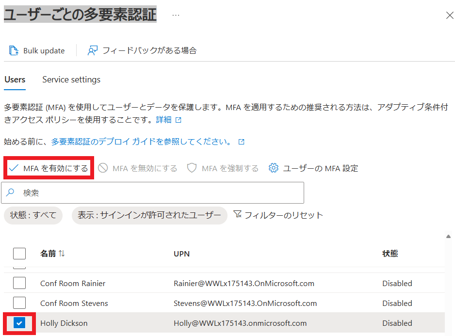

# [ラーニング パス 6 - ラボ 6 - 演習 5 - 攻撃シミュレーション トレーニングを使用してスピア フィッシング攻撃を実行する](https://github.com/MicrosoftLearning/MS-102T00-Microsoft-365-Administrator-Essentials/blob/master/Instructions/Labs/LAB_AK_06_Lab6_Ex5_AttackSim_Phishing_attack.md#learning-path-6---lab-6---exercise-5---conduct-a-spear-phishing-attack-using-attack-simulation-training)

Holly Dickson 氏は、Adatum の一部のユーザーがフィッシング攻撃に関する教育を必要とする可能性があることを懸念しています。パイロット プロジェクトの一環として、ホリーは Microsoft 365 の攻撃シミュレーション トレーニング機能を使用して、ユーザーがフィッシング攻撃を受けやすいかを判断することにしました。

### タスク 1: 全体管理者の多要素認証を有効にする (HollyのMFAが有効な場合は不要)

Microsoft の攻撃シミュレーション トレーニング機能を使用してフィッシング攻撃をシミュレートするには、まず組織全体、またはシミュレーションを実行する全体管理者のみに対して多要素認証 (MFA) を有効にする必要があります。パイロット プロジェクトでは、ホリーは現時点ではすべての Adatum ユーザーに対して MFA を設定したくありません。したがって、彼女は自分のユーザー アカウントに対してのみ MFA を有効にし、攻撃シミュレーション トレーニングの実行が終了した後、MFA をオフに戻します。

**重要:**  MFA を実装するには、2 番目の認証形式としてテナントに入力できるように、携帯電話を使用して確認コードを受信する必要があります。電話をお持ちでない場合は、このラボをスキップする必要があります。この場合は、インストラクターに通知してください。インストラクターは、このラボを一緒に進める別の学生と協力してくれる可能性があります。

1. お手元のPCでInPrivate ウィンドウ(Microsoft Edge) もしくは、シークレットウィンドウ (Google Chrome) で、Microsoft 365 管理センター ([https://admin.microsoft.com](https://admin.microsoft.com/)) にアクセスし、Hollyの資格情報でサインインします。

2. 左側のナビゲーション ウィンドウで  **[ユーザー]** 、  **[アクティブ ユーザー]** の順に選択します。

3. [アクティブなユーザー]ウィンドウのユーザー リストの上部にあるメニュー バーで、 **[多要素認証]** を選択します。このオプションがメニュー バーに表示されない場合は、 省略記号 (その他のアクション) アイコンを選択し、表示されるドロップダウン メニューで  [多要素認証] を選択します。

4. 新しい ブラウザー タブに [多要素認証 (MFA) の構成]ウィンドウが表示されます。ページ上部のテキストの段落の下には、「お探しのものではありませんか?」というメッセージが表示される情報ボックスがあります。個々のユーザーごとのレベルで MFA を構成するには、「従来のユーザーごとの MFA」を選択します。このメッセージ内の **「従来のユーザーごとの MFA」** リンクを選択します。

   表示される多要素認証ページでは、ページの上部に「ユーザー」タブがデフォルトで表示されます。すべての既存のユーザー アカウントの MFA ステータスが[無効] であることに注意してください。上の方の虫眼鏡アイコンをクリックすると現れる検索欄に、holly と入力して検索します。 Holly Dickson(holly@WWLxXXXXXX.onmicrosoft.com)のチェック ボックスを **オン** にし、右側に表示される Holly のプロパティ ペインで **[有効にする]** を選択します。

   

5. 表示される[多要素認証の有効化について] ダイアログ ボックスで、 **[multi-factor authを有効にする]** ボタンを選択し、 **[閉じる]** を選択します。

6. 多要素認証ウィンドウで、Holly の MFA ステータスが**有効**に変更されたことを確認します。ブラウザーの **[多要素認証]** タブを閉じます。**これにより、 Microsoft 365 管理センター**タブに戻るはずです。

7. ここで、Holly として Microsoft 365 からサインアウトし、ブラウザー セッションを閉じて (キャッシュをクリアするため)、新しいセッションを開いて、MFA を使用して Holly として再度ログインする必要があります。ユーザー アカウントで MFA を有効にした後、初めてサインインし直すと、電話番号や認証オプションなど、MFA に必要な認証情報の入力を求められます。その後、認証プロセスが機能することを検証するための確認コードがテキストメッセージで送信されます。このタスクの残りの部分では、これらの手順を実行します。

   まず、Holly として Microsoft 365 からサインアウトする必要があるため、ブラウザーの右上隅にある**DH**ユーザー アイコンを選択し、表示されるHolly Dicksonウィンドウで　**[サインアウト]**　を選択します。

8. サインアウトしたら、ブラウザーを閉じます。

9. ブラウザーを再度起動します。アドレス バーに次の URL を入力して、Microsoft Office ホームページに移動します: **https://portal.office.com/**

10. [アカウントの選択]ウィンドウで、**[Holly@xxxxxZZZZZZ.onmicrosoft.com](mailto:Holly@xxxxxZZZZZZ.onmicrosoft.com)** (xxxxxZZZZZZ はラボ ホスティング プロバイダーによって提供されるテナント プレフィックス) を選択し、 **[次へ]** を選択します。[パスワードの入力]ウィンドウで、ラボ ホスティング プロバイダーから提供されたテナント管理者アカウント (つまり MOD 管理者アカウント) と同じ Microsoft 365 テナント パスワードを入力し、 **[サインイン]**　を選択します。

11. Holly では MFA が有効になっているため、[詳細情報が必要]ウィンドウが表示されます。 **「次へ」** を選択します。

12. Microsoft Authenticatorページでは、このモバイル アプリをダウンロードすることも、MFA 検証に別の方法を使用することもできます。このラボでは、このトレーニング クラス後に再度使用することのない Microsoft Authenticator アプリのインストールに時間を費やす必要がないように、携帯電話を使用することをお勧めします。ページの下部にある「 **別の方法を設定します** 」オプションを選択します。

13. 表示される[別の方法を選択してください]ダイアログ ボックスで、 [どの方法を使用しますか?]のドロップダウンを選択します。フィールドで **[電話]** を選択し、 **[確認]** を選択します。

14. 表示される[電話]ウィンドウの[どの電話番号を使用しますか?]で、フィールドで国または地域を **(Japan +81)** を選択し、その隣のフィールドに **電話番号** を入力します ( nnn-nnnn-nnnnの形式)。[コードを受け取る]オプションが選択されていることを確認し、 **[次へ]** を選択します。

15. 携帯電話に送信されたテキスト メッセージから確認コードを取得します。

16. [電話] ウィンドウで、コード フィールドに 6 桁の確認コードを入力し、**[次へ]** を選択します。[電話]ウィンドウに電話が正常に登録されたことを示すメッセージが表示されたら、 **[次へ]** を選択します。

17. [成功]ページで、 **「完了」** を選択します。

18. [Microsoft Office ホーム]タブで、画面左側のアプリ アイコンの列に表示される **管理** アイコンを選択します。これにより、新しいブラウザー タブでMicrosoft 365 管理センターが開きます。これにより、攻撃シミュレーション トレーニングの完了後に Holly Dickson の MFA を無効にするときの次のラボ演習の準備が整います。

19. **Microsoft 365 管理センター** で、ナビゲーション ウィンドウで **[すべて表示]** を選択します。[管理センター]で、**[セキュリティ]** を選択します。これにより、 Microsoft 365 Defenderポータルが開きます。攻撃シミュレーション トレーニングを使用してスピア フィッシング攻撃を開始するときは、次のタスクでここから再開します。

20. これで、Holly Dickson の MFA が構成され、MFA を使用して Holly としてOffice 365ポータルにサインインし、今後のラボ用に Microsoft 365 管理センターを開き、Microsoft 365 Defender ポータルで攻撃シミュレーター トレーニングを実行する準備が整いました。

### タスク 2: スピア フィッシング攻撃を設定して開始する

ホリーは MFA を有効にしたので、Microsoft 365 の攻撃シミュレーション トレーニング機能を実行し、シミュレートされたスピア フィッシング攻撃を開始する準備が整いました。これにより、Adatum がこの種のセキュリティ攻撃にどの程度対処できるかを可視化できます。

Microsoft 365 には、シミュレーションを作成し、すべてのユーザーまたは選択したユーザー グループに対して実行できる攻撃シミュレーション トレーニング機能が含まれています。各フィッシング攻撃には、「ペイロード」と呼ばれるものが含まれます。これは、ハッカーが情報収集や悪意のあるコードのデポジットなどに使用する悪意のあるコンポーネントを含む電子メール内のメッセージです。攻撃シミュレーション トレーニング機能には、選択できる多数のペイロード テンプレートが含まれており、必要に応じて独自のペイロードを作成できます。

このラボ演習では、既存のペイロード テンプレートの 1 つを使用します。次のラボ演習では、独自のカスタム ペイロードを作成します。

1. Microsoft 365 Defenderポータルの左側のナビゲーション ウィンドウの [メールとコラボレーション]セクションで、 **[攻撃シミュレーション トレーニング]** を選択します。[攻撃シミュレーション トレーニングへようこそ]ウィンドウが表示された場合は、 **[閉じる]** を選択します。

2. 攻撃シミュレーション トレーニングページで、ホリーは、URL を使用してユーザー名とパスワードの取得を試みる、アカウント侵害のシミュレーションを実行することを決定しました。これは、攻撃シミュレーターではCredentials Harvest攻撃と呼ばれます。

   この攻撃は、 [シミュレーション]タブから実行するか、 [概要]ページの[シミュレーションの起動]リンクを選択して実行できます。[概要]タブには追加情報があり、攻撃シミュレーション トレーニングサービスを選択するときのデフォルト ページであるため、このタイプの攻撃の詳細を学ぶためにそこからサービスを起動することをお勧めします。

   [概要]タブで、 **[おすすめ]** セクションまで下にスクロールします。[他のソーシャル エンジニアリング技術を使用してフィッシング シミュレーションを開始する]推奨事項で、 **[新しい手法を使用して別のシミュレーションを作成]** を選択します。これにより、シミュレーションの作成ウィザードが開始されます。

3. [技法の選択]ページで、 [資格情報収集] 攻撃タイプ オプションに関連する特定の情報を確認します。[資格情報収集]オプションの下部にある **[資格情報収集の詳細を表示する]** リンクを選択します。これにより、右側に[資格情報収集]ペインが開きます。このタイプの攻撃の説明とシミュレーションの手順を確認してください。完了したら、資格情報収集ペインを閉じます。

4. [テクニックの選択]ページで、デフォルトで **[資格情報収集]** 攻撃タイプが選択されていない場合は選択し、 **[次へ]** を選択します。

5. シミュレーションウィザードでは、シミュレーションに含まれるステップが左側のペインに表示されます。フィッシング キャンペーンを手動で作成することもできますが、ほとんどの情報が事前に入力される利用可能なテンプレートを利用することをお勧めします。フィッシング攻撃を成功させる鍵は、非常に魅力的で現実世界に見える電子メールを作成することであり、テンプレートは非常に創造的なソリューションを提供します。

   [名前のシミュレーション]ページで、次の情報を入力します。

   - シミュレーション名:  **PhishingTest1**
   - 説明: **このシミュレーションは、社内のユーザーに対する標的型電子メールの脅威に関する洞察を提供します。**

6.   **[次へ]** を選択します。

7. [ペイロードとログイン ページの選択]ウィンドウで、 **Service Notification** (見つけるには検索欄を活用してください)ペイロードの左側にあるチェック ボックスをオンにします。**「次へ」** を選択します。

8. [対象ユーザー]ページで、 **[組織にすべてのユーザーを含める]**  オプションを選択します。これにより、すべてのユーザーが表示されます。**[次へ]** を選択し、[ユーザーの除外]ページでもう一度 **[次へ]** を選択します。

9. [トレーニングの割り当て]ページの[設定]セクションで、 **[トレーニングを自動で割り当てる (推奨)]** オプションがデフォルトで選択されている必要があります (選択されていない場合は、ここで選択します)。 **[期限日]** フィールドを選択します。表示されるドロップダウン メニューで、 [**7 日:シミュレーション終了日より ]**を選択し、**[次へ]** を選択します。

10. [フィッシング ランディング ページを選択する]ウィンドウには、デフォルトで[グローバル ランディング ページ]タブが表示されます。**Microsoft Landing Page Template 1** の名前を選択して、ページをプレビューします。

11. このテンプレート のMicrosoft ランディング ページのプレビューが新しいペインに表示されます。このプレビュー ウィンドウには、誰かがフィッシング攻撃に遭遇し、シミュレーションでMicrosoft Landing Page Template 1を使用した場合にランディング ページがどのように表示されるかの例が表示されます。このプレビュー パネルを下にスクロールして、機能を確認します。完了したら、プレビュー ペインの下部にある **[閉じる]** ボタンを選択します。

12. Microsoft Landing Page Template 1の横のチェックボックスを **オン** にして、 **[次へ]** を選択します。

13. [エンド ユーザー通知の選択]ページで、エンド ユーザーへの通知方法を選択します。このラボでは、 **[Microsoft の既定の通知 (推奨)]** を選択します。表示される通知のリストで、次の通知を構成します。

    - Microsoft default positive reinforcement notification -配信設定を**シミュレーション終了後に配信する**ように設定します
    - Microsoft default training reminder notification -配信設定を**週毎**に 設定します

    

14.  **「次へ」** を選択します。

15. [起動の詳細]ページで、 **[完了したらすぐにこのシミュレーションを起動する]**　オプションを選択し、 **「次へ」** を選択します。

16. [シミュレーションの確認]ページで、入力した情報を確認します。変更する必要がある場合は、適切な編集オプションを選択して変更を加えます。すべてが正しければ、**「送信」** 選択します。シミュレーションの起動がスケジュールされたことを示す確認メッセージが表示されるまでに、数分かかる場合があります。  **[完了]** を選択します。

### タスク 3: 攻撃シミュレーション結果を確認する

このタスクでは、攻撃シミュレーション トレーニングで設定した電子メールを Adatum が受信したかどうかを確認します。次に、シミュレーションしたスピア フィッシング攻撃に関連する診断フィードバックを確認します。

1. Holly をサインアウトし、ブラウザーを閉じます。

2. Officeポータルにアクセスします。ブラウザーを起動し、アドレス バーに次の URL を入力します: **https://portal.office.com**  

   Lynne Robbins(LynneR@xxxxxZZZZZZ.onmicrosoft.com)の資格情報でサインインしてください。

3. [Microsoft 365 へようこそ]ページの画面左側にあるアプリケーション アイコンの列で、**Outlook**アイコンを選択します。これにより、 Lynne Robbins の Outlook メールボックスが新しいタブで開きます。

4. Lynne の Outlook 受信トレイに、攻撃シミュレーターによって送信「2 Failed messages to you 」という件名のされたスピア フィッシング メールが表示されるはずです。電子メールを選択して開き、メッセージ本文の詳細を確認します。

   **注記！** メールが届くまでに最大 15 分ほどかかる場合があります。続行する前にメールを待ってください。

5. 電子メール内の **「ご利用確認はこちら」** ボタンを選択します。これがスピア フィッシング攻撃であることがわかっていても、スピア フィッシング キャンペーンの結果を追跡する攻撃シミュレーター レポートでその効果を確認できるようになります。

6. 表示される[サインイン]ダイアログ ボックスに **「LynneR@xxxxxZZZZZZ.onmicrosoft.com」** と入力し (xxxxxZZZZZZ はラボ ホスティング プロバイダーから提供されたテナント プレフィックス ID)、ラボ ホスティング プロバイダーから提供されたものと同じ Microsoft 365 管理者パスワードを入力します。[パスワードの入力]ウィンドウでテナント管理者アカウント (つまり、MOD 管理者アカウント) を入力します。 **[サインイン]** を選択します。

7. これにより、組織が実施しているフィッシング認識テストの一環として、どのようにリダイレクトされたかを説明する Web ページが表示されます。このサイトのコンテンツを最後まで読んでください。このサイトでは、攻撃シミュレーションを設定するときに前のタスクで選択したランディング ページ テンプレートが使用されています。

8. Lynner をサインアウトし、ブラウザーを閉じます。

9. Microsoft 365 Defender にアクセスします。ブラウザーを起動し、アドレス バーに次の URL を入力します: **https://security.microsoft.com/**  

   holly (holly@xxxxxZZZZZZ.onmicrosoft.com)の資格情報でサインインしてください。

10. ナビゲーション ウィンドウで　**攻撃シミュレーション トレーニング** を選択して表示します。PhishingTest1シミュレーションが表示されます。 **PhishingTest1**シミュレーションを選択して、このシミュレーションでキャプチャされた診断結果を表示します。

11. **PhishingTest1**ページが表示されます。このシミュレートされた攻撃のために収集されたすべての情報を確認します。完了したら、ウィンドウの右上隅にある  **[X]** を選択してウィンドウを閉じます。

    
