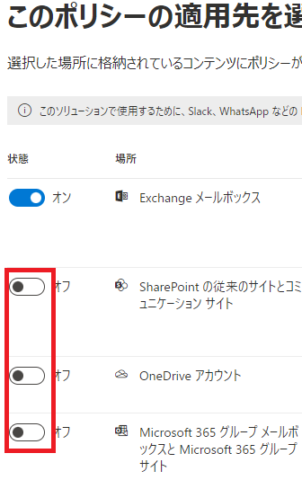

# [ラーニング パス 7 - ラボ 7 - 演習 2 - インプレースのアーカイブおよび保持ポリシーを構成する](https://github.com/MicrosoftLearning/MS-102T00-Microsoft-365-Administrator-Essentials/blob/master/Instructions/Labs/LAB_AK_07_Lab7_Ex2_Retention_Policies.md#learning-path-7---lab-7---exercise-2---configure-in-place-archiving-and-retention-policies)

この演習では、Microsoft Exchange 管理センターを使用して、Holly Dickson のメールボックスのインプレース アーカイブを有効にします。次に、Microsoft Purview ポータルを通じて 2 つの保持ポリシーを構成します。

### タスク 1 – 新しいユーザーのメールボックスに対してインプレース アーカイブをアクティブ化する

Adatum パイロット プロジェクトの次のフェーズでは、Microsoft Exchange 管理センターにアクセスして、Holly Dickson のアーカイブ メールボックスをアクティブ化します。ホリーのアーカイブ メールボックスが有効になると、彼女のメールボックスに割り当てられた既定のアイテム保持ポリシーによって次の処理が実行されます。

- 2 年以上前のアイテムを、ホリーのプライマリ メールボックスからアーカイブ メールボックスに移動します。
- 14 日以上経過したアイテムを、ホリーのプライマリ メールボックスの回復可能なアイテム フォルダーからアーカイブ メールボックスの回復可能なアイテム フォルダーに移動します。

1. Holly Dicksonとして Microsoft 365 にログインしているはずです。

2. Microsoft Edge のMicrosoft 365 管理センターの[管理センター]グループで、 **[Exchange]** を選択してExchange 管理センターを開きます。

3. Exchange 管理センターでは、デフォルトで[メールボックスの管理]ページが表示されます。「アーカイブ の状態」が[アクティブ]となっているユーザーに注目してください。これらのアーカイブ メールボックスは、このトレーニング コース用に ラボ環境が構築され、これらのユーザーがテナントで事前構成されたときに有効になりました。ただし、このコースの開始時に最初のラボの 1 つで Holly のユーザー アカウントを追加したため、彼女のアーカイブ メールボックスはデフォルトで[None]になっています。

   Holly のアーカイブ メールボックスを有効にするには、ユーザー リストで**Holly Dickson** を選択します。表示される[Holly Dickson]ペインで、 **[その他]** タブを選択します。[メールボックス アーカイブ]セクションで、Holly のアーカイブ メールボックスが[無効]になっていることに注意してください。このグループで、**[メールボックス アーカイブの管理]** を選択します。

4. 表示される[メールボックス アーカイブの管理]ウィンドウで、 **[メールボックス アーカイブ ステータス]**の切り替えスイッチを選択して、 **[有効]** に変更します。**[保存]** を選択した後、右上の **[x]** を選択してペインを閉じます。

5. Holly のアーカイブ メールボックスを作成するには、少し時間がかかる場合があります。[メールボックスの管理]ページで、ユーザーのリストの上にあるメニュー バーの **[更新]** アイコンを選択します。アーカイブ メールボックスが作成されると、Holly のアーカイブ メールボックスはアクティブになるはずです。[アクティブ] が表示されるまで、1 ～ 2 分待ってから再度更新する必要がある場合があります。

6. Microsoft Edge ブラウザーでは、次のタスクのために Edge ブラウザーとそのすべてのタブを開いたままにしておきます。

### タスク 2 – テスト ユーザー用の電子メール保持ポリシーを作成する

Adatum のパイロット プロジェクトの一環として、新しい保持ポリシーを作成して、Microsoft Purview ポータルを通じて電子メールの保持を構成します。次に、このアイテム保持ポリシーを Joni Sherman と Lynne Robbins のメールボックスに割り当てます。Joni と Lynne は、Holly のコンプライアンス テスト用の 2 人のテスト ユーザーです。ホリーは、組織全体に適用される次のタスクで 2 番目の保持ポリシーを作成する前に、このポリシーを使用してこれら 2 人のテスト ユーザーの電子メール保持をテストしたいと考えています。

1. ブラウザーでMicrosoft 365 管理センターが開いたままになっているはずです。**Microsoft 365 管理センター**のタブを選択します。左側のナビゲーション ウィンドウの [管理センター]セクションで、**[コンプライアンス]** を選択します。これにより、Microsoft Purviewポータルが開きます。

2. Microsoft Purviewポータルの左側のナビゲーション ウィンドウで、[データ ライフサイクル管理] の下にある **[Microsoft 365]** を選択します。

3. [データ ライフサイクル管理]ウィンドウのページ上部に表示されるタブのリストで、**[アイテム保持ポリシー]** を選択します。

4. [保持ポリシー]タブで、メニュー バーの  **[+新しいアイテム保持ポリシー]** を選択します。これにより、アイテム保持ポリシーの作成ウィザードが開始されます。

5. [アイテム保持ポリシーに名前を付ける]ページで、[名前]フィールドに **「テスト ユーザーの電子メール保持」** と入力し、**[次へ]** を選択します。

6. [ポリシー スコープ]ページで、**[次へ]** を選択します。

7. [作成する保持ポリシーの種類を選択する]フィールドで、**[静的]** を選択し、 **[次へ]** を選択します。

8. [このポリシーの適用先を選択します]ページで、Exchange の電子メールの場所をメモします。現在、すべての受信者が含まれるように設定されています。これを Joni Sherman と Lynne Robbins のメールボックスにのみ適用するように変更したいと考えています。[すべてのメールボックス]の下にある **[編集]** を選択します。

9. 表示される「Exchange メールボックス」ウィンドウで、 **Joni Sherman**の上にマウスを置き、チェック ボックスをオンにします。**Lynne Robbins**　についても同じことを行います。

   **注:**ユーザー名を選択すると、選択されていた他のチェック ボックスの選択が解除されます。複数のユーザーを選択するには、各ユーザーの名前の上にマウスを置き、表示されるチェック ボックスをオンにする必要があります。

   両方のチェック ボックスをオンにしたら、**[完了]** を選択します。

10. [ポリシーを適用する場所を選択します]ページで、Exchange 電子メールの場所に2 メールボックスが含まれることが示されるはずです。

   このポリシーは Joni と Lynne の Exchange 電子メールにのみ適用されるため、現在オンに設定されている他のすべての場所 ( **SharePoint サイト**、**OneDrive アカウント**、および**Microsoft 365 グループ**)では、**状態**トグル スイッチを**オフ**に設定します。**[次へ]** を選択します。

   

11. [コンテンツを保持するか、削除するか、または両方を行うかを決定します]ページで、[特定の期間アイテムを保持] オプションが選択されていることを確認します(必要に応じて、ここで選択します)。次に、このオプションに次の情報を入力します。

    - アイテムを特定の期間保持します - このフィールドで選択し、表示されるドロップダウン メニューで   **[カスタム]** を選択します。年、月、日の 3 つのフィールドが表示されます。テストの目的で、ホリーは、ジョニとリンのメールボックス内の電子メールの保存期間を、1 年未満の電子メールのみを保持することによってテストしたいと考えています。したがって、期間を次の値に設定します: **1 - 年、0 - か月、0 - 日**。
    - **アイテムの作成日時** に基づいて保存期間を開始します。
    - 保存期間の終了時 -**アイテムを自動的に削除する**

12. **「次へ」** を選択します。

13. **[確認と終了]** ページで、選択内容を確認します。変更する必要がある場合は、適切な編集リンクを選択し、必要な変更を加えます。それ以外の場合は、すべてが正しい場合は、**[送信]** を選択します。

14. **[保持ポリシーが正常に作成されました]**ウィンドウで、**[完了]** を選択します。

### タスク 3 – すべてのユーザーに対する電子メール保持ポリシーを作成する

ホリーは、前のタスクで作成したテスト ユーザーの電子メール保持ポリシーを使用して、ジョニとリンのメールボックスでの電子メール保持のテストを終了しました。Holly は現在、すべての Exchange Online メールボックスの内容を最後の変更から 5 年間削除されないように保存する保持ポリシーを作成したいと考えています。ホリーは電子メール保持テストを完了したため、まずテスト ユーザーの電子メール保持ポリシーを無効にしたいと考えています。これにより、Joni と Lynne のメールボックスは、このタスクで作成したすべての Adatum メールボックスに適用される保持ポリシーによって管理されるようになります。

1. ブラウザーでは前のタスクで使用したMicrosoft Purviewポータルが開いたままになっており、「データ ライフサイクル管理」ウィンドウが表示されているはずです。

2. [データ ライフサイクル管理]ウィンドウのページ上部に表示されるタブのリストで、**[アイテム保持ポリシー]** を選択します(別のタブが選択されている場合)。

3. [アイテム保持ポリシー]タブで、 **[テスト ユーザーの電子メール保持]** の横にあるチェック ボックスをオンにし、メニュー バーで **[ポリシーを無効化]** を選択します。

   ポリシーが無効になると、ポリシーが無効であることを示すメッセージがページの上部に一時的に表示されます。このタスクの残りの手順に進み、Adatum の公式の組織全体の電子メール保持ポリシーを作成できるようになります。

4. [アイテム保持ポリシー]タブで、メニュー バーの [ **+新しいアイテム保持ポリシー]** を選択します。これにより、アイテム保持ポリシーの作成ウィザードが開始されます。

5. [アイテム保持ポリシーに名前を付ける]ページで、[名前]フィールドに **「電子メールの保持」** と入力し、 **[次へ]** を選択します。

6. [ポリシー スコープ]ページで、 **[次へ]** を選択します。

7. [作成する保持ポリシーの種類を選択してください]フィールドで、**[静的]** を選択し、 **[次へ]** を選択します。

8. このポリシーは **Exchange メールボックス** にのみ適用されるようにします。[ポリシーを適用する場所の選択]ページでは、[ステータス] が **[オン]** に設定されていることを確認します。デフォルトでオンになっている他のすべての場所では、ステータストグル スイッチを **[オフ]** に設定します。

9. Exchange メールボックスの場所については、現在[すべてのメールボックス]が含まれるように設定されていることに注意してください。このポリシーをすべてのユーザーのメールボックスに適用する必要があるため、この値は変更しないでください。**「次へ」** を選択します。

10. **[コンテンツを保持するか、削除するか、または両方を行うかを決定します]** ページで、[特定の期間アイテムを保持する] オプションが選択されていることを確認します(必要に応じて、ここで選択します)。次に、このオプションに次の情報を入力します。

   - 特定の期間アイテムを保持 - **5 年**
   - 以下に基づいて保存期間を開始する -  **アイテムの最終変更日時**
   - 保存期間の終了時 -**アイテムを自動的に削除する**

11. **「次へ」** を選択します。

12. **[確認と終了]** ページで、選択内容を確認します。変更する必要がある場合は、適切な編集リンクを選択し、必要な変更を加えます。それ以外の場合は、すべてが正しい場合は、**[送信]** を選択します。

13. **[保持ポリシーは正常に作成されました]** ウィンドウで、**[完了]** を選択します。

    

これで、Microsoft Purview ポータルで、すべてのメールボックスからのすべての Exchange 電子メールを最後の変更後 5 年間保持する新しい保持ポリシーが作成されました。
