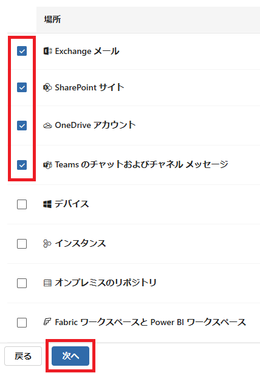

# [ラーニング パス 8 - ラボ 8 - 演習 1 - DLP ポリシーの管理](https://github.com/MicrosoftLearning/MS-102T00-Microsoft-365-Administrator-Essentials/blob/master/Instructions/Labs/LAB_AK_08_Lab8_Ex1_Manage_DLP_Policies.md#learning-path-8---lab-8---exercise-1---manage-dlp-policies)

Adatum の新しい Microsoft 365 管理者である Holly Dickson としてのあなたの役割では、仮想化されたラボ環境に Microsoft 365 を展開しています。Microsoft 365 パイロット プロジェクトを進める際の次のステップは、Adatum でデータ損失防止 (DLP) ポリシーを実装することです。この演習では、まずカスタム DLP ポリシーを作成し、次に電子メール メッセージのアーカイブと機密データを含む電子メールに関連する DLP ポリシーをテストします。

### タスク 1 – カスタム設定を使用して DLP ポリシーを作成する

このタスクでは、Microsoft Purview ポータルでデータ損失防止ポリシーを作成し、機密データがユーザーによって共有されないように保護します。作成した DLP ポリシーは、IP アドレスを含むコンテンツを共有したいかどうかをユーザーに通知します。

ポリシーには 2 つのルールまたはアクションが含まれており、それぞれのルールはメッセージ内の IP アドレスの数に依存します。メッセージに 1 つの IP アドレスが含まれている場合、ポリシーはユーザーにポリシー ヒントを通知し、メッセージを電子メールで送信します。ただし、コンテンツに 2 つ以上の IP アドレスが含まれている場合、メッセージはブロックされ、高機密レベルのインシデント電子メールが送信者に送信され、送信者が電子メールのブロックを上書きできるようにするポリシー ヒントが表示されます。送信者がポリシー ヒント内でビジネス上の正当な理由を提供した場合。

1. お手元のPCでInPrivate ウィンドウ(Microsoft Edge) もしくは、シークレットウィンドウ (Google Chrome) で、Microsoft 365 管理センター ([https://admin.microsoft.com](https://admin.microsoft.com/)) にアクセスし、Hollyの資格情報でサインインします。

2. 左側のナビゲーション ウィンドウの [管理センター]で、 **[コンプライアンス]**　を選択します。これにより、ブラウザーにMicrosoft Purview の新しいタブが開きます。

3. Microsoft Purviewポータルの左側のナビゲーション ウィンドウで、**[ソリューション]** - **[データ損失防止]** を選択し、**[ポリシー]** を選択します。

4. [ポリシー]ページで、メニュー バーの **[+ポリシーの作成]** オプションを選択して、ポリシーの作成ウィザードを開始します。

5. [テンプレートの利用またはカスタム ポリシーの作成]ページの[カテゴリ]列にポリシー カテゴリが表示されます。カスタム カテゴリを除く、各ポリシーカテゴリには、そのタイプのポリシーの作成に使用できるテンプレートが用意されています。このカテゴリには特定のテンプレートは提供されません。代わりに、組織がカスタム ポリシーを最初から作成できるようになります。カテゴリを選択すると、[テンプレート]列が表示され、選択したカテゴリで選択できる使用可能なテンプレートが表示されます。テンプレートを選択すると、そのテンプレートで保護されている情報の種類を示す別の列が表示されます。

   たとえば、左側のペインで [財務]を選択し、 [テンプレート]列で選択できるさまざまなテンプレートをスクロールします。1 つまたは 2 つのテンプレートを選択して、保護される情報の種類を確認します。必要に応じて、残りの各カテゴリを選択して、提供されているテンプレートの種類を確認します。

6. このラボの目的として、カスタム DLP ポリシーを作成します。[カテゴリ]列で **[カスタム]** を選択し、[規制]列で **カスタム ポリシー** を選択して、 **[次へ]** を選択します。

7. [DLP ポリシーの名前の設定]ページで、 **[次へ]** を選択します。

8. [管理単位を割り当てる]ページで、 **[次へ]** を選択します。

9. [ポリシーを適用する場所の選択]ページで、次の場所の[ステータス]トグルが **[オン]** に設定されていることを確認します(これらの場所のいずれかがデフォルトで [オン] に設定されていない場合は、ここで [オン]に設定します)。

- **Exchangeメール**
- **SharePoint サイト**
- **OneDrive アカウント**
- **Teams チャットおよびチャネル メッセージ**

他のすべての場所を **[オフ]** に設定し、**[次へ]** を選択します。

9. [ポリシー設定の定義]ページで、 **[詳細な DLP ルールを作成またはカスタマイズします]** オプションがデフォルトで設定されている必要があります (デフォルトでまだ選択されていない場合は、今すぐ選択してください) し、  **[次へ]** を選択します。
10. [詳細な DLP ルールのカスタマイズ]ページで、メニュー バーの **[+ルールの作成]** オプションを選択します。
11. [ルールを作成]ページで、次の情報を入力します。

- 名前:**単一 IP アドレス ルール**
- 説明:**電子メールには IP アドレスが含まれています**
- [条件]セクションで、**[+条件の追加]** を選択し、表示されるドロップダウン メニューから **[コンテンツに含まれている]** を選択します。 次に、次の条件設定を入力します。
  - [コンテンツに含まれている] フィールドで、**[追加]** ドロップダウン メニューを選択し、**[機密情報の種類]** を選択します。
  - [機密情報の種類] ペインで、[検索]フィールドに **「IP」** と入力し、Enter キーを押します。
  - 検索結果で、**「IP Address」** チェックボックスを選択し、**「追加」** を選択します。
- [ユーザー通知]セクションまで下にスクロールし、[通知を使用してユーザーに通知し、機密情報の適切な使用についてユーザーを教育します。] のトグル スイッチを **[オン]** に設定します。
-  **[Office 365 サービスのユーザーにポリシーヒントの通知を表示する]**  チェック ボックスを **オン** にします。
- [ポリシー ヒント]セクションで、**[ポリシー ヒント のテキストをカスタマイズします]** チェック ボックスを **オン** にします。

このフィールドに次のテキストを入力します。**注意! このメッセージには機密情報 (IP アドレス) が入力されました。このメッセージの送信が妨げられることはありませんが、受信者にこの機密データを表示する権限があるかどうかを確認してください。**

- **[送信前にエンド ユーザーのダイアログとしてポリシー ヒントを表示する (Exchange ワークロードのみで使用可能)]** チェックボックスを **オン** にします。
- [インシデント レポート] セクションまで下にスクロールし、 **[アクティビティがルールに一致する場合に毎回アラートを送信]** 切り替えスイッチが **[オン]** に設定されていることを確認します)。
- ページの下部にある **[保存]** ボタンを選択します。

12. [詳細な DLP ルールのカスタマイズ]ページに、作成したばかりの「単一 IP アドレス ルール」が表示されます。**[+ルールを作成]** オプションを選択して、2 番目の DLP ルールを作成します。
13. [ルールの作成]ページで、次の情報を入力します。

- 名前:**複数の IP アドレス ルール**

- 説明:**電子メールには 2 つ以上の IP アドレスが含まれています**

- [条件]セクションで、**[+条件の追加]** を選択し、表示されるドロップダウン メニューから **[コンテンツに含まれている]** を選択します。次に、次の条件設定を入力します。
  
  - [コンテンツに含まれる内容] フィールドで、**[追加]**  ドロップダウン メニューを選択し、**[機密情報の種類]** を選択しします
  
  - [機密情報の種類]ペインで、[検索]フィールドに **「IP」** と入力し、Enter キーを押します。
  
  - **「IP Address」** チェックボックスを選択し、 **「追加」** を選択します。
  
  - [機密情報の種類]セクションに、IP アドレス情報の種類が表示されます。[IP アドレス] 行の右側で、[インスタンス数]設定が「1からすべて」に設定されます。最初のフィールドの値を「 1」 から **「2」** に変更します。この変更を行うことにより、このルールは電子メールに 2 つ以上の IP アドレスが表示される場合にのみ適用されます。
  
    
  
- [操作]セクションで、**[+処理の追加]** を選択します。表示されるドロップダウン メニューで、  **[Microsoft 365 の場所のコンテンツへのアクセスを制限またはコンテンツを暗号化する]** を選択します。
  
  - **[ユーザーによるメールの受信や SharePoint、OneDrive、Teams の共有ファイル、および Power BI アイテムへのアクセスをブロックします]** オプションで、 **[すべてのユーザーをブロックする**] オプションを選択します。
  
- [ユーザー通知]セクションで、 **[通知を使用してユーザーに通知し、機密情報の適切な使用についてユーザーを教育します。]** トグル スイッチを **[オン]** に設定します。

-  **[Office 365 サービスのユーザーにポリシーヒントの通知を表示する]**  チェック ボックスを **オン** にします。

- [ポリシー ヒント]セクションで、**[ポリシー ヒント のテキストをカスタマイズします]** チェック ボックスを **オン** にします。

このフィールドに次のテキストを入力します。**注意! このメッセージに機密情報 (複数の IP アドレス) を入力しました。このメッセージを送信しようとするとブロックされます。このブロックをオーバーライドすると、この機密データを受信者に送信することを許可したことを示します。**

- **[送信前にエンド ユーザーのダイアログとしてポリシー ヒントを表示する (Exchange ワークロードのみで使用可能)]** チェックボックスをオンにします。
- [ユーザーによる上書き]セクションで、 **[ユーザーがFabric(Power BI を含む)、Exchange、SharePoint、OneDrive、Teamsのポリシーの制限を上書きできるようにします。]** チェック ボックスをオンにします。これにより、オーバーライドの処理方法を示す追加の設定が有効になります。次の 2 つのオプションのそれぞれのチェック ボックスをオンにします。
  - **上書きするには業務上の理由が必要です**
  - **誤検知として報告された場合にルールを自動的に上書きします**
- [インシデント レポート]セクションまで下にスクロールし、 **[アクティビティがルールに一致する場合に毎回アラートを送信]** 切り替えスイッチが **[オン]** に設定されていることを確認します)。
- ページの下部にある **[保存]** ボタンを選択します。

14. **[詳細な DLP ルールのカスタマイズ]**ページに、**単一 IP アドレス ルール**と**複数 IP アドレス ルールの**両方が表示されるようになります。**「次へ」** を選択します。
15. [ポリシー モード]ページで、 **[ポリシーをすぐに有効にする]** オプションを選択し、**[次へ]** を選択します。
16. [ポリシーの確認と作成]ページで、作成したポリシーを確認します。修正する必要がある場合は、適切な編集オプションを選択して修正を加えます。すべてOKと表示されたら、**[送信]** を選択します。
17. [新しいポリシーが作成されました] ページが表示されるまでに 1 分ほどかかる場合があります。完了したら、**「完了」** を選択します。

これで、組織内で送信または共有される電子メールおよびドキュメント内の IP アドレスをスキャンする DLP ポリシーが作成されました。
