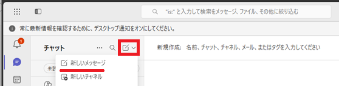
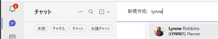
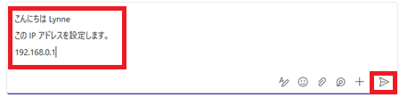
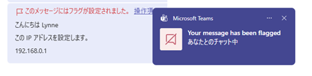
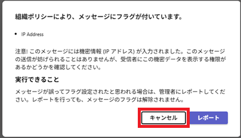
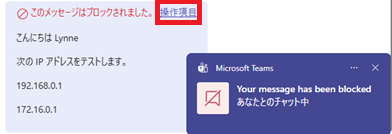
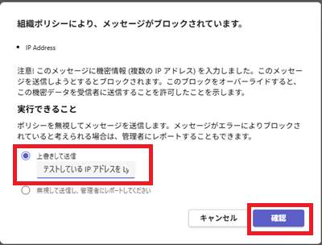
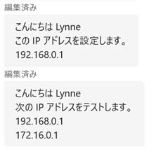

# [ラーニング パス 8 - ラボ 8 - 演習 2 - (Teams)DLP ポリシーのテスト](https://github.com/MicrosoftLearning/MS-102T00-Microsoft-365-Administrator-Essentials/blob/master/Instructions/Labs/LAB_AK_08_Lab8_Ex2_Test_DLP_Policy.md#learning-path-8---lab-8---exercise-2---test-the-dlp-policy)

### タスク 1 – DLP ポリシー ルールをテストする

前の演習では、Adatum テナント内の IP アドレスに関連する機密情報を電子メールで検索するカスタム DLP ポリシーを作成しました。このポリシーには 2 つのルールが含まれていました。1 つは単一の IP アドレスを含むメッセージをチェックするルール、もう 1 つは 2 つ以上の IP アドレスを含むメッセージをチェックするルールです。

このタスクでは、最初のルール (単一の IP アドレス) をテストするチャットを Holly Dickson から Lynne Robbins に送信します。このルールがトリガーされると、電子メール ポリシー ヒントが送信者の チャットに表示され、機密データが含まれていることを送信者に通知します。

1. ブラウザーで、**Holly Dickson**として Microsoft 365 にログインしているはずです。

2. Teams  (https://teams.cloud.microsoft) にHolly Dicksonとしてサインインします。

3. 画面の左上の **[新しいアイテム] - [新しいメッセージ]** を選択します。

    

4. 画面の右側に表示されるメッセージ ペインに以下のように入力した後、**[送信]**を選択します.。

   - 宛先: **Lynne** と入力し、表示されるユーザー リストから **Lynne Robbins** を選択します。 

   - メッセージ:  

     こんにちは Lynne  

     この IP アドレスを設定します。

     192.168.0.1

   

   

5. 以下のように表示されることを確認します。

    

6. **操作項目**を選択して、表示されるメッセージを確認し、**キャンセル** で閉じます。

    

7. 次に、複数の IP アドレスを含む 2 番目のメッセージを Holly から Lynne に送信します。前と同じプロセスを繰り返して、次の情報を入力した後、**[送信] **を選択します.。

   - メッセージ:

     こんにちは Lynne

     次の IP アドレスをテストします。

     192.168.0.1  

     172.16.0.1

     

8. 以下のように表示されることを確認し、 **操作項目**を選択しす。

   

   

9. 表示されるダイアログ ボックスでは、**[上書きして送信]** オプションを選択します。このオプションを選択したままにして、 「上書きして送信」 フィールドに **「テストしている IP アドレスを Lynne に通知する必要があります」** と入力し、**[確認]** を選択します。

      

   

10. 別のブラウザーを開くか、あるいはHollyをサインアウトして、Teams (https://teams.cloud.microsoft)にLynne Robbins としてサインインします。これまで送ったチャットメッセージが届いていることを確認してください。

      

     
