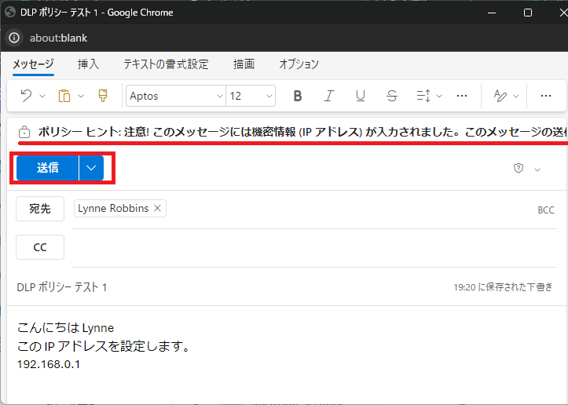
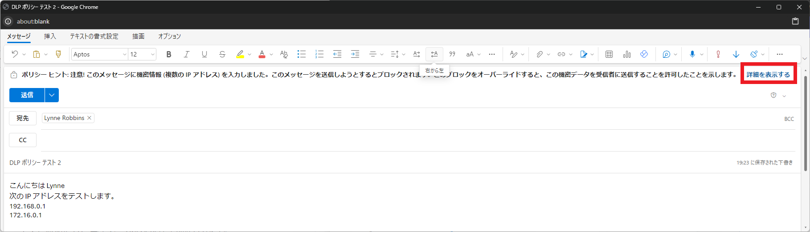

# [ラーニング パス 8 - ラボ 8 - 演習 2 - DLP ポリシーのテスト](https://github.com/MicrosoftLearning/MS-102T00-Microsoft-365-Administrator-Essentials/blob/master/Instructions/Labs/LAB_AK_08_Lab8_Ex2_Test_DLP_Policy.md#learning-path-8---lab-8---exercise-2---test-the-dlp-policy)

Holly Dickson は現在、パイロット プロジェクトの段階にあり、前のラボ演習で作成した機密情報を含む電子メールに関連する DLP ポリシーをテストしたいと考えています。

**注:** このラボ演習では、DLP ポリシーとポリシー ヒントが期待どおりに機能しないという問題が過去に断続的に発生しました。これは、VM ラボ環境と Microsoft 365 試用版テナントの間で時々発生する調整の問題が原因です。これは、Microsoft 365 運用環境での通常のエクスペリエンスを示すものではありません。また、通常のトレーニング経験を示すものでもありません。このラボ演習中にこの問題が発生した場合は、申し訳ありません。

### タスク 1 – DLP ポリシー ルールをテストする

前の演習では、Adatum テナント内の IP アドレスに関連する機密情報を電子メールで検索するカスタム DLP ポリシーを作成しました。このポリシーには 2 つのルールが含まれていました。1 つは単一の IP アドレスを含む電子メールをチェックするルール、もう 1 つは 2 つ以上の IP アドレスを含む電子メールをチェックするルールです。

このタスクでは、最初のルール (単一の IP アドレス) をテストする電子メールを Holly Dickson から Lynne Robbins に送信します。このルールがトリガーされると、電子メール ポリシー ヒントが送信者の Outlook メールボックスに表示され、電子メールに機密データが含まれていることを送信者に通知します。送信者も電子メール通知を受け取りますが、電子メールは引き続き受信者に送信されます。

1. ブラウザーで、**Holly Dickson**として Microsoft 365 にログインしているはずです。

2. 次に、Holly から Lynne Robbins に電子メールを送信し、電子メールの本文に IP アドレスを含めます。

    Outlook (https://outlook.office.com)にHolly Dicksonとしてサインインします。

3. 画面の左上隅にある **[新規メール]** を選択します。

4. 画面の右側に表示されるメッセージ ペインに、次の情報を入力します。

   - 宛先: **Lynne** と入力し、表示されるユーザー リストから **Lynne Robbins** を選択します。 

   - 件名:  DLP ポリシー テスト 1

   - メッセージ:  

     こんにちは Lynne  

     この IP アドレスを設定します。

     192.168.0.1

   **注:** 機密データ (この場合は 1 つの IP アドレス) を含むこの電子メールの下書きを行うと、以前に作成した IP アドレス ポリシー、具体的には単一 IP アドレス ルールがトリガーされます。そのため、電子メール メッセージが組織のポリシーに違反していることを示すポリシー ヒントが表示される必要があります。このポリシー ヒントを無視して電子メールを送信し、Holly に通知電子メールを送信する DLP ポリシーの残りの部分をテストします。

5. ポリシー ヒントが表示されたら、**[送信] を選択します。**

   

6. Holly の**送信済みアイテム**フォルダーを選択して、電子メールが送信されたことを確認します。

7. Holly の**受信トレイ**フォルダーを選択します。ホリーはMicrosoft Outlookから **「Notification: DLP ポリシー テスト 1」** という件名の電子メールを受信するはずです。このメールを選択し、内容を確認してください。

8. 次に、複数の IP アドレスを含む 2 番目のメッセージを Holly から Lynne に送信します。前と同じプロセスを繰り返して、次の情報を記載した Lynne Robbins への電子メールを作成します。

   - 件名: DLP ポリシー テスト 2

   - メッセージ:

     こんにちは Lynne

     次の IP アドレスをテストします。

     192.168.0.1  

     172.16.0.1

     

   **注:** 機密データ (この場合は複数の IP アドレス) を含むこの電子メールの下書きを行うと、以前に作成した IP アドレス ポリシー、具体的には複数の IP アドレス ルールがトリガーされます。そのため、電子メール メッセージが組織のポリシーに違反していることを示すポリシー ヒントが表示される必要があります。このポリシー ヒントを無視して電子メールを送信し、電子メールをブロックする DLP ポリシーの残りの部分をテストします。電子メールのブロックをテストしたら、この機密データを送信するためのビジネス上の正当な理由を入力してブロックを無効にし、電子メールの送信を再試行します。

9. ポリシー ヒントが表示されたら、**[送信]** を選択します。メッセージに機密情報の受信を許可されていない 1 人以上の受信者が含まれていることを示す、 [送信が禁止されています]ダイアログ ボックスがすぐに表示されます。**[OK]** を選択します。

   

10. この電子メールを送信するには、 [送信] ボタンを選択する前にブロックをオーバーライドする必要があります。ブロックをオーバーライドするには、メッセージの上部に表示されるポリシー ヒントで、  **[詳細を表示する]** を選択します。   

11. ポリシー ヒントに表示される詳細メッセージで、**[上書き]** を選択します。

       

12. 表示されるダイアログ ボックスでは、[業務上の正当な理由がある]オプションがデフォルトで選択されています。このオプションを選択したままにして、 「ここに説明を入力します」 フィールドに **「テストしている IP アドレスを Lynne に通知する必要があります」** と入力します。

13.  **[上書き]** を選択します。

       機密情報が含まれているように見える場合でも、メッセージの送信を選択したことを示すようにポリシー ヒント メッセージがどのように変化したかに注目してください。

14.  **[送信]**　を選択してメールを送信します。Holly の**送信済みアイテム** フォルダーを選択して、電子メールが送信されたことを確認します。

15. Holly の受信トレイフォルダーを選択します。ホリーはMicrosoft Outlookから **「Notification: DLP ポリシー テスト 2」** という件名の電子メールを受信するはずです。このメールを選択し、内容を確認してください。これはHollyが管理者であるため受信した通知です。

16. Holly をサインアウトし、ブラウザーを閉じます。

17. Officeポータルにアクセスします。ブラウザーを起動し、アドレス バーに次の URL を入力します:https://outlook.office.com

       Lynne Robbins(LynneR@xxxxxZZZZZZ.onmicrosoft.com)の資格情報でサインインしてください。

18. [Microsoft 365 へようこそ]ページの画面左側にあるアプリケーション アイコンの列で、**Outlook**アイコンを選択します。これにより、 Lynne Robbins の Outlook メールボックスが新しいタブで開きます。

19.  **Lynne の受信トレイで、Holly Dickson からDLP Policy Test 1**という件名の電子メールを受信したことを確認します。メッセージを選択して、IP アドレスを含むコンテンツが削除されていないことを確認します。

20.  **Lynne の受信トレイで、Holly Dickson からDLP Policy Test 2**という件名の電子メールを受信したことを確認します。メッセージを選択して、IP アドレスを含むコンテンツが削除されていないことを確認します。
