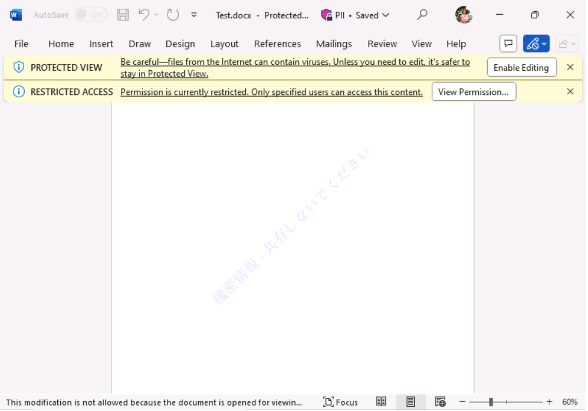

# ラーニング パス 9 - ラボ 9 - 演習 1 - Azure Information Protection Unified Labels クライアントを使用して秘密度ラベルを実装する

Adatum の新しい Microsoft 365 管理者である Holly Dickson としてのあなたの役割では、仮想化されたラボ環境に Microsoft 365 を展開しています。Microsoft 365 パイロット プロジェクトを進める際の次のステップは、Adatum で 秘密度ラベルを実装することです。このラボでは、ラベルを作成して公開し、公開されたラベルをテストします。

### タスク 1 – Microsoft 365 Apps for enterprise のユーザー主導のインストールを実行する

LON-CL1でAlex Wilberとして Microsoft 365 にログインし、– Microsoft 365 Apps for enterpriseをインストールします。

LON-CL2でJoni Sharmanとして Microsoft 365 にログインし、– Microsoft 365 Apps for enterpriseをインストールします。

1. LON-CL1に切り替えます。

2. Officeポータルにアクセスします。LON-CL1内でブラウザーを起動し、アドレス バーに次の URL を入力します: **[https://portal.office.com](https://portal.office.com/)**

   Alex Wilber([AlexW@xxxxxZZZZZZ.onmicrosoft.com](mailto:AlexW@xxxxxZZZZZZ.onmicrosoft.com))の資格情報でサインインしてください。他のユーザーでサインインしていた場合は、サインインしなおしてください。

3. 画面右上のドロップダウンリストで **[Install and more] - [Install Microsoft 365 Apps ]** を選択します。

4. 画面真ん中上の [Install Office] をクリックし、ダウンロードした OfficeSetup.exeを実行し、Microsoft 365 Apps for enterprise をインストールします。インストール中に下の手順に進みます。

5. LON-CL2に切り替えます。

6. Officeポータルにアクセスします。LON-CL2内でブラウザーを起動し、アドレス バーに次の URL を入力します: **[https://portal.office.com](https://portal.office.com/)**

7. Joni Sharman ([Jonis@xxxxxZZZZZZ.onmicrosoft.com](mailto:Jonis@xxxxxZZZZZZ.onmicrosoft.com))の資格情報でサインインしてください。他のユーザーでサインインしていた場合は、サインインしなおしてください。

8. 画面右上のドロップダウンリストで **[Install and more] - [Install Microsoft 365 Apps ]** を選択します。

9. 画面真ん中上の [Install Office] をクリックし、ダウンロードした OfficeSetup.exeを実行し、Microsoft 365 Apps for enterprise をインストールします。インストールの最初に管理者のユーザー名とパスワードを聞かれた場合、AdministratorとPa55w.rdを入力してください。

10. インストールが終了したら、LON-CL1とLON-CL2を再起動してください。

### タスク 2 – 秘密度ラベルを作成する

この演習では、秘密度ラベルを作成し、それをデフォルト ポリシーに追加して、Adatum テナントのすべてのユーザーに有効にするようにします。

1. お手元のPCでInPrivate ウィンドウ(Microsoft Edge) もしくは、シークレットウィンドウ (Google Chrome) で、Microsoft 365 管理センター ([https://admin.microsoft.com](https://admin.microsoft.com/)) にアクセスし、Hollyの資格情報でサインインします。

2. Microsoft 365 管理センターで、必要に応じて **[... すべて表示]** を選択します。[管理センター]グループの下の **[コンプライアンス]** を選択します。

3. Microsoft Purviewポータルの左側のナビゲーション ウィンドウで、 **[ソリューション]** - **[情報保護]** を選択し、 **[秘密度ラベル]** を選択します。

4. [秘密度ラベル] ページでは、次の内容を示す警告メッセージがページの中央に表示されます。**暗号化された秘密度ラベルが適用され、OneDrive および SharePoint に保存されている Office オンライン ファイルのコンテンツを処理する機能が組織で有効になっていません。ここでオンにすることができますが、複数地域環境では追加の構成が必要であることに注意してください。**

   このメッセージの右側に表示される **「今すぐ有効にする」** ボタンを選択します。これにより、Adatum は Microsoft 365 環境内で秘密度ラベルを適用できるようになります。

   

   メッセージが次のように変更されたことに注意してください。「Teams 、SharePoint サイト、および Microsoft 365 グループのプライバシーとアクセス制御設定を使用して秘密度ラベルを作成できるようになりました。」

5. [ラベル]ページで、画面中央のメニュー バー (前のメッセージの下) に表示される **[ + ラベルの作成]** オプションを選択します。これにより、新しい秘密度ラベルウィザードが開始されます。

6. 新しい秘密度ラベルウィザードの[名前とヒント]ページで、次の情報を入力します。

   - 名前: **PII**
   - 表示名: **PII**
   - ユーザー向けの説明: **PII を含むファイル**
   - 管理者向けの説明: **PII を含むファイル**
   - ラベルの色: 秘密度ラベルに割り当てる色の 1 つを選択します。

7. **「次へ」** を選択します。

8. [このラベルの範囲を定義する]ページで、**[ファイルと他のデータ資産]**  のチェック ボックスだけをオンにして、 **[次へ]** を選択します。

   

9. [ラベル付けされたアイテムの保護設定を選択する]ページで、 **[アクセスの制御]** と **[コンテンツ マーキングを適用する]** の2つのチェック ボックスをオンにし、 **[次へ]** を選択します。

10. [アクセスの制御] ページで、このラベルが適用されたアイテムにアクセスできるユーザーを定義します。[アクセス許可を今すぐ割り当てますか、それともユーザーが決定するようにしますか?] の項目で **[ラベルを適用するときにユーザーがアクセス許可を割り当てられるようにする]** オプションを選択し、さらに **[Word、PowerPoint、Excel で、アクセス許可の指定をユーザーに要求する]** オプションを選択し、**[次へ]** を選択します。

11. [コンテンツのマーキング]ページで、 **[コンテンツのマーキング]** トグル スイッチを **[オン]** に設定します。ファイルと電子メールにマークを付ける方法をカスタマイズできる 3 つのオプションが表示されます。

    3 つのチェック ボックスをすべて **オン** にします。各設定で、 **[テキストのカスタマイズ]** を選択します。これにより、特定の設定をカスタマイズするためのペインが開きます。 **各オプションの[カスタマイズ]** ペインに次の情報を入力します(各オプションの設定を入力した後、  **[保存]** を選択します)。

    - **透かしの追加**
      - 透かしテキスト:**機密情報 - 共有しないでください**
      - フォントサイズ: **25**
      - 文字色：**青**
      - 文字レイアウト:**斜め**
    - **ヘッダーの追加**
      - 透かしテキスト:**機密情報 - 共有しないでください**
      - フォントサイズ: **25**
      - 文字色：**赤**
      - テキストの配置:**中央** 
    - **フッターの追加**
      - 透かしテキスト:**機密情報 - 共有しないでください**
      - フォントサイズ: **25**
      - 文字色：**赤**
      - テキストの配置:**中央**

12. [コンテンツ マーキング]ページで、**[次へ]** を選択します。

13. [ファイルと電子メールの自動ラベル付け] ページで、**[ファイルと電子メールの自動ラベル付け]** で、**[次へ]** を選択します。

14. [グループとサイトの保護設定の定義]ページで、すべてのチェック ボックスを空白のままにして、**「次へ」** を選択します。

15. [スキーマ化されたデータ資産の自動ラベル付け (プレビュー)]ページでは、データベース列の自動ラベル付けを有効にしないでください。**「次へ」** を選択します。

16. [設定を確認して終了]ページで、**[ラベルを作成]** を選択します。

17. [秘密度ラベルが作成されました] ページで、**[ポリシーをまだ作成しない]** を選択し、**[完了]** を選択します。

18. 次に、PIIラベルを公開します。[情報保護]ウィンドウには、デフォルトで[ラベル]タブが表示されます。ラベルのリストにPIIラベルが表示されない場合は、メニュー バーの[更新]を選択します。 **PIIラベルが表示されたら、その左側に表示されるチェック ボックスをオンにします。** 

19. ラベルのリストの上にあるメニュー バーに表示される **[ラベルの発行]** オプションを選択します。これにより、ポリシーの作成ウィザードが開始されます。

20. **[次へ]** を選択し、 [管理単位の割り当て]で **[次へ]** を選択します。

21. **[すべてのユーザーまたはグループ]** が表示されていることを確認し、**[次へ]** を選択します。

22. [ポリシーの設定]ページで、 **[ユーザーはラベルを削除したり、ラベルの分類を下位のものにしたりする場合に、理由を示す必要がある]**　チェック ボックスをオンにし、 **[次へ]** を選択します。

23. [ドキュメントの既定の設定]ページで、表示されるドロップダウン メニューから **[PII]** を選択し、 **[次へ]** を選択します。

24. [メールの既定の設定]ページで、表示されるドロップダウン メニューから **[なし]** を選択し、 **[次へ]** を選択します。

25. [会議と予定表イベントの既定の設定]ページで、表示されるドロップダウン メニューから **[なし]** を選択し、 **[次へ]** を選択します。

26. [Fabric および Power BI コンテンツの既定の設定]ページで、表示されるドロップダウン メニューから **[なし]** を選択し、 **[次へ]** を選択します。

27. [ポリシーの名前を設定する]ページで、[名前] フィールドに **「PII ポリシー」** と入力し、この秘密度ラベル ポリシーに関する次の説明を入力 (またはコピーして貼り付け) します。

     **このポリシーは情報を暗号化します。**  

28. **[次へ]** を選択します。

29. [確認と終了] ページで、入力した情報を確認します。修正する必要がある場合は、対応する編集オプションを選択し、必要な修正を加えます。すべての情報が正しい場合は、**[送信]** を選択します。

30. [新しいポリシーが作成されました]ページで、**[完了]** を選択します。

### タスク 3 – 文書に秘密度ラベルを割り当てる

**重要:** 前のタスクから１時間以上時間をあけてください。

1. LON-CL1に切り替えます。

2. [スタート]メニューからWordを起動します。

3. Wordの画面が表示されたことを確認し、[Blank document]をクリックします。

4. [Sign in to get started with Word] ページで **[Sign in or create account]** をクリックした後、AlexW@WWLxZZZZZZ.onmicrosoft.comと入力、**[Next]** ボタンをクリックします。

5. [Enter password] ページが表示されたら、管理者のパスワードを入力し、**[Sign in]** ボタンをクリックします。

6. [Stay signed in to all your apps(すべてのアプリにサインインしたままにする)]ページが 表示されたことを確認し、 **[No, sign in to this app only]** をクリックします。 ([OK]ボタンをクリックしないでください。)

   

7. [Accept the license agreement)]ページで、 **[Accept]** ボタンをクリックします。

8. [Your privacy matters] ページが表示されたら、画面右下の **[Close]** ボタンをクリックします。

9. [Home(ホーム)]タブに、[Sensitivity(秘密度)]アイコンが表示されていることを確認します。 表示されていない場合は、Wordを閉じて、再度起動しなおしてください。それでも表示されない場合は、LON-CL1を再起動してください。

10. Word リボンの [Sensitivity] グループで、下矢印を選択します。

11. 秘密度ラベルをドキュメントに適用するため、ドロップダウン メニューで **[PII]** を選択します。その後もう一度、 [Sensitivity]グループのドロップダウン矢印を選択すると、表示されるドロップダウン メニューにはPIIラベルが表示され、その横にこのドキュメントに適用されていることを示すチェック マークが表示されることを確認します。

12. [Permission] ダイアログが表示されます。 **[Restrict permission to this document] チェックボックスをオン** にします。

13. Readの右の欄に **JoniS@WWLxZZZZZZ.onmicrosoft.com** と入力し、**[OK]** をクリックします。

14. 透かしテキストが表示されることを確認します。

15. Wordに任意の文章を入力した後、Word左上のSave(フロッピーディスクのアイコン)をクリックし、ファイルを保存します。

16. [Save this file] 画面のFile name でファイル名を **Test** と入力します。Choose a Location で **Documents** を選択します。Sensitibityのドロップダウン メニューで **[PII]** が選択されていることを確認します。 **[Save]** をクリックします。

17. Wordのドキュメントを閉じます。

これで、読み取り専用で保護された AIP 保護された Word 文書が正常に作成されました。このドキュメントにアクセスできるのは、作成者である Alex Wilber と、ドキュメントが共有された Joni Sherman (読み取り専用権限を持つ) のみです。

### タスク 4 – 秘密度ラベル ポリシーを確認する

前のタスクでは、Word 文書を作で保護しました。PII ラベルは文書に透かしを挿入し、文書に対するアクセス許可を制限する必要があります。ドキュメントに割り当てた保護が機能するかどうかを確認するには、まずドキュメントを Joni Sherman と自分の個人電子メール アドレスに電子メールで送信します。次に、ジョニ ウィルバーとアレックス ウィルバーの両方でどのような機能が可能かをテストします。

1. LON-CL1　のEdgeブラウザーで、Office 365ポータルにAlexw@WWLxZZZZZ.onmicrosoft.comとしてサインインしていることを確認します。そうでない場合はサインインし直します。

2. Office365ポータルページで、 **[Outlook]** アイコンをクリックします。 

3. **[New mail]** ボタンをクリックします。

4. 次の設定で新しいメッセージを作成します。

   • 宛先 : Joni Sherman

   • 件名 : Protected Document Test

   • 添付ファイル : 前のタスクで保存したTest.docx

   (Document フォルダーに保存されています。)

5. **[Send mail]** ボタンをクリックします。

6. LON-CL2に切り替えます。

7. Office 365ポータルにJoniS@WWLxZZZZZ.onmicrosoft.comとしてサインインしていることを確認します。そうでない場合はし直します。

8. Office365ポータルページで、**[Outlook]** アイコンをクリックします。Joniの受信トレイが表示されたことを確認し、Alexから届いたメールを選択します。

9. Wordの添付ファイルがあることを確認します。

10. 添付ファイルの右側に表示されている[∨]をクリックし、 次いで [ ↓ ]　(ダウンロード) をクリックします。

11. 画面の右上に[ダウンロード]ページが表示されますので、[Open file(ファイルを開く)]をクリックします。

12. [Sign in]ページが表示されたことを確認し、JoniS@WWLxZZZZZ.onmicrosoft.comで サインインします。

13. [Stay signed in to all your apps(すべてのアプリにサインインしたままにする)]ページが 表示されたことを確認し、**[No, sign in to this app only]** をクリックします。 ([OK]ボタンをクリックしないでください。)

    

14. [Hello Joni,welcome to Office]ページが表示されたことを確認し、**[Continue]** ボタンを クリックします。

15. [Activate Office]ページが表示されたことを確認し、 **JoniS@WWLxZZZZZ.onmicrosoft.com** と入力して（入力されていればそのまま）、**[Next]**　ボタンをクリックします。

16. [Accept the license agreement]ページが表示されたことを 確認し、**[Accept]** ボタンをクリックします。

17. [Your privacy option]ページが表示されたことを確認し、右下の **[Close(閉じる)]** ボタンをクリックします。

18. Joniには、読み取り専用のアクセス許可を付与したため、文書の内容が表示されます。

    また、Wordの画面の上部には通知バーが表示されます。

19. 入力などを行おうとすると、編集がロックされていることを確認します(文字を入力しようとすると、画面下部のステータスバーに変更できない旨のメッセージが表示されます)。

    

20. Wordを閉じます。

    Joni にドキュメントを読み取るアクセス許可が割り当てられているため、構成した ポリシー パラメーターに基づいて  Information Protection がドキュメントを保護していることを確認しました。

## おめでとうございます！このコースの最後のラボを完了しました。
