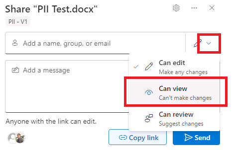

# ラーニング パス 9 - ラボ 9 - 演習 1 - Azure Information Protection Unified Labels クライアントを使用して秘密度ラベルを実装する

Adatum の新しい Microsoft 365 管理者である Holly Dickson としてのあなたの役割では、仮想化されたラボ環境に Microsoft 365 を展開しています。Microsoft 365 パイロット プロジェクトを進める際の次のステップは、Adatum で Azure Information Protection (AIP) を使用して秘密度ラベルを実装することです。このラボでは、ラベルを作成して公開し、公開されたラベルをテストします。ただし、その際、このラボで作成したラベルはテストされません。別のラベルをテストします。

**重要:** 思い起こせば、このクラスの初日に、秘密度ラベルと秘密度ラベル ポリシーを作成して公開するラボ セットアップ スクリプトを実行しました。秘密度ラベルのタイミングの問題のため、このラボをサポートするにはそのスクリプトを実行する必要がありました。ラベル ポリシーを発行すると、発行されたラベル ポリシーが Microsoft 365 に反映されるまで 24 時間かかります。そのため、このラボでは、作成して発行したラベルとラベル ポリシーをテストすることはできません。

このタイミングの問題に対処するために、1 日目に PowerShell スクリプトを実行して、秘密度ラベルとラベル ポリシーを作成して公開しました。このラボに到達したので、そのラベル ポリシーがシステム全体に伝播され、テストできるようになります。

Microsoft 365 UI を使用したラベルとラベル ポリシーの作成と発行の経験を積んでほしいため、このラボでも秘密度ラベルとラベル ポリシーを作成します。ただし、ラベルとラベル ポリシーをテストするタスクを実行する場合、そのラベルとラベル ポリシーは 24 時間テストできないため、UI で作成して公開したものはテストされません。代わりに、このクラスの 1 日目に実行したスクリプトを使用して、作成および公開したラベルとラベル ポリシーをテストします。

### タスク 1 – Azure Information Protection Unified Labeling クライアントをインストールする

Adatum のパイロット プロジェクトの一部として秘密度ラベルを実装するには、まず Microsoft ダウンロード センターから AIP クライアントをインストールする必要があります。

1. **LON-CL1** に切り替えます。**adatum\administrator** アカウントとしてログインします。

2. LON-CL1内のMicrosoft Edgeで、新しいタブを開き、アドレス バーに次の URL を入力 (またはコピーして貼り付け) します: **https://www.microsoft.com/en-us/download/confirmation.aspx?id=53018**

   これにより、AIP Unified ラベル クライアントのダウンロードが開始されます。

3. [Microsoft ダウンロード センター] タブのページ下部の通知バーに、ダウンロード中のAzInfoProtection_UI.exeファイルが表示されます。ファイルのダウンロードが完了したら、ファイル名の下に表示される **「Open file」リンクを選択します。** 

4. Microsoft **Azure Information Protection**ウィザードが開きます。ウィザードがデスクトップに表示されない場合は、タスクバーのウィザードのアイコンを選択してウィザードを表示します。

5. ウィザードの[Azure Information Protection クライアントのインストール]ページで、 [使用状況統計を Microsoft に送信して Azure Information Protection の改善に協力する(Help Improve AzureInfomation Protection by sending usage statistics to Microsoft)]チェック ボックスを **オフ** にして (チェックを外し) 、 **[I Agree]** ボタンを選択します。

6. インストールが完了したら、**「Close」** を選択します。

AIP Unified Label クライアントがクライアント 1 VM に正常にインストールされました。

### タスク 2 – 秘密度ラベルを作成する

この演習では、秘密度ラベルを作成し、それをデフォルト ポリシーに追加して、Adatum テナントのすべてのユーザーに有効にするようにします。

1. お手元のPCでInPrivate ウィンドウ(Microsoft Edge) もしくは、シークレットウィンドウ (Google Chrome) で、Microsoft 365 管理センター ([https://admin.microsoft.com](https://admin.microsoft.com/)) にアクセスし、Hollyの資格情報でサインインします。

2. Microsoft 365 管理センターで、必要に応じて **[... すべて表示]** を選択します。[管理センター]グループの下の **[コンプライアンス]** を選択します。

3. Microsoft Purviewポータルの左側のナビゲーション ウィンドウで、**[情報保護]** を選択し、 **[ラベル]** を選択します。

4. [ラベル] ページでは、次の内容を示す警告メッセージがページの中央に表示されます。**暗号化された秘密度ラベルが適用され、OneDrive および SharePoint に保存されている Office オンライン ファイルのコンテンツを処理する機能が組織で有効になっていません。ここでオンにすることができますが、複数地域環境では追加の構成が必要であることに注意してください。**

   このメッセージの右側に表示される **「今すぐ有効にする」** ボタンを選択します。これにより、Adatum は Microsoft 365 環境内で秘密度ラベルを適用できるようになります。

   メッセージが次のように変更されたことに注意してください。「Teams 、SharePoint サイト、および Microsoft 365 グループのプライバシーとアクセス制御設定を使用して秘密度ラベルを作成できるようになりました。」

5. [ラベル]ページで、画面中央のメニュー バー (前のメッセージの下) に表示される **[ + ラベルの作成]** オプションを選択します。これにより、新しい秘密度ラベルウィザードが開始されます。

6. 新しい秘密度ラベルウィザードの[名前とヒント]ページで、次の情報を入力します。

   - 名前: **PII**
   - 表示名: **PII**
   - ユーザー向けの説明: **PII を含むドキュメント、ファイル、電子メール**
   - 管理者向けの説明: **PII を含むドキュメント、ファイル、電子メール**
   - ラベルの色: 秘密度ラベルに割り当てる色の 1 つを選択します。

7. **「次へ」** を選択します。

8. [このラベルの範囲を定義する]ページで、すべてのチェック ボックスがオンになっていることを確認し (必要に応じてここで選択します)、 **[次へ]** を選択します。

9. [ラベル付けされたアイテムの保護設定を選択する]ページで、 **[アクセスの制御]** と **[コンテンツ マーキングを適用する]** の2つのチェック ボックスをオンにし、 **[次へ]** を選択します。

10. [暗号化] ページで、このラベルが適用されたアイテムにアクセスできるユーザーを定義します。**[ファイル、メール、または予定表イベントが暗号化されている場合は暗号化を削除する]**　オプションを選択し、**[次へ]** を選択します。

11. [コンテンツ マーキング]ページで、 **[コンテンツ マーキング]** トグル スイッチを **[オン]** に設定します。ファイルと電子メールにマークを付ける方法をカスタマイズできる 3 つのオプションが表示されます。

    3 つのチェック ボックスをすべて **オン** にします。各設定で、 **[テキストのカスタマイズ]** を選択します。これにより、特定の設定をカスタマイズするためのペインが開きます。 **各オプションの[カスタマイズ]** ペインに次の情報を入力します(各オプションの設定を入力した後、  **[保存]** を選択します)。

    - **透かしテキストのカスタマイズ**
      
      透かしテキスト:**機密情報 - 共有しないでください**
      
      - フォントサイズ: **25**
      - 文字色：**青**
      - 文字レイアウト:**斜め**
    - **ヘッダーを追加する**
      
      - ヘッダー テキスト:**機密情報 - 共有しないでください**
      - フォントサイズ: **25**
      - 文字色：**赤**
      - テキストの配置:**中央** 
    - **フッターを追加する**
      - フッター テキスト:**機密情報 - 共有しないでください**
      - フォントサイズ: **25**
      - 文字色：**赤**
      - テキストの配置:**中央**

12. [コンテンツ マーキング]ページで、**[次へ]** を選択します。

13. [ファイルと電子メールの自動ラベル付け] ページで、**[ファイルと電子メールの自動ラベル付け]** トグル スイッチを **[オン]** に設定します。これにより、次の手順で更新する一連のオプションが有効になります。

14. [これらの条件に一致するコンテンツを検出する]で、**[+条件を追加]** を選択し、 **[コンテンツに含まれている場合]** を選択します。

15. [コンテンツが含まれている場合] ウィンドウで、**[追加**] ドロップダウン矢印を選択し、 **[機密情報の種類]** を選択します。

16. [機密情報の種類]ウィンドウで、 **[名前]** 列見出しの左側にマウスを置きます。表示されるチェック ボックスをオンにすると、すべての機密情報の種類が自動的に選択されます。 **[追加]** を選択すると、これらすべての機密情報の種類がラベルに追加されます。

17. [ファイルと電子メールの自動ラベル付け]ページには、選択したすべての機密情報の種類が表示されます。ウィンドウを一番下までスクロールし、次の設定を更新します。

    - コンテンツがこれらの条件に一致する場合: **[ラベルを自動的に適用する]** を選択します。
    - ラベルを適用するときに、このメッセージをユーザーに表示する。: **[機密コンテンツが検出されたため、暗号化されます]**  と入力します。

18. **「次へ」** を選択します。

19. [グループとサイトの保護設定を定義] ページで、両方のチェック ボックスを空白のままにして、 **[次へ]** を選択します。

20. [スキーマ化されたデータ アセットの自動ラベル付け (プレビュー)]ページで、[スキーマ化されたデータ資産の自動ラベル付け (プレビュー)] を有効にしないでください。 **[次へ]**  を選択します。

21. [設定を確認して終了]ページで、入力した情報を確認します。設定を修正する必要がある場合は、対応する編集オプションを選択し、必要な変更を加えます。すべての情報が正しいと思われたら、 **[ラベルを作成]** を選択します。

22. 作成しようとしているラベルに対して生成されたルール BLOB が長すぎることを示すエラーダイアログボックスが表示されます。ルールごとに一度に選択できる機密情報の種類の最大サイズは49152です。数ステップ前の [機密情報の種類]ウィンドウで行ったようにすべての機密情報の種類を選択すると、この制限を超えてしまいます。

    **注:** このエラーが表示されるように、意図的にすべての機密情報の種類を選択するようにしました。このエラーが実稼働環境で発生した場合に、エラーが発生した理由とその修正方法を理解できるように、このエラーを実際に体験していただきたいと考えました。

    この問題を修正するには、[エラー]ダイアログ ボックスで **[OK]** を選択し、[設定を確認して終了]ページで[ファイルとメールの自動ラベル付け] セクションで、**[編集]** を選択します。

23. これにより、ウィザードの **[ラベル付けされたアイテムの保護設定を選択する]** ページに戻ります。このページで  **[次へ]** を選択し、 [暗号化]ページで  **[次へ]** を選択してから、[コンテンツ マーキング]ページで  **[次へ]** を選択します。これにより、 [ファイルと電子メールの自動ラベル付け]ページが表示されます。

24. [ファイルと電子メールの自動ラベル付け]ページで、 [コンテンツに含まれている場合] 条件の右側にある **ゴミ箱アイコン** を選択します。これにより、作成した条件が削除されます。

    残りの手順では、最初に行ったすべての機密情報タイプではなく、2 つの機密情報タイプのみを含む新しい条件を追加します。

25. [ファイルとメールの自動ラベル付け]ページの[これらの条件に一致するコンテンツを検出する]で、 **[+条件を追加]** を選択し、**[コンテンツに含まれている場合]** を選択します。

26. **[追加]** ドロップダウン矢印を選択し、**[機密情報の種類]** を選択します。

27. **[機密情報の種類]**ウィンドウの機密情報の種類のリストで、今回は **ABA Routing Number** と **U.S. Social Security Number (SSN)** (「SSN」等で検索して見つけてください)のチェック ボックスのみを選択し、**[追加]** を選択します。[ファイルと電子メールの自動ラベル付け]ページに戻ると、これらの機密情報の種類が両方とも表示されます。**「次へ」** を選択します。

28. [グループとサイトの保護設定の定義]ページで、2 つのチェック ボックスを空白のままにして、**「次へ」** を選択します。

29. [スキーマ化されたデータ資産の自動ラベル付け (プレビュー)]ページでは、データベース列の自動ラベル付けを有効にしないでください。**「次へ」** を選択します。

30. [設定を確認して終了]ページで、**[ラベルの作成]** を選択します。

31. [秘密度ラベルが作成されました] ページで、**[ポリシーをまだ作成しない]** を選択し、**[完了]** を選択します。

32. 次に、PIIラベルを公開します。[情報保護]ウィンドウには、デフォルトで[ラベル]タブが表示されます。ラベルのリストにPIIラベルが表示されない場合は、メニュー バーの[更新]を選択します。PIIラベルが表示されたら、その左側に表示されるチェック ボックスをオンにします。

33. ラベルのリストの上にあるメニュー バーに表示される **[ラベルの発行]** オプションを選択します。これにより、ポリシーの作成ウィザードが開始されます。

34. ポリシーの作成ウィザードの[発行する秘密度ラベルを選ぶ]ページでに**発行する秘密度ラベルを選ぶ** を選択します、

35. **PII** の左のチェックボックスを **オン** にして、 **[追加]** を選択します。

36. **[次へ]** を選択し、 [管理単位の割り当て (プレビュー)]で **[次へ]** を選択します。

37.  **[すべてのユーザーまたはグループ]** が表示されていることを確認し、**[次へ]** を選択します。

38. [ポリシーの設定]ページで、 **[ユーザーはラベルを削除したり、ラベルの分類を下位のものにしたりする場合に、理由を示す必要がある]**　チェック ボックスをオンにし、 **[次へ]** を選択します。

39. [ドキュメントの既定の設定]ページで、表示されるドロップダウン メニューから **[PII]** を選択し、 **[次へ]** を選択します。

40. [メールの既定の設定]ページで、表示されるドロップダウン メニューから **[PII]** を選択し、 **[次へ]** を選択します。

41. [会議と予定表イベントの既定の設定]ページで、表示されるドロップダウン メニューから **[PII]** を選択し、 **[次へ]** を選択します。

42. [Fabric および Power BI コンテンツの既定の設定]ページで、表示されるドロップダウン メニューから **[PII]** を選択し、 **[次へ]** を選択します。

43. [ポリシーの名前を設定する]ページで、[名前] フィールドに **「PII ポリシー」** と入力し、この秘密度ラベル ポリシーに関する次の説明を入力 (またはコピーして貼り付け) します。**このポリシーの目的は、ABA 銀行ルーティング番号や、ABA 銀行ルーティング番号などの機密情報を検出することです。電子メールや文書に米国の社会保障番号が含まれており、発見された場合にはこの情報を暗号化します。ユーザーは、分類ラベルを削除するための説明を提供する必要があります。**  

44. **[次へ]** を選択します。

45. **[確認と終了]** ページで、入力した情報を確認します。修正する必要がある場合は、対応する編集オプションを選択し、必要な修正を加えます。すべての情報が正しい場合は、**[送信]** を選択します。

46. [新しいポリシーが作成されました]ページで、**[完了]** を選択します。

### タスク 3 – 文書に秘密度ラベルを割り当てる

このラボの最初の手順で示したように、前のタスクで作成したばかりの秘密度ラベルとラベル ポリシーをテストすることはできません。そのラベル ポリシーが Microsoft 365 に反映されてから、そのラベルが Microsft Word、Outlook などに表示されるまでに最大 24 時間かかります。

**重要:** 次の 2 つのタスクでテストするラベルとラベル ポリシーは、クラスの初日にラボ 1 で PowerShell スクリプトを実行したときに作成されたラベルとラベル ポリシーになります。

**注:** 前のタスクで作成したラベルとラベル ポリシーは、実習 1 で PowerShell スクリプトを実行したときに作成したラベルとラベル ポリシーとまったく同じ設定を持ちます。 2 つのラベルと 2 つのラベル ポリシーの唯一の違いは、彼らの名前でなければなりません。これらのラベルとラベル ポリシーの名前は次のとおりです。

- 前のタスクで作成したラベルのタイトルは**PII**でした。
- 実習 1 で実行したスクリプトによって作成されたラベルのタイトルは**PII-V1**でした。
- 前のタスクで作成したラベル ポリシーには、 **「PII Policy」** というタイトルが付けられました。
- ラボ 1 で実行したスクリプトによって作成されたラベル ポリシーには、 **「PII Policy-V1」** というタイトルが付けられました。

次の 2 つのタスクでPII - V1ラベルとPII ポリシー - V1ラベル ポリシーをテストすると、 PIIラベルとPII ポリシーラベル ポリシーで設定したのと同じ結果が表示されるはずです。

1. LON-CL1に切り替えます。

2. Officeポータルにアクセスします。LON-CL1内でブラウザーを起動し、アドレス バーに次の URL を入力します: **https://portal.office.com**  

   Alex Wilber(AlexW@xxxxxZZZZZZ.onmicrosoft.com)の資格情報でサインインしてください。他のユーザーでサインインしていた場合は、サインインしなおしてください。

3. [Microsoft 365 へようこそ]ページの画面左側にあるアプリケーション アイコンの列で、**Outlook**アイコンを選択します。これにより、 Lynne Robbins の Outlook メールボックスが新しいタブで開きます。

4. [Microsoft Office ホーム]タブで、画面左側のアプリ アイコンの列にある**Wordアイコンを選択します。** これにより、同じタブで Microsoft Word Online が開かれます。

5. [Word]タブのページ上部の [Create New]セクションで、**[Blank document]**　を選択します。

6. [Privacy Option] ウィンドウが表示された場合は、[Close]　を選択します。

7. Word文書に **「PII Test」** と入力します。

8. この演習の開始時に秘密度ラベルを有効にしており、コースの 1 日目にスクリプトを実行して作成したラベルが Microsoft 365 を通じて完全に反映されているため、Word ではページ上部のリボンに **Sensitivity** グループが表示されます。

   **[Sensitivity] グループの下矢印を選択**　します。表示されるドロップダウン メニューには、スクリプトが作成および公開したPII - V1ラベルが表示されます。

   この最初の検証テストでは、このドキュメントに適用されている秘密度ラベルを削除しようとします。前のタスクでPII ポリシー - V1ポリシーとPIIラベルを作成したときに、選択した同じオプションがラボ 1 スクリプトによってPII ポリシー - V1ポリシーとPII - V1ラベルに適用されました。ラベル ポリシー オプションの 1 つは、ユーザーがラベルを削除するか、下位の分類ラベルを選択するための理由を提供することを要求します。この設定が適切に機能しているかどうかを確認します。

   このドキュメントからラベルを削除するには、このドロップダウン メニューに表示される**PII - V1ラベルを選択します。**

9. 表示される「Justification Required」ウィンドウで、 **「Other (Exprain)」** オプションを選択します。[Explain why you're changing this label]フィールドに、 **「Test」** と入力し、 **[Change]** を選択します。

10. Word リボンの[Sensitivity]グループで、下矢印を選択します。表示されるドロップダウン メニューで、**PII - V1**が表示されている間は、その横にチェック マークが表示されていないことに注意してください。これは、**PII - V1**秘密度ラベルがこのドキュメントに適用されなくなったことを示します。

11. 秘密度ラベルをドキュメントに再適用するため、ドロップダウン メニューで **[PII - V1]** を選択します。その後もう一度、 [Sensitivity]グループのドロップダウン矢印を選択すると、表示されるドロップダウン メニューにはPII - V1ラベルが表示され、その横にこのドキュメントに適用されていることを示すチェック マークが表示されることを確認します。

12. Word 文書で、入力した前のテキスト行の下に **「111-11-1111」** と入力します。この番号は、米国の社会保障番号と同じ形式です。

    **注**　: Web 用 Word では、PII - V1ポリシーで指定されたカスタム ヘッダー、フッター、およびウォーターマークは既定では表示されません。カスタム ヘッダー、フッター、ウォーターマークを表示するには、**[View]** タブを選択し、メニューで **[Reading View]** を選択します。あるいは、現実の世界では、これらをデフォルトで表示する Word デスクトップ アプリを使用することもできます。

    閲覧ビューを終了するには、ページの上の方にある **[Edit Document]** ドロップダウン メニューを選択し、**[Edit]** を選択します。

13. Word 画面左上で、**[File]** を選択します。表示されるメニューで **[Share]** を選択します。その右側の **[Share with People]** を選択します。

14. 表示されるウィンドウで、下の方にある **[Anyone with the link can edit]** リンクを選択します。

    表示される[Sharing settings]ページで、 **[People you choose]** を選択します。Share ”PII Test.docx”ウィンドウの右の方にある **下向き矢印** をクリックし、表示されるメニューで、**[Can View]** を選択します。

    

    
    
    **[Copy link]** を選択した後、 **Wordのウィンドウを閉じます。** 

これで、読み取り専用で保護された AIP 保護された Word 文書が正常に作成されました。このドキュメントにアクセスできるのは、作成者である Alex Wilber と、ドキュメントが共有された Joni Sherman (読み取り専用権限を持つ) のみです。

### タスク 4 – 秘密度ラベル ポリシーを確認する

前のタスクでは、Word 文書を作成し、秘密度ラベルで保護しました。PII **- V1**ラベルは文書に透かしを挿入し、文書に対するアクセス許可を制限する必要があります。ドキュメントに割り当てた保護が機能するかどうかを確認するには、まずドキュメントを Joni Sherman と自分の個人電子メール アドレスに電子メールで送信します。次に、ジョニ ウィルバーとアレックス ウィルバーの両方でどのような機能が可能かをテストします。

1. LON-CL1 では、Edge ブラウザーで、前のタスクで[Word]タブを開いた状態でAlex Wilberとして Microsoft 365 にログインしているはずです。

   **注**: 前の演習でコピーしたリンクがクリップボードにない場合は、リンクを再コピーする必要があります。これを行うには、[Word]タブを選択し、メニュー バーの右側にある [共有]ボタンを選択します。表示されるドロップダウン メニューで、[アクセスの管理]を選択します。[アクセスを許可するリンク]で、前のタスクで作成したリンクをコピーできます。

2. LON-CL1のEdge ブラウザで、「Microsoft Office ホーム」タブを表示します。

3. [Microsoft Office ホーム]タブで、画面左側のアプリ アイコンの列にある**Outlookアイコンを選択します。**これにより、Web 上の Outlook が新しいタブで開きます。

4. Web 上の Outlookで、画面の左上部分にある **[新規メール(New Mail)]** を選択します。

5. 右側のペインのメッセージ フォームに次の情報を入力します。

   - 宛先: **「Joni」**と入力し、ユーザー リストから**[Joni Sherman]を選択します。**
   - 件名を追加:**Protected Document Test**
   - メッセージの本文: 前のタスクからクリップボードにコピーしたリンクを貼り付けます。Wordファイルへのリンクが表示されます。

6. **[Send]** を選択します。「Recipients can't access links 」メッセージが表示されます。**[Send anyway]** を選択します。

7. **LON-CL2**に切り替えます。

8. **LON-CL2**では、前のラボ演習で使用したユーザーとしてWeb 上の Outlookにログインしているため、サインアウトします。

9. Edge ブラウザーで、**[サインアウト]** タブを除くすべてのタブを閉じます。このタブのアドレス バーに次の URL を入力します: **[https://outlook.office365.com](https://outlook.office365.com/)**

10. [アカウントの選択]ウィンドウで、**[別のアカウントを使用する]** を選択します。

11. [サインイン]ウィンドウで、**[「JoniS@xxxxxZZZZZZ.onmicrosoft](mailto:JoniS@xxxxxZZZZZZ.onmicrosoft)** (xxxxxZZZZZZ はラボ ホスティング プロバイダーによって提供されるテナント プレフィックス)」と入力し、 [**次へ]** を選択します。

12. [パスワードの入力]ウィンドウで、ラボ ホスティング プロバイダーから提供されたのと同じMicrosoft 365 テナント パスワードをテナント管理者アカウント (つまり、MOD 管理者アカウント) に入力し、 **[サインイン]** を選択します。

13. Outlook on the webのJoni の **受信トレイ** で、受信トレイ内の電子メールを選択して、Alex が彼女に送信したばかりの電子メールを開きます。メッセージに表示される ウォーターマークに注目してください。これらは、PowerShell スクリプトによって作成された PII - V1 ラベルに入力されたヘッダーとフッターのウォーターマークであり、前のタスクで作成したラベルに構成したウォーターマークと同じです。

14. リンクを選択してWordドキュメントを開きます。

15. 表示される[Your Privacy option]ダイアログ ボックスで、**[Close]** を選択します。

16. ドキュメントを確認します。 キーボードを操作すると。「Read-only」であることを示すメッセージが表示され、編集できません。

    

    

    注**:**ファイルに割り当てられたアクセス許可が適切に機能していることを確認しました。Joni はファイルを読み取ることができます (読み取り専用権限が割り当てられているため) が、変更することはできません 。

17. ドキュメントを閉じます。

    Joni にドキュメントを読み取るアクセス許可が割り当てられているため、構成した PII ポリシー パラメーターに基づいて Azure Information Protection がドキュメントを保護していることを確認しました。

## おめでとう！このコースの最後のラボを完了しました。
