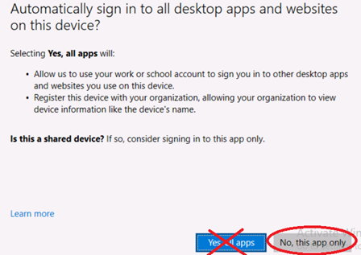

# ラーニング パス 9 - ラボ 9 - 演習 1 - Azure Information Protection Unified Labels クライアントを使用して秘密度ラベルを実装する

Adatum の新しい Microsoft 365 管理者である Holly Dickson としてのあなたの役割では、仮想化されたラボ環境に Microsoft 365 を展開しています。Microsoft 365 パイロット プロジェクトを進める際の次のステップは、Adatum で 秘密度ラベルを実装することです。このラボでは、ラベルを作成して公開し、公開されたラベルをテストします。

### タスク 1 – Microsoft 365 Apps for enterprise のユーザー主導のインストールを実行する

LON-CL1でMOD管理者(admin@xxxxxZZZZZZ.onmicrosoft.com)として Microsoft 365 にログインし、– Microsoft 365 Apps for enterpriseをインストールします。

LON-CL2でJoni Sherman(jonis@xxxxxZZZZZZ.onmicrosoft.com)として Microsoft 365 にログインし、– Microsoft 365 Apps for enterpriseをインストールします。

1. LON-CL1に切り替えます。

2. Officeポータルにアクセスします。LON-CL1内でブラウザーを起動し、アドレス バーに次の URL を入力します: **[https://portal.office.com](https://portal.office.com/)**

3. MOD管理者(admin@xxxxxZZZZZZ.onmicrosoft.com)の資格情報でサインインしてください。他のユーザーでサインインしていた場合は、サインインしなおしてください。

4. Officeポータルにアクセスしたら、画面左のメニューで **[アプリ]** - **[すべてのアプリ]** をクリックします。

5. 画面右上のドロップダウンリストで **[アプリをインストール] - [Microsoft 365 Apps ]** を選択します。

6. 画面真ん中上の [Officeのインストール] をクリックし、ダウンロードした OfficeSetup.exeを実行し、Microsoft 365 Apps for enterprise をインストールします。インストール中に下の手順に進みます。

7. LON-CL2に切り替えます。

8. Officeポータルにアクセスします。LON-CL2内でブラウザーを起動し、アドレス バーに次の URL を入力します: **[https://portal.office.com](https://portal.office.com/)**

9. Joni Sherman(jonis@xxxxxZZZZZZ.onmicrosoft.com)の資格情報でサインインしてください。他のユーザーでサインインしていた場合は、サインインしなおしてください。

10. 画面左のメニューで **[Apps]** をクリックします。

11. 画面右上のドロップダウンリストで **[Install Apps] - [Microsoft 365 Apps ]** を選択します。

12. 画面真ん中上の [Install Office] をクリックし、ダウンロードした OfficeSetup.exeを実行し、Microsoft 365 Apps for enterprise をインストールします。User Account Controlのダイアログで **[Yes]** をクリックします。

    

13. インストールが終了したら、LON-CL1とLON-CL2を再起動してください。

### タスク 2 – 秘密度ラベルを作成する

この演習では、秘密度ラベルを作成し、それをデフォルト ポリシーに追加して、Adatum テナントのすべてのユーザーに有効にするようにします。

1. お手元のPCでInPrivate ウィンドウ(Microsoft Edge) もしくは、シークレットウィンドウ (Google Chrome) で、Microsoft 365 管理センター ([https://admin.microsoft.com](https://admin.microsoft.com/)) にアクセスし、Hollyの資格情報でサインインします。

2. Microsoft 365 管理センターで、必要に応じて **[... すべて表示]** を選択します。[管理センター]グループの下の **[Microsoft Purview]** を選択します。

3. Microsoft Purviewポータルの左側のナビゲーション ウィンドウで、 **[ソリューション]** - **[Microsoft Information Protection]** を選択し、 **[秘密度ラベル]** を選択します。

4. [秘密度ラベル] ページでは、次の内容を示す警告メッセージがページの中央に表示されます。**組織では、暗号化された感度ラベルが適用され、OneDrive と SharePoint に保存されている Office online ファイルのコンテンツを処理する機能が有効になっていません。ここでは有効化できますが、複数地域環境の場合は、追加の構成が必要となることに注意してください。**

   このメッセージの右側に表示される **「今すぐ有効にする」** ボタンを選択します。これにより、Adatum は Microsoft 365 環境内で秘密度ラベルを適用できるようになります。

   

   メッセージが次のように変更されたことに注意してください。「Teams 、SharePoint サイト、および Microsoft 365 グループのプライバシーとアクセス制御設定を使用して秘密度ラベルを作成できるようになりました。」

5. [ラベル]ページで、画面中央のメニュー バー (前のメッセージの下) に表示される **[ + ラベルの作成]** オプションを選択します。これにより、新しい秘密度ラベルウィザードが開始されます。

6. 新しい秘密度ラベルウィザードの[名前とヒント]ページで、次の情報を入力します。

   - 名前: **PII**
   - 表示名: **PII**
   - ユーザー向けの説明: **PII を含むファイル**
   - 管理者向けの説明: **PII を含むファイル**
   - ラベルの色: 秘密度ラベルに割り当てる色の 1 つを選択します。

7. **「次へ」** を選択します。

8. [このラベルの範囲を定義する]ページで、**[ファイルと他のデータ資産]**  のチェック ボックスだけをオンにして、 **[次へ]** を選択します。

   

9. [ラベル付けされたアイテムの保護設定を選択する]ページで、 **[アクセスの制御]** と **[コンテンツ マーキングを適用する]** の2つのチェック ボックスをオンにし、 **[次へ]** を選択します。

10. [アクセスの制御] ページで、このラベルが適用されたアイテムにアクセスできるユーザーを定義します。[アクセス許可を今すぐ割り当てますか、それともユーザーが決定するようにしますか?] の項目で **[ラベルを適用するときにユーザーがアクセス許可を割り当てられるようにする]** オプションを選択し、さらに **[Word、PowerPoint、Excel で、アクセス許可の指定をユーザーに要求する]** オプションを選択し、**[次へ]** を選択します。

11. [コンテンツのマーキング]ページで、 **[コンテンツのマーキング]** トグル スイッチを **[オン]** に設定します。ファイルと電子メールにマークを付ける方法をカスタマイズできる 3 つのオプションが表示されます。

    「透かしの追加」のチェック ボックスを **オン** にし、「ヘッダーの追加」と「フッターの追加」のチェックボックスを **オフ** にします。「透かしの追加」の下にある、 **[テキストのカスタマイズ]** を選択します。これにより、特定の設定をカスタマイズするためのペインが開きます。 **各オプションの[カスタマイズ]** ペインに次の情報を入力します(各オプションの設定を入力した後、  **[保存]** を選択します)。

    - **透かしの追加**
      - 透かしテキスト:**機密情報 - 共有しないでください**
      - フォントサイズ: **25**
      - 文字色：**青**
      - 文字レイアウト:**斜め**
    
12. [コンテンツ マーキング]ページで、**[次へ]** を選択します。

13. [ファイルと電子メールの自動ラベル付け] ページで、**[ファイルと電子メールの自動ラベル付け]** で、**[次へ]** を選択します。

14. [グループとサイトの保護設定の定義]ページで、すべてのチェック ボックスを空白のままにして、**「次へ」** を選択します。

16. [設定を確認して終了]ページで、**[ラベルを作成]** を選択します。

17. [秘密度ラベルが作成されました] ページで、**[ポリシーをまだ作成しない]** を選択し、**[完了]** を選択します。

18. 次に、PIIラベルを公開します。[情報保護]ウィンドウには、デフォルトで[ラベル]タブが表示されます。ラベルのリストにPIIラベルが表示されない場合は、メニュー バーの[更新]を選択します。 **PIIラベルが表示されたら、その左側に表示されるチェック ボックスをオンにします。** 

19. ラベルのリストの上にあるメニュー バーに表示される **[ラベルを発行]** オプションを選択します。これにより、ポリシーの作成ウィザードが開始されます。

20. **[次へ]** を選択し、 [管理単位の割り当て]で **[次へ]** を選択します。

21. **[すべてのユーザーまたはグループ]** が表示されていることを確認し、**[次へ]** を選択します。

22. [ポリシーの設定]ページで、 **[ユーザーはラベルを削除したり、ラベルの分類を下位のものにしたりする場合に、理由を示す必要がある]**　チェック ボックスをオンにし、 **[次へ]** を選択します。

23. [ドキュメントの既定の設定]ページで、表示されるドロップダウン メニューから **[PII]** を選択し、 **[次へ]** を選択します。

24. [メールの既定の設定]ページで、表示されるドロップダウン メニューから **[なし]** を選択し、 **[次へ]** を選択します。

25. [会議と予定表イベントの既定の設定]ページで、表示されるドロップダウン メニューから **[なし]** を選択し、 **[次へ]** を選択します。

26. [Fabric および Power BI コンテンツの既定の設定]ページで、表示されるドロップダウン メニューから **[なし]** を選択し、 **[次へ]** を選択します。

27. [ポリシーの名前を設定する]ページで、[名前] フィールドに **「PII ポリシー」** と入力し、この秘密度ラベル ポリシーに関する次の説明を入力 (またはコピーして貼り付け) します。

     **このポリシーは情報を暗号化します。**  

28. **[次へ]** を選択します。

29. [確認と終了] ページで、入力した情報を確認します。修正する必要がある場合は、対応する編集オプションを選択し、必要な修正を加えます。すべての情報が正しい場合は、**[送信]** を選択します。

30. [新しいポリシーが作成されました]ページで、**[完了]** を選択します。

### タスク 3 – 文書に秘密度ラベルを割り当てる

**重要:** 前のタスクから１時間以上時間をあけてください。

1. LON-CL1に切り替えます。

2. [スタート]メニューからWordを起動します。

3. Wordの画面が表示されたことを確認し、[白紙の文書]をクリックします。

4. 「こんにちは MODさん、Word へようこそ」ページで **[続行]** ボタンをクリックします。 

5. [Office ライセンス認証]ページが表示されたことを確認し、admin@xxxxxZZZZZZ.onmicrosoft.com と入力、**[次へ]** ボタンをクリックします。

6. [パスワードの入力] ページが表示されたら、管理者のパスワードを入力し、**[サインイン]** ボタンをクリックします。

7. [このデバイス上のすべてのデスクトップアプリとWebサイトに自動的にサインインしますか？]ページが 表示されたことを確認し、 **[いいえ、このアプリのみです]** をクリックします。

   

8. [ライセンス契約に同意します]ページで、 **[同意する]** ボタンをクリックします。

9. [ホーム]タブに、[秘密度]アイコンが表示されていることを確認します。 表示されていない場合は、Wordを閉じて、再度起動しなおしてください。それでも表示されない場合は、LON-CL1を再起動してください。

10. Word リボンの [秘密度] グループで、下矢印を選択します。

11. 秘密度ラベルをドキュメントに適用するため、ドロップダウン メニューで **[PII]** を選択します。その後もう一度、 [秘密度]グループのドロップダウン矢印を選択すると、表示されるドロップダウン メニューにはPIIラベルが表示され、その横にこのドキュメントに適用されていることを示すチェック マークが表示されることを確認します。

12. [アクセス許可] ダイアログが表示されます。 閲覧者 の欄に **Jonis@WWLxZZZZZZ.onmicrosoft.com** と入力し、**[適用]** をクリックします。

13. 透かしテキストが表示されることを確認します。

14. Wordに任意の文章を入力した後、Word左上のSave(フロッピーディスクのアイコン)をクリックし、ファイルを保存します。

15. [このファイルを保存] 画面のFile name でファイル名を **Test** と入力します。Choose a Location で **Documents** を選択します。[秘密度]のドロップダウン メニューで **[PII]** が選択されていることを確認します。 **[保存]** をクリックします。

16. Wordのドキュメントを閉じます。

これで、読み取り専用で保護された AIP 保護された Word 文書が正常に作成されました。このドキュメントにアクセスできるのは、作成者である MOD管理者と、ドキュメントが共有された Joni Sherman (読み取り専用権限を持つ) のみです。

### タスク 4 – 秘密度ラベル ポリシーを確認する

前のタスクでは、Word 文書を作で保護しました。PII ラベルは文書に透かしを挿入し、文書に対するアクセス許可を制限する必要があります。ドキュメントに割り当てた保護が機能するかどうかを確認するには、まずドキュメントを Joni Sherman に電子メールで送信します。次に、Joni Sherman でどのような機能が可能かをテストします。

1. LON-CL1　のEdgeブラウザーで、 Outlook ( https://outlook.office.com )にサインインします。

3. **[新規メール]** ボタンをクリックします。

4. 次の設定で新しいメッセージを作成します。

   • 宛先 : Joni Sherman

   • 件名 : Protected Document Test

   • 添付ファイル : 前のタスクで保存したTest.docx 

   (上のメニューで「挿入」を選択して、表示されるクリップのようなアイコンを選択した後、「このコンピューターから選択」から「Documents」 フォルダーを選択し、Test.docx を選択します。)

5. **[送信]** ボタンをクリックします。

6. LON-CL2に切り替えます。

7. Edgeブラウザーで、 Outlook (https://outlook.office.com) に JoniS@WWLxZZZZZ.onmicrosoft.comとしてサインインします。

8. Joniの受信トレイが表示されたことを確認し、MOD管理者から届いたメールを選択します。

9. Wordの添付ファイルのアイコンをクリックします。

10. 添付ファイルのプレビューが開きます。上の方にある **[ ↓ Download ]** をクリックし、[Open file(ファイルを開く)]をクリックします。(あるいは、Downloadsフォルダーにある Test.docx を開いてください)

12. [Sign in]ページが表示されたことを確認し、JoniS@WWLxZZZZZ.onmicrosoft.comで サインインします。

13. [Stay signed in to all your apps(すべてのアプリにサインインしたままにする)]ページが 表示されたことを確認し、**[No, this app only]** をクリックします。 

    

16. [Accept the license agreement]ページが表示されたら、**[Accept]** ボタンをクリックします。

17. [Your privacy option]ページが表示されたら、右下の **[Close(閉じる)]** ボタンをクリックします。

18. Joniには、読み取り専用のアクセス許可を付与したため、文書の内容が表示されます。

    また、Wordの画面の上部には通知バーが表示されます。

19. 入力などを行おうとすると、編集がロックされていることを確認します(文字を入力しようとすると、画面下部のステータスバーに変更できない旨のメッセージが表示されます)。

    

20. Wordを閉じます。

    Joni にドキュメントを読み取るアクセス許可が割り当てられているため、構成した ポリシー パラメーターに基づいて  Information Protection がドキュメントを保護していることを確認しました。

## おめでとうございます！このコースの最後のラボを完了しました。
