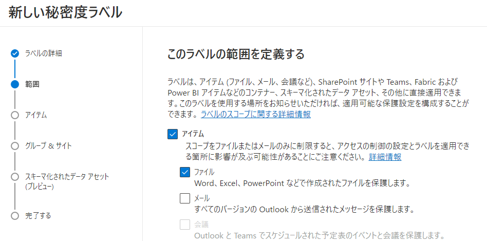
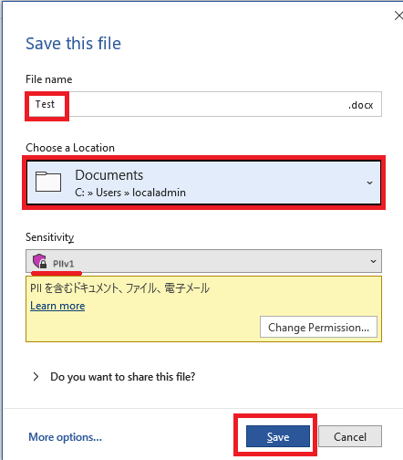

# ラーニング パス 9 - ラボ 9 - 演習 1 - Azure Information Protection Unified Labels クライアントを使用して秘密度ラベルを実装する

Adatum の新しい Microsoft 365 管理者である Holly Dickson としてのあなたの役割では、仮想化されたラボ環境に Microsoft 365 を展開しています。Microsoft 365 パイロット プロジェクトを進める際の次のステップは、Adatum で 秘密度ラベルを実装することです。このラボでは、ラベルを作成して公開し、公開されたラベルをテストします。ただし、その際、このラボで作成したラベルはテストされません。別のラベルをテストします。

**重要:** 思い起こせば、このクラスの初日に、秘密度ラベルと秘密度ラベル ポリシーを作成して公開するラボ セットアップ スクリプトを実行しました。秘密度ラベルのタイミングの問題のため、このラボをサポートするにはそのスクリプトを実行する必要がありました。ラベル ポリシーを発行すると、発行されたラベル ポリシーが Microsoft 365 に反映されるまで 24 時間かかります。そのため、このラボでは、作成して発行したラベルとラベル ポリシーをテストすることはできません。

このタイミングの問題に対処するために、1 日目に PowerShell スクリプトを実行して、秘密度ラベルとラベル ポリシーを作成して公開しました。このラボに到達したので、そのラベル ポリシーがシステム全体に伝播され、テストできるようになります。

Microsoft 365 UI を使用したラベルとラベル ポリシーの作成と発行の経験を積んでほしいため、このラボでも秘密度ラベルとラベル ポリシーを作成します。ただし、ラベルとラベル ポリシーをテストするタスクを実行する場合、そのラベルとラベル ポリシーは 24 時間テストできないため、UI で作成して公開したものはテストされません。代わりに、このクラスの 1 日目に実行したスクリプトを使用して、作成および公開したラベルとラベル ポリシーをテストします。

### タスク 1 – Microsoft 365 Apps for enterprise のユーザー主導のインストールを実行する

LON-CL1でAlex Wilberとして Microsoft 365 にログインし、– Microsoft 365 Apps for enterpriseをインストールします。

LON-CL2でJoni Sharmanとして Microsoft 365 にログインし、– Microsoft 365 Apps for enterpriseをインストールします。

1. LON-CL1に切り替えます。

2. Officeポータルにアクセスします。LON-CL1内でブラウザーを起動し、アドレス バーに次の URL を入力します: **[https://portal.office.com](https://portal.office.com/)**

   Alex Wilber([AlexW@xxxxxZZZZZZ.onmicrosoft.com](mailto:AlexW@xxxxxZZZZZZ.onmicrosoft.com))の資格情報でサインインしてください。他のユーザーでサインインしていた場合は、サインインしなおしてください。

3. 画面右上のドロップダウンリストで **[Install and more] - [Install Microsoft 365 Apps ]** を選択します。

4. 画面真ん中上の [Install Office] をクリックし、ダウンロードした OfficeSetup.exeを実行し、Microsoft 365 Apps for enterprise をインストールします。インストール中に下の手順に進みます。

5. LON-CL2に切り替えます。

6. Officeポータルにアクセスします。LON-CL2内でブラウザーを起動し、アドレス バーに次の URL を入力します: **[https://portal.office.com](https://portal.office.com/)**

7. Joni Sharman ([Jonis@xxxxxZZZZZZ.onmicrosoft.com](mailto:Jonis@xxxxxZZZZZZ.onmicrosoft.com))の資格情報でサインインしてください。他のユーザーでサインインしていた場合は、サインインしなおしてください。

8. 画面右上のドロップダウンリストで **[Install and more] - [Install Microsoft 365 Apps ]** を選択します。

9. 画面真ん中上の [Install Office] をクリックし、ダウンロードした OfficeSetup.exeを実行し、Microsoft 365 Apps for enterprise をインストールします。インストールの最初に管理者のユーザー名とパスワードを聞かれるため、AdministratorとPa55w.rdを入力してください。インストール中に下の手順に進みます。

### タスク 2 – 秘密度ラベルを作成する

この演習では、秘密度ラベルを作成し、それをデフォルト ポリシーに追加して、Adatum テナントのすべてのユーザーに有効にするようにします。

1. お手元のPCでInPrivate ウィンドウ(Microsoft Edge) もしくは、シークレットウィンドウ (Google Chrome) で、Microsoft 365 管理センター ([https://admin.microsoft.com](https://admin.microsoft.com/)) にアクセスし、Hollyの資格情報でサインインします。

2. Microsoft 365 管理センターで、必要に応じて **[... すべて表示]** を選択します。[管理センター]グループの下の **[コンプライアンス]** を選択します。

3. Microsoft Purviewポータルの左側のナビゲーション ウィンドウで、**[情報保護]** を選択し、 **[ラベル]** を選択します。

4. [ラベル] ページでは、次の内容を示す警告メッセージがページの中央に表示されます。**暗号化された秘密度ラベルが適用され、OneDrive および SharePoint に保存されている Office オンライン ファイルのコンテンツを処理する機能が組織で有効になっていません。ここでオンにすることができますが、複数地域環境では追加の構成が必要であることに注意してください。**

   このメッセージの右側に表示される **「今すぐ有効にする」** ボタンを選択します。これにより、Adatum は Microsoft 365 環境内で秘密度ラベルを適用できるようになります。

   

   メッセージが次のように変更されたことに注意してください。「Teams 、SharePoint サイト、および Microsoft 365 グループのプライバシーとアクセス制御設定を使用して秘密度ラベルを作成できるようになりました。」

5. [ラベル]ページで、画面中央のメニュー バー (前のメッセージの下) に表示される **[ + ラベルの作成]** オプションを選択します。これにより、新しい秘密度ラベルウィザードが開始されます。

6. 新しい秘密度ラベルウィザードの[名前とヒント]ページで、次の情報を入力します。

   - 名前: **PII**
   - 表示名: **PII**
   - ユーザー向けの説明: **PII を含むドキュメント、ファイル、電子メール**
   - 管理者向けの説明: **PII を含むドキュメント、ファイル、電子メール**
   - ラベルの色: 秘密度ラベルに割り当てる色の 1 つを選択します。

7. **「次へ」** を選択します。

8. [このラベルの範囲を定義する]ページで、**[アイテム] と [ファイル] の2つのチェック ボックスだけをオン**にして、 **[次へ]** を選択します。

   

9. [ラベル付けされたアイテムの保護設定を選択する]ページで、 **[アクセスの制御]** と **[コンテンツ マーキングを適用する]** の2つのチェック ボックスをオンにし、 **[次へ]** を選択します。

10. [アクセスの制御] ページで、このラベルが適用されたアイテムにアクセスできるユーザーを定義します。[アクセス許可を今すぐ割り当てますか、それともユーザーが決定するようにしますか?] の項目で **[ラベルを適用するときにユーザーがアクセス許可を割り当てられるようにする]** オプションを選択し、さらに **[Word、PowerPoint、Excel で、アクセス許可の指定をユーザーに要求する]** オプションを選択し、**[次へ]** を選択します。

11. [コンテンツ マーキング]ページで、 **[コンテンツ マーキング]** トグル スイッチを **[オン]** に設定します。ファイルと電子メールにマークを付ける方法をカスタマイズできる 3 つのオプションが表示されます。

    3 つのチェック ボックスをすべて **オン** にします。各設定で、 **[テキストのカスタマイズ]** を選択します。これにより、特定の設定をカスタマイズするためのペインが開きます。 **各オプションの[カスタマイズ]** ペインに次の情報を入力します(各オプションの設定を入力した後、  **[保存]** を選択します)。

    - **透かしの追加**
      - 透かしテキスト:**Sensitive - Do Not Share**
      - フォントサイズ: **25**
      - 文字色：**青**
      - 文字レイアウト:**斜め**
    - **ヘッダーの追加**
      - 透かしテキスト:**Sensitive - Do Not Share**
      - フォントサイズ: **25**
      - 文字色：**赤**
      - テキストの配置:**中央** 
    - **フッターの追加**
      - 透かしテキスト:**Sensitive - Do Not Share**
      - フォントサイズ: **25**
      - 文字色：**赤**
      - テキストの配置:**中央**

12. [コンテンツ マーキング]ページで、**[次へ]** を選択します。

13. [ファイルと電子メールの自動ラベル付け] ページで、**[ファイルと電子メールの自動ラベル付け]** トグル スイッチを **[オン]** に設定します。これにより、次の手順で更新する一連のオプションが有効になります。

14. [これらの条件に一致するコンテンツを検出する]で、**[+条件を追加]** を選択し、 **[コンテンツに含まれている場合]** を選択します。

15. [コンテンツが含まれている場合] ウィンドウで、**[追加**] ドロップダウン矢印を選択し、 **[機密情報の種類]** を選択します。

16. **[機密情報の種類]**ウィンドウの機密情報の種類のリストで、今回は **ABA Routing Number** と **U.S. Social Security Number (SSN)** (「SSN」等で検索して見つけてください)のチェック ボックスのみを選択し、**[追加]** を選択します。[ファイルと電子メールの自動ラベル付け]ページに戻ると、これらの機密情報の種類が両方とも表示されます。**「次へ」** を選択します。

17. [グループとサイトの保護設定の定義]ページで、すべてのチェック ボックスを空白のままにして、**「次へ」** を選択します。

18. [スキーマ化されたデータ資産の自動ラベル付け (プレビュー)]ページでは、データベース列の自動ラベル付けを有効にしないでください。**「次へ」** を選択します。

19. [設定を確認して終了]ページで、**[ラベルを作成]** を選択します。

20. [秘密度ラベルが作成されました] ページで、**[ポリシーをまだ作成しない]** を選択し、**[完了]** を選択します。

21. 次に、PIIラベルを公開します。[情報保護]ウィンドウには、デフォルトで[ラベル]タブが表示されます。ラベルのリストにPIIラベルが表示されない場合は、メニュー バーの[更新]を選択します。 **PIIラベルが表示されたら、その左側に表示されるチェック ボックスをオンにします。** 

22. ラベルのリストの上にあるメニュー バーに表示される **[ラベルの発行]** オプションを選択します。これにより、ポリシーの作成ウィザードが開始されます。

23. **[次へ]** を選択し、 [管理単位の割り当て]で **[次へ]** を選択します。

24. **[すべてのユーザーまたはグループ]** が表示されていることを確認し、**[次へ]** を選択します。

25. [ポリシーの設定]ページで、 **[ユーザーはラベルを削除したり、ラベルの分類を下位のものにしたりする場合に、理由を示す必要がある]**　チェック ボックスをオンにし、 **[次へ]** を選択します。

26. [ドキュメントの既定の設定]ページで、表示されるドロップダウン メニューから **[PII]** を選択し、 **[次へ]** を選択します。

27. [メールの既定の設定]ページで、表示されるドロップダウン メニューから **[なし]** を選択し、 **[次へ]** を選択します。

28. [会議と予定表イベントの既定の設定]ページで、表示されるドロップダウン メニューから **[なし]** を選択し、 **[次へ]** を選択します。

29. [Fabric および Power BI コンテンツの既定の設定]ページで、表示されるドロップダウン メニューから **[なし]** を選択し、 **[次へ]** を選択します。

30. [ポリシーの名前を設定する]ページで、[名前] フィールドに **「PII ポリシー」** と入力し、この秘密度ラベル ポリシーに関する次の説明を入力 (またはコピーして貼り付け) します。**このポリシーの目的は、ABA 銀行ルーティング番号や、ABA 銀行ルーティング番号などの機密情報を検出することです。電子メールや文書に米国の社会保障番号が含まれており、発見された場合にはこの情報を暗号化します。ユーザーは、分類ラベルを削除するための説明を提供する必要があります。**  

31. **[次へ]** を選択します。

32. [確認と終了] ページで、入力した情報を確認します。修正する必要がある場合は、対応する編集オプションを選択し、必要な修正を加えます。すべての情報が正しい場合は、**[送信]** を選択します。

33. [新しいポリシーが作成されました]ページで、**[完了]** を選択します。

### タスク 3 – 文書に秘密度ラベルを割り当てる

このラボの最初の手順で示したように、前のタスクで作成したばかりの秘密度ラベルとラベル ポリシーをテストすることはできません。そのラベル ポリシーが Microsoft 365 に反映されてから、そのラベルが Microsft Word、Outlook などに表示されるまでに最大 24 時間かかります。

**重要:** 次の 2 つのタスクでテストするラベルとラベル ポリシーは、クラスの初日にラボ 1 で PowerShell スクリプトを実行したときに作成されたラベルとラベル ポリシーになります。

**注:** 前のタスクで作成したラベルとラベル ポリシーは、実習 1 で PowerShell スクリプトを実行したときに作成したラベルとラベル ポリシーとまったく同じ設定を持ちます。 2 つのラベルと 2 つのラベル ポリシーの唯一の違いは、彼らの名前でなければなりません。これらのラベルとラベル ポリシーの名前は次のとおりです。

- 前のタスクで作成したラベルのタイトルは**PII**でした。
- 実習 1 で実行したスクリプトによって作成されたラベルのタイトルは**PII-V1**でした。
- 前のタスクで作成したラベル ポリシーには、 **「PII Policy」** というタイトルが付けられました。
- ラボ 1 で実行したスクリプトによって作成されたラベル ポリシーには、 **「PII Policy-V1」** というタイトルが付けられました。

次の 2 つのタスクでPII - V1ラベルとPII ポリシー - V1ラベル ポリシーをテストすると、 PIIラベルとPII ポリシーラベル ポリシーで設定したのと同じ結果が表示されるはずです。

1. LON-CL1に切り替えます。

2. [スタート]メニューからWordを起動します。

3. **[Activate Office]** ページが表示されたことを確認し、AlexW@WWLxZZZZZZ.onmicrosoft.comと入力して（入力されていればそのまま）、**[Next]** ボタンをクリックします。

4. [Enter password] ページが表示されたことを確認し、 **Pa55w.rd1234** と入力して、**[Sign in]** ボタンをクリックします。

5. [Stay signed in to all your apps(すべてのアプリにサインインしたままにする)]ページが 表示されたことを確認し、 **[No, sign in to this app only]** をクリックします。 ([OK]ボタンをクリックしないでください。)

   

6. [Accept the license agreement)]ページで、 **[Accept]** ボタンをクリックします。

7. [Your privacy matters] ページが表示されたら、画面右下の **[Close]** ボタンをクリックします。

8. Wordの画面が表示されたことを確認し、[Blank document]をクリックします。

9. [Home(ホーム)]タブに、[Sensitivity(秘密度)]アイコンが表示されていることを確認します。 表示されていない場合は、Wordを閉じて、再度起動しなおしてください。

10. Word リボンの [Sensitivity] グループで、下矢印を選択します。

11. [Permission] ダイアログが表示されます。 **[Restrict permission to this document] チェックボックスをオン** にします。

12. Readの右の欄に **JoniS@WWLxZZZZZZ.onmicrosoft.com** と入力し、**[OK]** をクリックします。

13. 秘密度ラベルをドキュメントに再適用するため、ドロップダウン メニューで **[PII - V1]** を選択します。その後もう一度、 [Sensitivity]グループのドロップダウン矢印を選択すると、表示されるドロップダウン メニューにはPII - V1ラベルが表示され、その横にこのドキュメントに適用されていることを示すチェック マークが表示されることを確認します。

14. Word 文書で、入力した前のテキスト行の下に **111-11-1111** と入力します。この番号は、米国の社会保障番号と同じ形式です。

15. Word左上のSave(フロッピーディスクのアイコン)をクリックし、ファイルを保存します。

16. [Permission] ダイアログが表示されます。[Restrict permission to this document] チェックボックスをオンにします。

17. Readの右の欄に JoniS@WWLxZZZZZZ.onmicrosoft.com と入力し、**[OK]** をクリックします。

18. [Save this file] 画面のFile name で Test と入力します。Choose a Location で Documents を選択します。Sensitibityのドロップダウン メニューで **[PII - V1]** となっていることを確認します。 **[Save]** をクリックします。

    

    

19. 適用された透かしを確認します。

    

これで、読み取り専用で保護された AIP 保護された Word 文書が正常に作成されました。このドキュメントにアクセスできるのは、作成者である Alex Wilber と、ドキュメントが共有された Joni Sherman (読み取り専用権限を持つ) のみです。

### タスク 4 – 秘密度ラベル ポリシーを確認する

前のタスクでは、Word 文書を作成し、秘密度ラベルで保護しました。PII **- V1**ラベルは文書に透かしを挿入し、文書に対するアクセス許可を制限する必要があります。ドキュメントに割り当てた保護が機能するかどうかを確認するには、まずドキュメントを Joni Sherman と自分の個人電子メール アドレスに電子メールで送信します。次に、ジョニ ウィルバーとアレックス ウィルバーの両方でどのような機能が可能かをテストします。

1. LON-CL1　のEdgeブラウザーで、Office 365ポータルにAlexw@WWLxZZZZZ.onmicrosoft.comとしてサインインしていることを確認します。ほかのユーザーでサインインしている場合はサインインし直します。

2. Office365ポータルページで、 **[Outlook]** アイコンをクリックします。 パスワードが要求されたら **Pa55w.rd1234** と入力します。

3. **[新規メール]** ボタンをクリックします。

4. 次の設定で新しいメッセージを作成します。

   • 宛先 : Joni Sherman

   • 件名 : Protected Document Test

   • 添付ファイル : 前のタスクで保存したTest.docx

   (Document フォルダーに保存されています。)

5.  **[送信]** ボタンをクリックします。

6. LON-CL2に切り替えます。

7. [すべて完了です。Officeはインストールされました。]ページが表示されている場合は、**[閉じる]** ボタンをクリックします。 

8. [まだいくつか手順があります…]ページが表示されている場合は、[閉じる]ボタンをクリックします。 

9. Office 365ポータルにJoniS@WWLxZZZZZ.onmicrosoft.comとしてサインインしていることを確認します。ほかのユーザーでサインインしている場合は、次のユーザー名とパスワードを 使用してサインインし直します。

   • ユーザー名 JoniS@WWLx ZZZZZ.onmicrosoft.com

   • パスワード Pa55w.rd1234

10. Office365ポータルページで、**[Outlook]** アイコンをクリックします。パスワードが要求されたら **Pa55w.rd1234** と入力します。

11. Joniの受信トレイが表示されたことを確認し、Alexから届いたメールを選択します。

12. 添付ファイルをクリックします。 

13. [プライバシーオプション]ページが表示された場合は、[閉じる]ボタンをクリックします。

14. プレビューが表示されたことを確認します。 ただし、[Restricted Access Permission is currently restricted. Only specified users can access this content.(制限付きアクセス 現在、許可は制限されています。指定された ユーザーのみがこのコンテンツにアクセスできます)]と表示されていることを確認します。

15. プレビューウィンドウを閉じます。

16. Outlookに戻ったことを確認し、添付ファイルの右側に表示されている[∨]をクリックし、 次いで [ ↓ ]　(ダウンロード) をクリックします。

17. 画面の右上に[ダウンロード]ページが表示されますので、[Open file(ファイルを開く)]をクリックします。

18. [Sign in]ページが表示されたことを確認し、JoniS@WWLxZZZZZ.onmicrosoft.comで サインインします。パスワードは、  **Pa55w.rd1234** を使用します。

19. [Stay signed in to all your apps(すべてのアプリにサインインしたままにする)]ページが 表示されたことを確認し、**[No, sign in to this app only]** をクリックします。 ([OK]ボタンをクリックしないでください。)

    

2. [Hello Joni,welcome to Office]ページが表示されたことを確認し、**[Continue]** ボタンを クリックします。

21. [Activate Office]ページが表示されたことを確認し、 **JoniS@WWLxZZZZZ onmicrosoft.com** と入力して（入力されていればそのまま）、**[Next]**　ボタンをクリックします。

22. [Accept the license agreement]ページが表示されたことを 確認し、**[Accept]** ボタンをクリックします。

23. [Your privacy option]ページが表示されたことを確認し、右下の **[Close(閉じる)]** ボタンをクリックします。

24. Joniには、読み取り専用のアクセス許可を付与したため、文書の内容が表示されます。

    また、Wordの画面の上部には通知バーが表示されます。

25. 入力などを行おうとすると、編集がロックされていることを確認します(文字を入力しようとすると、画面下部のステータスバーに変更できない旨のメッセージが表示されます)。

    

26. Wordを閉じます。

    Joni にドキュメントを読み取るアクセス許可が割り当てられているため、構成した ポリシー パラメーターに基づいて Azure Information Protection がドキュメントを保護していることを確認しました。

## おめでとう！このコースの最後のラボを完了しました。
